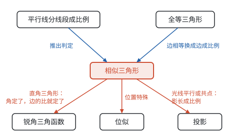

# 总览：从全等到相似

**这一部分的主线是：全等只管“一模一样”，相似放开了大小、只管形状；形状用“比”来描述，相似三角形的对应边成比例，直角三角形里边的比只由锐角决定，就是锐角三角函数。**

## 全等和相似对照

相似比为 1 的相似就是全等。相似的每一条判定，都是把全等的判定中的“边相等”换成“边成比例”，证明时也正是借用了对应的全等判定（见第八部分“相似”）：

| 比较 | 全等三角形 | 相似三角形 |
| --- | --- | --- |
| 定义 | 能够完全重合 | 对应角相等，对应边成比例 |
| 三边 | 三边分别相等（SSS） | 三边成比例 |
| 两边和夹角 | 两边和它们的夹角分别相等（SAS） | 两边成比例且夹角相等 |
| 角 | 两角和一边分别相等（ASA、AAS） | 两角分别相等，不需要边 |
| 直角三角形 | 斜边和一条直角边分别相等（HL） | 斜边和一条直角边成比例 |
| 不能判定 | 两边和其中一边的对角（SSA）；三个角（AAA） | 两边成比例和其中一边的对角相等 |
| 周长、面积 | 相等 | 周长比等于相似比 $k$，面积比等于 $k^2$ |
| 对应的图形变化 | 平移、轴对称、旋转 | 位似（放大或缩小），再加上前三种 |

## 都是“比”

这一部分出现的新量，几乎都是两条线段的比：

| 比 | 在哪里出现 | 由什么决定 |
| --- | --- | --- |
| 比例线段 $\frac{a}{b} = \frac{c}{d}$ | 平行线分线段成比例 | 一组平行线 |
| 相似比 $k$ | 相似三角形的对应边 | 两个三角形的大小关系 |
| 黄金分割数约 0.618 | 截去一个正方形后，剩下的长方形和原来相似 | 方程 $x^2 = 1 - x$ |
| $\sin A$、$\cos A$、$\tan A$ | 直角三角形两条边的比 | 锐角 $A$ 的大小 |
| 坡度 $i$ | 铅直高度与水平宽度的比 | 坡角的正切 |
| 物高与影长的比 | 太阳光下的平行投影 | 光线的方向 |
| 一次函数的 $k$ | 竖直方向变化量与水平方向变化量的比 | 直线的倾斜程度 |

这些比能够成立，靠的都是相似：同一个角的直角三角形都相似，比值才只由角决定；同一时刻的太阳光平行，物体和影子组成的三角形才都相似。一次函数的 $k$ 放在这里，是因为直线上每一级台阶都是相似的直角三角形，$k$ 就是台阶的正切（见第七部分“一次函数”）。

## 各页的关系

- **相似**是这一部分的中心。它从“平行线分线段成比例”这个基本事实出发，借助全等的判定推出相似的判定，再得到相似三角形的性质、位似和测高测距的方法（见第八部分“相似”）。
- **锐角三角函数**把相似用到直角三角形上：锐角确定了，边的比就确定了，于是可以由角求边、由边求角，解决仰角、坡度、方位角的实际问题（见第八部分“锐角三角函数”）。
- **投影与视图**讲怎样把立体图形变成平面图形。太阳光下的影子、路灯下的影子，计算时都是相似三角形；三视图用正投影表示物体的形状和尺寸（见第八部分“投影与视图”）。

## 学习顺序

1. **相似：** 先复习第五部分“全等三角形”和第一部分“基本事实”中的平行线分线段成比例，再学相似。重点是判定和“面积比等于相似比的平方”。
2. **锐角三角函数：** 学完相似再学，还要用到第五部分“勾股定理”和第三部分“二次根式”。重点是解直角三角形和作高、列方程两种想法。
3. **投影与视图：** 平行投影和中心投影的计算用到相似；三视图可以和第五部分“几何图形初步”中的展开图对照着学。

学完这一部分再学圆，圆中的计算和证明也常常用到相似三角形和锐角三角函数（见第九部分“总览：圆的对称性”）。
