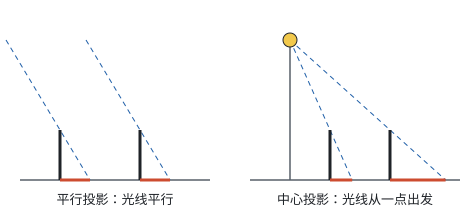
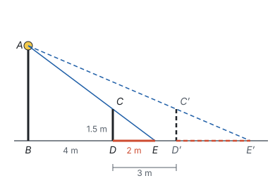
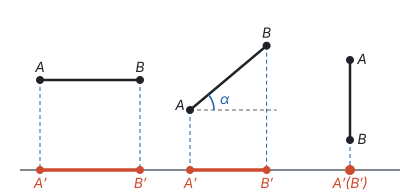
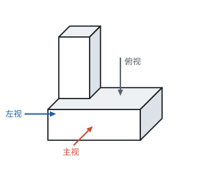
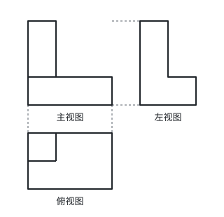
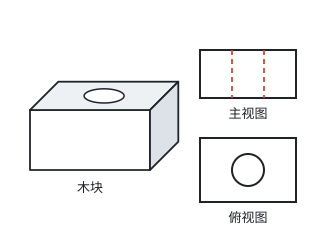
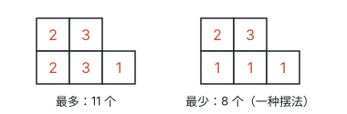
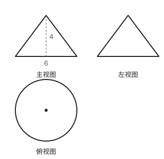
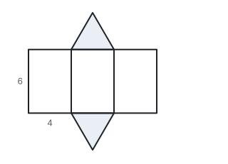

# 投影与视图

> 对应人教版九年级下册“投影与视图”一章。

**用光线照射物体，在某个平面上得到的影子叫物体的投影；把光线换成视线、从三个规定的方向去看，就得到物体的三视图。** 投影和视图都是把立体图形变成平面图形的办法。

## 从哪里来

阳光下的树影、灯光下的人影、皮影戏里幕布上的影子，都是投影。照射的光线叫**投影线**，影子所在的平面叫**投影面**。

影子的形状和大小由两件事决定：光线是怎样射来的，物体和投影面是怎样摆放的。光线有两种典型情况：

## 平行投影和中心投影

| 投影 | 投影线 | 例子 | 等高的物体 | 可以用来 |
| --- | --- | --- | --- | --- |
| 平行投影 | 互相平行 | 太阳光下的影子 | 同一时刻影子一样长，影长与物高成比例 | 用影长测高度 |
| 中心投影 | 从一点出发 | 路灯、手电筒、台灯下的影子 | 离光源越远，影子越长 | 由影子找光源的位置 |

**平行投影：** 太阳离地球非常远，射到地面上的光线可以看成平行的。同一时刻，竖直的物体和它的影子、光线组成的直角三角形，一个锐角都等于光线和地面的夹角，所以都相似，**物高与影长的比都相等**。第八部分“相似”中测树高的例题就是这样做的：同一时刻，身高 1.6 m 的小明影长 1.2 m，树的影长 6 m，树高与影长的比也等于 $1.6 : 1.2$，所以树高是 $\frac{1.6 \times 6}{1.2} = 8$（m）。一天中太阳的位置在变，影子的方向和长短也在变：上午影子偏向西，中午最短，下午偏向东。

**中心投影：** 灯光从一点射出。把两个物体的顶端和各自影子的端点分别连成直线，两条直线的交点就是光源。

**例 1**　如图，路灯 $AB$ 竖直立在地面上，身高 1.5 m 的小明站在 $D$ 处，$BD = 4$ m，他的影长 $DE = 2$ m。

（1）求路灯的高 $AB$；

（2）小明沿 $BD$ 方向再走 3 m 到 $D'$ 处，这时他的影长 $D'E'$ 是多少？

**思路：** 光线 $AE$ 经过小明的头顶 $C$。人和路灯都垂直于地面，$CD \parallel AB$，于是 $\triangle ECD$ 和 $\triangle EAB$ 是 A 字型的相似三角形。第（2）问换了位置，但还是同一个图形，只是未知数变成了影长。

**解：**（1）因为 $CD \parallel AB$，所以 $\triangle ECD \sim \triangle EAB$，

$$\frac{CD}{AB} = \frac{DE}{BE}, \quad \frac{1.5}{AB} = \frac{2}{4 + 2},$$

所以 $AB = 4.5$ m。

（2）此时 $BD' = 4 + 3 = 7$（m）。设 $D'E' = x$ m，同理 $\triangle E'C'D' \sim \triangle E'AB$，

$$\frac{1.5}{4.5} = \frac{x}{7 + x}.$$

两边乘 $4.5(7 + x)$，得 $1.5(7 + x) = 4.5x$，解得 $x = 3.5$。经检验，$x = 3.5$ 是方程的解。答：影长是 3.5 m。

**想一想：** 上面算了两个位置：离灯 4 m 时影长 2 m，离灯 7 m 时影长 3.5 m，每换一个位置都要重新列比例、解方程。能不能一次说清“走到哪里，影子多长”？把位置也用字母表示：设小明离路灯底部 $x$ m，影长 $y$ m（这里 $x$ 表示离灯的距离，不再是第（2）问的影长）。同样由 $\triangle ECD \sim \triangle EAB$，

$$\frac{1.5}{4.5} = \frac{y}{x + y}.$$

左边化简是 $\frac{1}{3}$，所以 $x + y = 3y$，即

$$y = \frac{1}{2}x.$$

这个 $\frac{1}{2}$ 从哪里来？人高 1.5 m，是灯高 4.5 m 的 $\frac{1}{3}$，所以影长占“离灯距离 + 影长”的 $\frac{1}{3}$，也就是离灯距离的一半。

$y = \frac{1}{2}x$ 是正比例函数（见第七部分“一次函数”）：人离灯越远，影子越长，而且均匀变长，离灯每远 1 m，影子变长 0.5 m；走到灯底下（$x = 0$），影子缩成 0。把前面两个位置代进去：$x = 4$ 时 $y = 2$，$x = 7$ 时 $y = 3.5$，和上面算的一致。有了这个式子，小明走到哪里，影子多长，一眼就能看出来。

## 正投影

平行投影中，投影线**垂直**于投影面时，叫**正投影**。一条线段的正投影有多长，要看它和投影面怎样摆放：

- **平行于投影面：** $AA'$、$BB'$ 都垂直于投影面，$AA'B'B$ 是矩形，所以 $A'B' = AB$；
- **倾斜于投影面：** 设 $AB$ 与投影面成 $\alpha$ 角，过 $A$ 作投影面的平行线，得到一个斜边为 $AB$ 的直角三角形，$A'B' = AB \cdot \cos \alpha$，比 $AB$ 短（见第八部分“锐角三角函数”）；
- **垂直于投影面：** 正投影是一个点。

平面图形也一样：平行于投影面时，正投影和原图形全等；倾斜时，形状会被“压扁”；垂直时，缩成一条线段。所以要看清一个面的真实形状，就要让它平行于投影面。

## 三视图

从一个方向看一个物体，看到的就是物体在这个方向上的正投影，叫**视图**。一个视图只能反映物体的两个方向的尺寸，所以要从三个互相垂直的方向去看：

- 从正面看，得到**主视图**；
- 从左面看，得到**左视图**；
- 从上面看，得到**俯视图**。

把物体的左右方向叫“长”，前后方向叫“宽”，上下方向叫“高”。三个视图各反映两个尺寸：

| 视图 | 看的方向 | 反映的尺寸 | 位置 |
| --- | --- | --- | --- |
| 主视图 | 从前往后 | 长和高 | 左上 |
| 俯视图 | 从上往下 | 长和宽 | 主视图的正下方 |
| 左视图 | 从左往右 | 宽和高 | 主视图的正右方 |

三视图这样排，是为了让共有的尺寸对齐：主视图和俯视图都反映长，就上下对正，左右边界对齐；主视图和左视图都反映高，就左右摆齐，上下边界对齐；俯视图和左视图都反映宽，所以**俯视图的上下宽度等于左视图的左右宽度**。

读图时还要分清方向：俯视图的**下方**是物体的前面；左视图的**右方**是物体的前面（站在物体左边往右看，物体的前面在你的右手边）。上图中较高的部分在物体后部，所以在俯视图里靠上，在左视图里靠左。

**看得见的轮廓线画实线，看不见的轮廓线画虚线。** 比如一块中间打了竖直圆孔的木块，孔在主视图里看不见，要画成两条竖直的虚线；从上往下看，孔看得见，俯视图里是一个实线的圆。

常见几何体的三视图：

| 几何体 | 主视图 | 左视图 | 俯视图 |
| --- | --- | --- | --- |
| 正方体 | 正方形 | 正方形 | 正方形 |
| 长方体 | 长方形 | 长方形 | 长方形 |
| 圆柱（竖放） | 长方形 | 长方形 | 圆 |
| 圆锥（竖放） | 等腰三角形 | 等腰三角形 | 圆和圆心 |
| 球 | 圆 | 圆 | 圆 |

圆锥的俯视图里有圆心那一点，因为从上往下看，顶点正对着底面圆心。

## 由三视图想象几何体

反过来，由三视图想象物体的形状，常用的顺序是：**先看俯视图定“地基”，再用主视图和左视图定高度。**

**例 2**　用若干个大小相同的小正方体搭成一个几何体，它的主视图和俯视图如图所示。搭成这个几何体最多需要几个小正方体？最少需要几个？

**思路：** 俯视图告诉我们哪些位置上有小正方体：后排 2 个位置，前排 3 个位置，每个位置至少有 1 个。主视图告诉我们的是**每一列最高的那一摞有多高**，至于这一列前后两个位置各有几个，主视图看不出来。

- 左边一列：前后两个位置，最高是 2；
- 中间一列：前后两个位置，最高是 3；
- 右边一列：只有前排一个位置，高是 1。

**解：** 把每个位置上小正方体的个数写在俯视图的格子里：

- **最多：** 每个位置都摆到这一列的最高高度，共 $2 + 2 + 3 + 3 + 1 = 11$ 个。
- **最少：** 每一列只要有一个位置达到最高高度，其余位置各摆 1 个，共 $(2 + 1) + (3 + 1) + 1 = 8$ 个。最少时哪个位置摆高都可以，摆法不止一种。

答：最多需要 11 个，最少需要 8 个。

**例 3**　一个几何体的三视图如图所示（单位：cm）。求这个几何体的侧面积和全面积。

**思路：** 俯视图是带圆心的圆，主视图、左视图是等腰三角形，这是一个竖放的圆锥。主视图的底边是底面直径，高是圆锥的高；求侧面积还需要母线长，它是由高、底面半径和母线组成的直角三角形的斜边。

**解：** 这个几何体是圆锥，底面半径 $r = 3$ cm，高 $h = 4$ cm。由勾股定理，母线长 $l = \sqrt{3^2 + 4^2} = 5$（cm）。

侧面积 $\pi r l = \pi \times 3 \times 5 = 15\pi$（$\text{cm}^2$），底面积 $\pi r^2 = 9\pi$（$\text{cm}^2$），全面积为 $15\pi + 9\pi = 24\pi$（$\text{cm}^2$）。

圆锥侧面积公式的由来见第九部分“与圆有关的计算”。

## 立体图形、展开图与三视图

把立体图形变成平面图形，有两种办法，得到的东西不一样：

| 办法 | 怎样得到 | 保留了什么 | 丢掉了什么 |
| --- | --- | --- | --- |
| 展开图 | 沿棱剪开，把所有的面摊平在一个平面上 | 每个面的真实形状和大小 | 面与面之间的立体位置关系 |
| 三视图 | 从三个方向作正投影 | 长、宽、高和各个方向上的轮廓 | 倾斜的面的真实形状；看不见的部分要靠虚线补 |

展开图适合算表面积、做模型；三视图适合表示形状和尺寸。一个面只有平行于投影面时，在视图里才是真实形状，所以倾斜的面要从展开图或计算中求真实大小，例 3 的母线长就是这样算出来的：视图里看不到母线的真实长度，是由圆锥的高 4 cm 和底面半径 3 cm 用勾股定理算出 5 cm。展开图的读法见第五部分“几何图形初步”。

**制作立体模型。** 把三视图、想象、展开图连起来，可以亲手做一个模型来检验：

1. 由三视图想象出几何体的形状，从视图中读出各部分的尺寸；
2. 画出它的展开图，尺寸和三视图一致；
3. 剪下、折叠、粘好，做成模型；
4. 从正面、左面、上面看模型，画出三视图，和原来的对照。

比如一个直三棱柱，俯视图是边长 4 cm 的等边三角形，主视图和左视图都是高 6 cm 的长方形。它的侧面是三个 4 cm × 6 cm 的长方形，上下底面是两个边长 4 cm 的等边三角形，展开图可以画成：

## 易错点

- **左视图放错位置或看错方向。** 左视图画在主视图的正右方，是从左往右看得到的；物体的前面在左视图的右边。
- **看不见的轮廓线没画成虚线。** 被挡住的棱和轮廓线也要画出来，用虚线。
- **分不清平行投影和中心投影。** 看投影线：互相平行的是平行投影（太阳光），交于一点的是中心投影（灯光）。在中心投影下，影长与物高不再有固定的比，要用相似三角形具体算。
- **以为正投影和原线段一样长。** 只有线段平行于投影面时才一样长，倾斜时变短。
- **圆锥的俯视图漏了圆心。** 顶点投影在底面圆心，要画出这一点。
- **用主视图直接数小正方体。** 主视图只反映每一列的最高高度，前后有几个位置要看俯视图；最多、最少要分开想。

## 联系

- **相似：** 平行投影中影长与物高成比例，中心投影的影子问题是 A 字型相似三角形。见第八部分“相似”。
- **锐角三角函数：** 倾斜的线段的正投影长等于原长乘以夹角的余弦。见第八部分“锐角三角函数”。
- **一次函数：** 路灯下影长是离灯距离的正比例函数。见第七部分“一次函数”。
- **几何图形初步：** 立体图形与平面图形的互相转化，除了三视图，还有展开图。见第五部分“几何图形初步”。
- **勾股定理：** 由三视图求圆锥的母线、长方体的对角线，都要用勾股定理。见第五部分“勾股定理”。
- **与圆有关的计算：** 圆锥的侧面展开图是扇形，侧面积 $\pi r l$ 由扇形面积推出。见第九部分“与圆有关的计算”。
