# 相似 ★

> 对应人教版九年级下册“相似”一章。

**形状相同、大小不一定相同的图形叫相似图形；相似就是把图形的每一条线段都乘同一个数 $k$：对应角相等，对应边成比例。**

## 从哪里来

把一张照片等比例放大、按比例尺画地图、用复印机缩印一页纸，得到的图形和原来的“样子一样”，只是大小变了。“样子一样”要说清楚，就要问：变的是什么，不变的是什么？

- 放大到 2 倍，**所有**线段都变成原来的 2 倍，不能有的边放大、有的边不变，否则图形会被拉扁；
- 所有的角都不变，否则图形会变歪。

所以两个多边形相似，是指：**对应角相等，对应边成比例**。各对应边的比 $k$ 叫**相似比**。$\triangle ABC$ 与 $\triangle A'B'C'$ 相似，记作 **$\triangle ABC \sim \triangle A'B'C'$**，和全等一样，字母的顺序表示对应关系。

两个条件缺一不可：

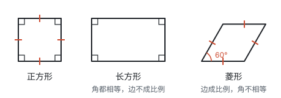

正方形和长方形的四个角都是直角，但长方形的长和宽不相等，不能由正方形按同一个比放大得到；正方形和菱形的四条边都相等，边是成比例的，但菱形的角变了。它们都和正方形不相似。

相似比 $k = 1$ 时，对应边相等，对应角也相等，就是全等。**全等是相似的特殊情况。**

## 比例线段

相似离不开“比”。四条线段 $a$、$b$、$c$、$d$ 中，如果 $a$ 与 $b$ 的比等于 $c$ 与 $d$ 的比，即

$$\frac{a}{b} = \frac{c}{d},$$

就说这四条线段是**成比例线段**。求线段的比时，两条线段要用同一个长度单位，比值是一个没有单位的数。

比例式本质是一个等式，所以可以用等式的性质变形：

| 性质 | 写法 | 怎样得到 |
| --- | --- | --- |
| 基本性质 | $\frac{a}{b} = \frac{c}{d}$ 可以化成 $ad = bc$ | 两边都乘 $bd$ |
| 比例中项 | 如果 $\frac{a}{b} = \frac{b}{c}$，那么 $b^2 = ac$，$b$ 叫 $a$、$c$ 的比例中项 | 基本性质的特殊情况 |
| 合比 | $\frac{a}{b} = \frac{c}{d}$ 可以化成 $\frac{a + b}{b} = \frac{c + d}{d}$ | 两边都加 1 |

合比要成立，前提是**两个比相等**。它说的是：两个比相等，把每个比的前项和后项加起来作新的前项，得到的两个比仍然相等。道理就是两边都加 1：$\frac{a}{b} + 1 = \frac{c}{d} + 1$，通分就是 $\frac{a + b}{b} = \frac{c + d}{d}$。

它在相似里的用处，是处理“两条线段按同样的比例切开”的情况。如图，$DE \parallel BC$，$AD = 2$，$DB = 3$，$AE = 4$，$EC = 6$：

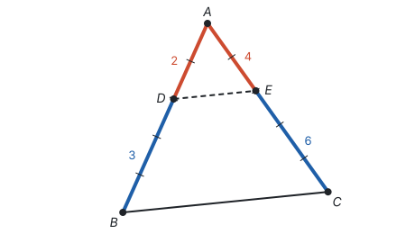

- **部分比部分相等：** $\frac{AD}{DB} = \frac{AE}{EC}$，即 $\frac{2}{3} = \frac{4}{6}$。平行线截出来的就是这种关系（见下文“平行线分线段成比例”）。
- **合比，得到整体比部分相等：** 两边都加 1，$\frac{AD + DB}{DB} = \frac{AE + EC}{EC}$，即 $\frac{AB}{DB} = \frac{AC}{EC}$，也就是 $\frac{5}{3} = \frac{10}{6}$。
- **再得到部分比整体相等：** 把上式倒过来，$\frac{DB}{AB} = \frac{EC}{AC} = \frac{3}{5}$；用 1 减去它，$\frac{AD}{AB} = \frac{AE}{AC} = \frac{2}{5}$。

用份数看更直观：$AD : DB = 2 : 3$，就是把 $AB$ 分成 5 份，$D$ 在第 2 份处；$AE : EC$ 也是 $2 : 3$，$AC$ 也分成 5 份，$E$ 也在第 2 份处。两条边不一样长（$AB = 5$，$AC = 10$，每份的长短不同），但切的位置相同，所以 $AD$ 占 $AB$ 的 $\frac{2}{5}$，$AE$ 也占 $AC$ 的 $\frac{2}{5}$。合比做的就是“把份数加成整体”这一步。

为什么要这样换？平行线直接给出的是“部分比部分”，$\frac{AD}{DB} = \frac{AE}{EC}$；而相似三角形 $\triangle ADE \sim \triangle ABC$ 的相似比要用“部分比整体”，$\frac{AD}{AB} = \frac{AE}{AC} = \frac{DE}{BC}$，分母是整条边。合比就是这两种写法之间的桥。

## 黄金分割

在线段 $AB$ 上取一点 $C$，如果较长的一段 $AC$ 是全长 $AB$ 和较短的一段 $CB$ 的比例中项，即 $AC^2 = AB \cdot CB$，就说点 $C$ 把线段 $AB$ **黄金分割**，点 $C$ 叫线段 $AB$ 的**黄金分割点**。

设 $AB = 1$，$AC = x$，则 $CB = 1 - x$，条件变成 $x^2 = 1 - x$。解这个一元二次方程，取正根：

$$x = \frac{\sqrt{5} - 1}{2} \approx 0.618.$$

也就是说 $AC \approx 0.618 AB$（见第四部分“一元二次方程”）。黄金分割点离哪一端近都可以，所以一条线段有两个黄金分割点。

黄金分割为什么和相似有关？看一个长和宽的比是 $1 : x$ 的长方形 $ABCD$，从中截去正方形 $AEFD$：

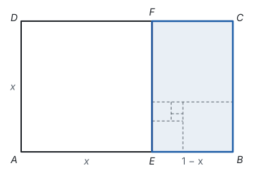

原长方形的宽与长之比是 $\frac{x}{1}$；剩下的长方形 $EBCF$ 的宽是 $EB = 1 - x$，长是 $BC = x$，宽与长之比是 $\frac{1 - x}{x}$。要让剩下的长方形和原来的**相似**，就要

$$\frac{1 - x}{x} = \frac{x}{1},$$

仍然是 $x^2 = 1 - x$。所以宽与长之比为 0.618 的长方形有一个特点：截去一个正方形，剩下的还是和它相似的长方形，可以一直截下去。这样的长方形叫**黄金矩形**。

## 平行线分线段成比例

相似的判定要从一个基本事实出发（见第一部分“基本事实”）：

**两条直线被一组平行线所截，所得的对应线段成比例。**

把它用到三角形里：在 $\triangle ABC$ 中作 $DE \parallel BC$，$D$、$E$ 分别在直线 $AB$、$AC$ 上。再过顶点 $A$ 作直线 $l \parallel BC$。这样 $l$、$DE$、$BC$ 是三条互相平行的直线，它们截直线 $AB$、$AC$，在 $AB$ 上截出 $AD$、$DB$，在 $AC$ 上截出 $AE$、$EC$，由基本事实，这些对应线段成比例。多作直线 $l$，是因为 $AD$、$AE$ 的一端在顶点 $A$ 处，要让它们也成为“被平行线截出的线段”，$A$ 处就得有一条平行线。于是得到推论：**平行于三角形一边的直线截其他两边（或两边的延长线），所得的对应线段成比例。**

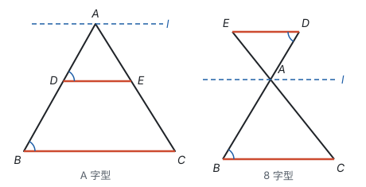

两种图里都有

$$\frac{AD}{AB} = \frac{AE}{AC}.$$

A 字型中还有 $\frac{AD}{DB} = \frac{AE}{EC}$，两个比例式可以用合比互相转化。$D$、$E$ 恰好是 $AB$、$AC$ 的中点时，$\frac{AD}{AB} = \frac{1}{2}$，这就是三角形的中位线（见第五部分“四边形”）。

## 相似三角形的判定

### 起点：平行线截出相似三角形

**平行于三角形一边的直线和其他两边（或两边的延长线）相交，所构成的三角形与原三角形相似。**

以 A 字型为例，$DE \parallel BC$，要证 $\triangle ADE \sim \triangle ABC$，按定义要说明三个角分别相等、三条边成比例。

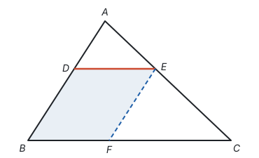

1. **角：** $\angle A$ 是公共角；$DE \parallel BC$，所以 $\angle ADE = \angle B$，$\angle AED = \angle C$（两直线平行，同位角相等）。
2. **两条边：** 由上一节的推论（平行于三角形一边的直线截其他两边，所得的对应线段成比例），$\frac{AD}{AB} = \frac{AE}{AC}$。
3. **第三条边：** $DE$ 和 $BC$ 不在同一对截线上，要把 $DE$ “搬”到 $BC$ 上。过 $E$ 作 $EF \parallel AB$ 交 $BC$ 于点 $F$。四边形 $DBFE$ 两组对边分别平行，是平行四边形，所以 $DE = BF$。对直线 $CA$、$CB$ 用推论，$\frac{BF}{BC} = \frac{AE}{AC}$，也就是 $\frac{DE}{BC} = \frac{AE}{AC}$。

三个角分别相等，三条边的比都等于 $\frac{AE}{AC}$，所以 $\triangle ADE \sim \triangle ABC$。

### 三个判定：截一个全等的小三角形

有了这个起点，判定就好推了。要证 $\triangle A'B'C'$（较小）和 $\triangle ABC$ 相似，办法是：**在 $\triangle ABC$ 的边 $AB$ 上截取 $AD = A'B'$，作 $DE \parallel BC$ 交 $AC$ 于点 $E$。** 由上面的结论，$\triangle ADE \sim \triangle ABC$；只要再证 $\triangle ADE \cong \triangle A'B'C'$，$\triangle A'B'C'$ 也就和 $\triangle ABC$ 相似了。

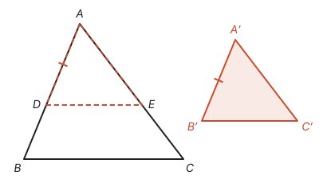

| 判定 | 已知 | 为什么 $\triangle ADE \cong \triangle A'B'C'$ |
| --- | --- | --- |
| 两角分别相等 | $\angle A = \angle A'$，$\angle B = \angle B'$ | $\angle ADE = \angle B = \angle B'$，又 $AD = A'B'$，$\angle A = \angle A'$，用 ASA |
| 两边成比例且夹角相等 | $\frac{A'B'}{AB} = \frac{A'C'}{AC}$，$\angle A = \angle A'$ | $\frac{AE}{AC} = \frac{AD}{AB} = \frac{A'B'}{AB} = \frac{A'C'}{AC}$，所以 $AE = A'C'$，用 SAS |
| 三边成比例 | $\frac{A'B'}{AB} = \frac{B'C'}{BC} = \frac{C'A'}{CA}$ | 同理得 $AE = A'C'$，$DE = B'C'$，用 SSS |

**每一条相似的判定，都是一条全等的判定把“边相等”换成“边成比例”**，证明时也正是借用了对应的全等判定。直角三角形还有一条：**斜边和一条直角边成比例的两个直角三角形相似**，因为由勾股定理，第三边也成同样的比，就变成了三边成比例（对应全等里的 HL）。

和全等一样，“两边成比例且其中一边的对角相等”不能判定相似。而“三个角分别相等”在全等里不行，在相似里只要两个角就够了：相似本来就不管大小。

## 相似三角形的性质

相似三角形的对应角相等，对应边成比例，这是定义。由此还能推出更多的“对应量”之比：

- **对应高、对应中线、对应角平分线的比都等于相似比。** 比如 $\triangle ABC \sim \triangle A'B'C'$，$AD$、$A'D'$ 是对应的高，那么 $\triangle ABD$ 和 $\triangle A'B'D'$ 中 $\angle B = \angle B'$，$\angle ADB = \angle A'D'B' = 90^\circ$，两角分别相等，所以相似，$\frac{AD}{A'D'} = \frac{AB}{A'B'} = k$。中线、角平分线也一样，找出含它们的那一对三角形：若 $AD$、$A'D'$ 是对应中线，则 $\frac{BD}{B'D'} = \frac{BC}{B'C'} = k$，又 $\frac{AB}{A'B'} = k$，$\angle B = \angle B'$，两边成比例且夹角相等；若是对应角平分线，则 $\angle BAD = \angle B'A'D'$（相等的角的一半），又 $\angle B = \angle B'$，两角分别相等。
- **周长的比等于相似比。** 三条边都乘 $k$，和也乘 $k$。
- **面积的比等于相似比的平方。** 三角形面积是 $\frac{1}{2} \times \text{底} \times \text{高}$，底乘 $k$，高也乘 $k$，面积就乘 $k^2$。

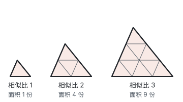

长度是“一维”的量，乘 $k$；面积是“二维”的量，乘 $k^2$。把一张照片的长和宽都放大到 2 倍，面积是原来的 4 倍，道理相同。

## 例题

**例 1**　如图，在 $\triangle ABC$ 中，$DE \parallel BC$，$AD = 3$，$DB = 2$，$BC = 10$。求 $DE$ 的长，以及 $\triangle ADE$ 与四边形 $DBCE$ 的面积比。

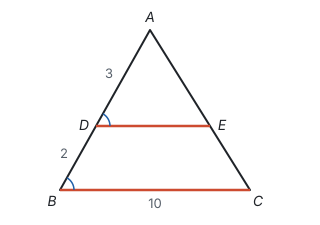

**思路：** $DE \parallel BC$ 马上给出 $\triangle ADE \sim \triangle ABC$。相似比是哪两条边的比？$DE$ 和 $BC$ 是对应边，和它们对应的是 $AD$ 与 $AB$，不是 $AD$ 与 $DB$。

**解：** 因为 $DE \parallel BC$，所以 $\triangle ADE \sim \triangle ABC$，相似比为

$$\frac{AD}{AB} = \frac{3}{3 + 2} = \frac{3}{5}.$$

所以 $\frac{DE}{BC} = \frac{3}{5}$，$DE = 10 \times \frac{3}{5} = 6$。

面积比等于相似比的平方，$S_{\triangle ADE} : S_{\triangle ABC} = 9 : 25$。把 $\triangle ABC$ 的面积看成 25 份，$\triangle ADE$ 占 9 份，四边形 $DBCE$ 占 $25 - 9 = 16$ 份，所以 $\triangle ADE$ 与四边形 $DBCE$ 的面积比是 $9 : 16$。

**例 2**　如图，在 $\triangle ABC$ 中，$\angle ACB = 90^\circ$，$CD \perp AB$ 于点 $D$。求证：$AC^2 = AD \cdot AB$。若 $AC = 15$，$BC = 20$，求 $AD$ 和 $CD$。

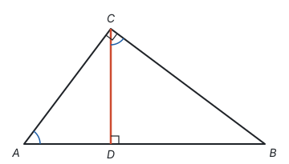

**思路：** 要证的式子是乘积相等，由比例的基本性质，它就是 $\frac{AD}{AC} = \frac{AC}{AB}$。这三条线段里，$AD$、$AC$ 在 $\triangle ACD$ 中，$AC$、$AB$ 在 $\triangle ABC$ 中，所以去证这两个三角形相似。

**证明：** 在 $\triangle ACD$ 和 $\triangle ABC$ 中，$\angle A = \angle A$（公共角），$\angle ADC = \angle ACB = 90^\circ$，所以 $\triangle ACD \sim \triangle ABC$（两角分别相等），所以 $\frac{AD}{AC} = \frac{AC}{AB}$，即 $AC^2 = AD \cdot AB$。

**计算：** 由勾股定理，$AB = \sqrt{15^2 + 20^2} = \sqrt{625} = 25$。所以 $AD = \frac{AC^2}{AB} = \frac{225}{25} = 9$，$BD = AB - AD = 16$。

求 $CD$ 可以有两种想法：

- **再找一对相似三角形。** 同理 $\triangle CBD \sim \triangle ABC$，所以 $\triangle ACD \sim \triangle CBD$，得 $CD^2 = AD \cdot BD = 9 \times 16 = 144$，$CD = 12$。
- **把面积算两遍。** $\triangle ABC$ 的面积既等于 $\frac{1}{2} AC \cdot BC$，又等于 $\frac{1}{2} AB \cdot CD$，所以 $CD = \frac{15 \times 20}{25} = 12$。

**想一想：** 图中三个直角三角形 $\triangle ABC$、$\triangle ACD$、$\triangle CBD$ 两两相似，因为它们各有一个直角，又两两共用一个锐角（图中蓝色弧标出的 $\angle A = \angle BCD$，都是 $\angle B$ 的余角）。这种“直角三角形斜边上的高”的图形里，任意两个三角形都可以列比例式；只求高时，面积法更快。

**例 3**　同一时刻，身高 1.6 m 的小明在阳光下的影长是 1.2 m，一棵树的影长是 6 m。这棵树有多高？

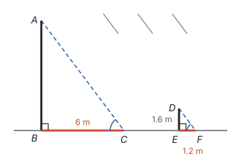

**思路：** 树高没法直接量，影长能量。太阳离得很远，同一时刻照到地面上的光线可以看成平行的，于是树、影子、光线围成的三角形，和人、影子、光线围成的三角形形状相同。

**解：** 因为 $AC \parallel DF$，所以 $\angle ACB = \angle DFE$；又 $\angle ABC = \angle DEF = 90^\circ$，所以 $\triangle ABC \sim \triangle DEF$，

$$\frac{AB}{DE} = \frac{BC}{EF}, \quad AB = \frac{1.6 \times 6}{1.2} = 8.$$

答：树高 8 m。

**例 4**　为了测量河宽，在河对岸选一个目标 $P$，在这一岸找到点 $Q$，使 $PQ$ 与河岸垂直。沿河岸从 $Q$ 走 40 m 到 $R$，在 $R$ 处立一根标杆，再走 20 m 到 $S$；从 $S$ 沿与河岸垂直的方向往远离河的方向走，直到点 $T$，使 $T$、$R$、$P$ 在同一直线上，量得 $ST = 30$ m。求河宽 $PQ$。

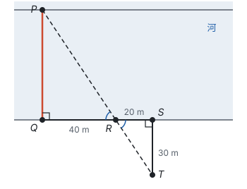

**思路：** 河宽过不去，就在岸上造一个“缩小版”的三角形：$\triangle PQR$ 和 $\triangle TSR$ 在 $R$ 处是对顶角，又各有一个直角，是 8 字型的相似三角形。

**解：** $\angle PRQ = \angle TRS$（对顶角相等），$\angle PQR = \angle TSR = 90^\circ$，所以 $\triangle PQR \sim \triangle TSR$，

$$\frac{PQ}{TS} = \frac{QR}{SR}, \quad PQ = \frac{30 \times 40}{20} = 60.$$

答：河宽 60 m。

**回顾：** 测高、测距的共同想法是：**要量的长度够不着，就找一个和它相似、又能量的三角形。** 相似三角形把“形状”搬到了能测量的地方，比例式再把长度换算回来。

## 位似

把一个图形放大或缩小，最直接的画法是：选一个点 $O$，把每个点 $A$ 沿射线 $OA$ 推到 $A'$，使 $OA' = k \cdot OA$。

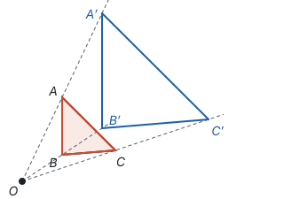

这样得到的两个图形不仅相似，而且**对应点的连线都经过同一点 $O$，对应边互相平行（或在同一条直线上）**。这样的两个图形叫**位似图形**，点 $O$ 叫**位似中心**，$k$ 叫**位似比**。

为什么 $\triangle A'B'C' \sim \triangle ABC$？因为 $\frac{OA'}{OA} = \frac{OB'}{OB} = k$，又 $\angle AOB$ 是公共角，所以 $\triangle OA'B' \sim \triangle OAB$（两边成比例且夹角相等），得 $A'B' = k \cdot AB$，且 $\angle OA'B' = \angle OAB$，$A'B' \parallel AB$。三条边都这样，所以三边成比例。

位似中心也可以在两个图形之间：把每个点 $A$ 推到射线 $OA$ 的反向延长线上，同样使 $OA' = k \cdot OA$，得到的图形在 $O$ 的另一侧，是倒过来的（见下面例 5 的图）。

**坐标系中的位似。** 以原点 $O$ 为位似中心，位似比为 $k$，点 $(x, y)$ 的对应点是 $(kx, ky)$ 或 $(-kx, -ky)$。理由是：从点 $A(x, y)$ 和它的对应点 $A'$ 分别向 $x$ 轴作垂线，得到的两个直角三角形也是位似的，直角边都变成原来的 $k$ 倍，而两条直角边的长正是横坐标和纵坐标的绝对值。

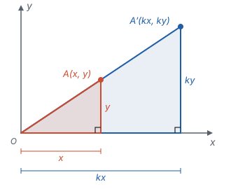

**例 5**　$\triangle ABC$ 的顶点是 $A(2, 4)$，$B(6, 4)$，$C(4, 2)$。以原点 $O$ 为位似中心，位似比为 $\frac{1}{2}$，把 $\triangle ABC$ 缩小，写出对应点的坐标。

**思路：** 位似比为 $\frac{1}{2}$，就是每个点到原点 $O$ 的距离都变成一半；缩小后的图形可以在 $O$ 的同一侧，也可以在另一侧，两种都要写。

**解：** 把每个点的横、纵坐标都乘 $\frac{1}{2}$，得 $A'(1, 2)$，$B'(3, 2)$，$C'(2, 1)$；都乘 $-\frac{1}{2}$，得 $A''(-1, -2)$，$B''(-3, -2)$，$C''(-2, -1)$。两个三角形都符合要求。

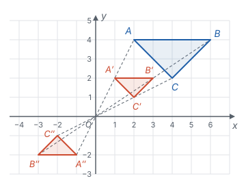

和坐标系中的其他变化放在一起看：

| 变化 | 点 $(x, y)$ 变成 | 形状 | 大小 |
| --- | --- | --- | --- |
| 平移 | $(x + a, y + b)$ | 不变 | 不变 |
| 关于 $x$ 轴对称 | $(x, -y)$ | 不变 | 不变 |
| 绕原点旋转 $180^\circ$ | $(-x, -y)$ | 不变 | 不变 |
| 以原点为位似中心，位似比为 $k$ | $(kx, ky)$ 或 $(-kx, -ky)$ | 不变 | 边长变成 $k$ 倍 |

平移、轴对称、旋转得到全等的图形，位似得到相似的图形。取 $k = 1$ 时的 $(-x, -y)$，正好是绕原点旋转 $180^\circ$。

## 易错点

- **对应关系没对齐就写比例式。** $\triangle ABC \sim \triangle DEF$ 的比例式是 $\frac{AB}{DE} = \frac{BC}{EF} = \frac{CA}{FD}$，对应边要从相似式里按字母位置读出来。题目只说“两个三角形相似”而没给出对应关系时，要分情况讨论。
- **把 $\frac{AD}{DB}$ 当成相似比。** A 字型中 $\frac{DE}{BC} = \frac{AD}{AB}$，是“部分比整体”；$\frac{AD}{DB} = \frac{AE}{EC}$ 只对两条边上的线段成立，不能用来求 $DE$。
- **面积比用了相似比。** 面积比是相似比的平方；反过来，已知面积比 $4 : 9$，相似比是 $2 : 3$。
- **把相似比的方向弄反。** $\triangle ABC$ 与 $\triangle A'B'C'$ 的相似比是 $k$，那么 $\triangle A'B'C'$ 与 $\triangle ABC$ 的相似比是 $\frac{1}{k}$。
- **位似只画了一侧。** 没有说明在位似中心的哪一侧时，两侧的图形都符合要求，坐标乘 $k$ 和乘 $-k$ 各有一个答案。
- **黄金分割点只找了一个。** 一条线段有两个黄金分割点，分别靠近两个端点。

## 联系

- **全等三角形：** 全等是相似比为 1 的相似；相似的判定由全等的判定推出，一一对应。见第五部分“全等三角形”。
- **基本事实：** 相似三角形的全部判定都从“平行线分线段成比例”出发。见第一部分“基本事实”。
- **四边形：** 三角形的中位线是平行线截三角形时比为 $1 : 2$ 的特例。见第五部分“四边形”。
- **一元二次方程：** 黄金分割数是方程 $x^2 + x - 1 = 0$ 的正根。见第四部分“一元二次方程”。
- **勾股定理：** 直角三角形斜边上的高分出的三个三角形两两相似，由此也能推出勾股定理。像例 2 那样，$\angle ACB = 90^\circ$，$CD \perp AB$ 于点 $D$，则 $AC^2 = AD \cdot AB$，$BC^2 = BD \cdot AB$，两式相加得 $AC^2 + BC^2 = AB^2$。见第五部分“勾股定理”。
- **平移、轴对称与旋转：** 这三种变化保持大小不变，位似改变大小、保持形状。见第六部分“平移、轴对称与旋转”。
- **锐角三角函数：** 有一个锐角相等的两个直角三角形相似，所以它们对应边的比相等，这个比只由锐角决定。见第八部分“锐角三角函数”。
- **投影与视图：** 阳光下的影长和物高成比例，路灯下的影子问题也是相似三角形。见第八部分“投影与视图”。
- **分类讨论：** 相似的对应关系不确定、位似在中心的哪一侧不确定时，都要分情况。见第十一部分“分类讨论”。
