# 锐角三角函数 ★

> 对应人教版九年级下册“锐角三角函数”一章。

**在直角三角形中，一个锐角的大小确定了，三条边两两之间的比就都确定了；这些比叫做这个锐角的三角函数。** 它们把“角”和“边”连了起来：知道角可以求边的比，知道边的比也可以求角。

## 从哪里来

一个斜坡有多陡，可以用坡角的大小来说，也可以用“升高的高度 ÷ 水平走过的距离”来说。这两种说法之间是什么关系？

在一个锐角 $\angle A$ 的一边上任取几个点 $B$、$B'$、$B''$，分别向另一边作垂线，得到几个直角三角形：

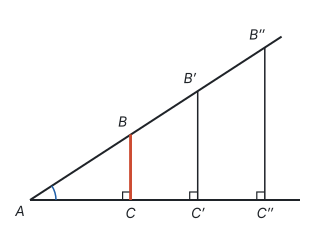

这些直角三角形都有一个直角，又共用 $\angle A$，两角分别相等，所以**全都相似**（见第八部分“相似”）。于是它们对应边的比相等：

$$\frac{BC}{AB} = \frac{B'C'}{AB'} = \frac{B''C''}{AB''}.$$

垂线画在哪里，三角形有多大，都不影响这个比值；只有 $\angle A$ 变了，比值才会变。**比值只由角决定**，所以可以把它看成角的“身份证”：给一个锐角，就对应一个确定的比值。每取一个锐角都对应唯一的比值，这正是函数的意思（见第七部分“函数”），所以叫三角函数。

## 正弦、余弦、正切

在 $\text{Rt}\triangle ABC$ 中，$\angle C = 90^\circ$，$\angle A$、$\angle B$、$\angle C$ 的对边分别是 $a$、$b$、$c$。对 $\angle A$ 来说，$a$ 是它的**对边**，$b$ 是它的**邻边**，$c$ 是**斜边**：

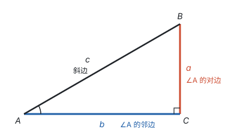

三条边两两相比，有三个常用的比值：

$$\sin A = \frac{\text{对边}}{\text{斜边}} = \frac{a}{c}, \qquad \cos A = \frac{\text{邻边}}{\text{斜边}} = \frac{b}{c}, \qquad \tan A = \frac{\text{对边}}{\text{邻边}} = \frac{a}{b}.$$

它们分别叫 $\angle A$ 的**正弦**、**余弦**、**正切**，统称 $\angle A$ 的锐角三角函数。$\sin A$ 是一个完整的记号，表示一个数，不是 $\sin$ 乘 $A$。

**斜边取 1 来看。** 既然比值和三角形的大小无关，不妨让斜边等于 1，这时对边的长就是 $\sin A$，邻边的长就是 $\cos A$：

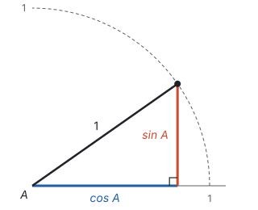

从图上能直接读出：

- 直角边比斜边短，所以 $0 < \sin A < 1$，$0 < \cos A < 1$；
- $\angle A$ 越大，对边越长、邻边越短：**$\sin A$ 随 $\angle A$ 的增大而增大，$\cos A$ 随 $\angle A$ 的增大而减小；**
- $\tan A$ 是对边除以邻边，分子变大、分母变小，也随 $\angle A$ 的增大而增大。$\tan A$ 越大，斜边越陡，这正是坡度要用的量。

## 三个比值之间的关系

三个比值来自同一个直角三角形，它们之间有关系，不用单独记：

| 关系 | 式子 | 从哪里来 |
| --- | --- | --- |
| 平方和为 1 | $\sin^2 A + \cos^2 A = 1$ | $\frac{a^2}{c^2} + \frac{b^2}{c^2} = \frac{a^2 + b^2}{c^2}$，由勾股定理 $a^2 + b^2 = c^2$，结果是 1 |
| 正切是正弦除以余弦 | $\tan A = \frac{\sin A}{\cos A}$ | $\frac{a}{c} \div \frac{b}{c} = \frac{a}{b}$ |
| 互余两角 | $\angle A + \angle B = 90^\circ$ 时，$\sin A = \cos B$，$\cos A = \sin B$ | $\angle A$ 的对边 $a$ 正是 $\angle B$ 的邻边，所以 $\sin A = \frac{a}{c} = \cos B$ |

其中 $\sin^2 A$ 表示 $(\sin A)^2$。

## 特殊角的三角函数值

$30^\circ$、$45^\circ$、$60^\circ$ 的三角函数值，都能从两个熟悉的三角形里读出来：

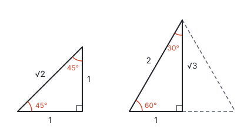

- **等腰直角三角形：** 两条直角边都取 1，由勾股定理斜边是 $\sqrt{2}$，两个锐角都是 $45^\circ$。
- **半个等边三角形：** 边长为 2 的等边三角形，作一条高，把它分成两个全等的直角三角形。每个直角三角形的斜边是 2，短直角边是底边的一半 1，另一条直角边（高）由勾股定理是 $\sqrt{2^2 - 1^2} = \sqrt{3}$。等边三角形的角是 $60^\circ$，高又平分顶角，所以两个锐角是 $60^\circ$ 和 $30^\circ$。

按定义直接读出比值：

| 角 | $\sin$ | $\cos$ | $\tan$ |
| --- | --- | --- | --- |
| $30^\circ$ | $\frac{1}{2}$ | $\frac{\sqrt{3}}{2}$ | $\frac{\sqrt{3}}{3}$ |
| $45^\circ$ | $\frac{\sqrt{2}}{2}$ | $\frac{\sqrt{2}}{2}$ | 1 |
| $60^\circ$ | $\frac{\sqrt{3}}{2}$ | $\frac{1}{2}$ | $\sqrt{3}$ |

比如 $\tan 30^\circ = \frac{1}{\sqrt{3}} = \frac{\sqrt{3}}{3}$（分母有理化，见第三部分“二次根式”）。表里的规律都能用前面的道理检查：$\sin 30^\circ = \cos 60^\circ$，因为 $30^\circ$ 和 $60^\circ$ 互余；$\sin$ 一列从上往下变大，$\cos$ 一列变小。

反过来，已知三角函数值也能求角：$\sin A = \frac{1}{2}$，$A$ 是锐角，那么 $A = 30^\circ$。其他角的三角函数值，以及由三角函数值求角，用计算器。

## 解直角三角形

直角三角形除了直角，还有 5 个元素：三条边和两个锐角。它们之间有三类关系：

- **三边之间：** $a^2 + b^2 = c^2$（勾股定理）；
- **两锐角之间：** $\angle A + \angle B = 90^\circ$；
- **边角之间：** $\sin A = \frac{a}{c}$，$\cos A = \frac{b}{c}$，$\tan A = \frac{a}{b}$。

由已知元素求出其余元素，叫**解直角三角形**。只要知道 5 个元素中的 2 个，而且**其中至少有一条边**，就能解出其余的。只知道两个角不行：角相同的直角三角形可大可小，都相似，边定不下来。这和“两角分别相等的三角形相似而不一定全等”是一回事。

怎样选用关系式：**选一个同时含有已知量和要求的量的式子。** 比如在 $\text{Rt}\triangle ABC$ 中，$\angle C = 90^\circ$，$\angle A = 30^\circ$，$AB = 8$，求 $BC$：$BC$ 是 $\angle A$ 的对边，$AB$ 是斜边，对边和斜边用正弦，$BC = AB \cdot \sin 30^\circ = 4$。同样，$AC = AB \cdot \cos 30^\circ = 4\sqrt{3}$，$\angle B = 60^\circ$。

**例 1**　在 $\triangle ABC$ 中，$\angle B = 30^\circ$，$\angle C = 45^\circ$，$AC = 2\sqrt{2}$。求 $BC$ 的长和 $\triangle ABC$ 的面积。

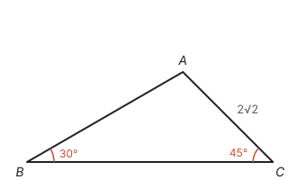

**思路：** 三角函数是在直角三角形里定义的，$\triangle ABC$ 不是直角三角形，先要造出直角。已知的两个角 $\angle B$、$\angle C$ 都在 $BC$ 的两端，从 $A$ 作 $BC$ 的垂线 $AD$，这两个角就分别落在两个直角三角形里，而且两个直角三角形共用 $AD$。先在已知一条边的 $\text{Rt}\triangle ADC$ 里算出 $AD$，再用 $AD$ 去解 $\text{Rt}\triangle ADB$。

**解：** 作 $AD \perp BC$ 于点 $D$。

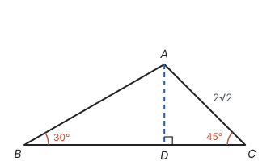

在 $\text{Rt}\triangle ADC$ 中，$\angle C = 45^\circ$，

$$AD = AC \cdot \sin 45^\circ = 2\sqrt{2} \times \frac{\sqrt{2}}{2} = 2, \qquad DC = AC \cdot \cos 45^\circ = 2.$$

在 $\text{Rt}\triangle ADB$ 中，$\angle B = 30^\circ$，$\tan B = \frac{AD}{BD}$，所以

$$BD = \frac{AD}{\tan 30^\circ} = \frac{2}{\frac{\sqrt{3}}{3}} = 2\sqrt{3}.$$

所以 $BC = BD + DC = 2\sqrt{3} + 2$，面积

$$S_{\triangle ABC} = \frac{1}{2} BC \cdot AD = \frac{1}{2} \times (2\sqrt{3} + 2) \times 2 = 2\sqrt{3} + 2.$$

**回顾：** 斜三角形作高，是把它化成直角三角形的常用办法。作哪条高要看条件：让已知的角留在直角三角形里，不要把它分开。

## 实际问题中的角和比

解实际问题，先要把题目里的说法翻译成直角三角形里的角或边的比：

| 说法 | 示意图 | 意思 | 注意 |
| --- | --- | --- | --- |
| 仰角、俯角 | 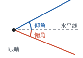 | 视线与**水平线**的夹角；视线在水平线上方是仰角，在下方是俯角 | 从水平线量起，不是从竖直方向量起 |
| 坡度 $i$ | 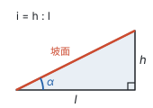 | 坡面的铅直高度 $h$ 与水平宽度 $l$ 的比，$i = h : l$，常写成 $1 : m$ | 坡面与水平面的夹角 $\alpha$ 叫坡角，$i = \frac{h}{l} = \tan \alpha$。坡度是比值，不是角 |
| 方位角 | 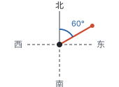 | 从正北或正南方向量起，偏向东或西的角，如“北偏东 $60^\circ$” | 先找南北方向线，再往东或西转 |

**例 2**　在地面上 $A$ 处测得塔顶 $C$ 的仰角为 $30^\circ$，向塔前进 20 m 到达 $B$ 处，测得塔顶 $C$ 的仰角为 $45^\circ$。$A$、$B$ 和塔底 $D$ 在同一直线上。求塔高 $CD$（结果保留根号，并求出精确到 0.1 m 的近似值。参考数据：$\sqrt{3} \approx 1.73$）。

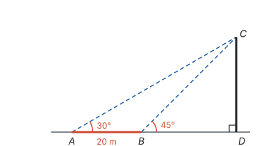

**思路：** 图里有两个直角三角形 $\triangle ACD$ 和 $\triangle BCD$，但哪一个都只知道一个角，没有已知的边；已知的 20 m 是两条直角边 $AD$ 和 $BD$ 的差。它们共用 $CD$，所以设 $CD = x$，把 $AD$、$BD$ 都用 $x$ 表示，再由 $AD - BD = 20$ 列方程。

**解：** 设 $CD = x$ m。

在 $\text{Rt}\triangle BCD$ 中，$\angle CBD = 45^\circ$，所以 $BD = CD = x$。

在 $\text{Rt}\triangle ACD$ 中，$\angle A = 30^\circ$，$\tan 30^\circ = \frac{CD}{AD}$，所以

$$AD = \frac{x}{\tan 30^\circ} = \sqrt{3} x.$$

由 $AD - BD = AB$，得 $\sqrt{3} x - x = 20$，所以

$$x = \frac{20}{\sqrt{3} - 1} = \frac{20(\sqrt{3} + 1)}{(\sqrt{3} - 1)(\sqrt{3} + 1)} = 10(\sqrt{3} + 1) \approx 10 \times 2.73 = 27.3.$$

答：塔高 $10(\sqrt{3} + 1)$ m，约 27.3 m。

**想一想：** 例 2 里的两个直角三角形 $\text{Rt}\triangle ACD$ 和 $\text{Rt}\triangle BCD$，各自只知道一个角，没有一条已知边，都“条件不够”，没法单独解出来。但它们有公共边 $CD$，已知的 20 m 又是两条线段的差 $AD - BD$，所以设公共边为未知数，列方程。对比例 1（$\angle B = 30^\circ$，$\angle C = 45^\circ$，$AC = 2\sqrt{2}$）：作高 $AD$ 后，$\text{Rt}\triangle ADC$ 已知斜边 $AC$ 和 $\angle C$，是一个“条件够用”的直角三角形，可以直接一步一步往下算。什么时候直接算、什么时候列方程，看的是**有没有一个直角三角形已经知道两个元素（至少一条边）**。

**例 3**　一段河堤的横截面是梯形 $ABCD$，$DC \parallel AB$，堤顶宽 $DC = 4$ m，堤高 6 m，斜坡 $AD$ 的坡度 $i = 1 : 1$，斜坡 $BC$ 的坡度 $i = 1 : \sqrt{3}$，坡角为 $\alpha$。求坡角 $\alpha$、堤底宽 $AB$ 和斜坡 $BC$ 的长（精确到 0.1 m。参考数据：$\sqrt{3} \approx 1.73$）。

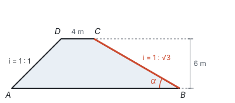

**思路：** 梯形不是直角三角形，过 $D$、$C$ 作高 $DE$、$CF$，梯形分成两个直角三角形和中间一个矩形。坡度就是直角三角形里“高 ÷ 水平宽度”，每一段都能直接算。

**解：** 作 $DE \perp AB$ 于点 $E$，$CF \perp AB$ 于点 $F$，则 $DE = CF = 6$，四边形 $DEFC$ 是矩形，$EF = DC = 4$。

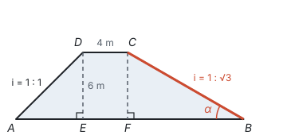

- 斜坡 $AD$：$\frac{DE}{AE} = 1$，所以 $AE = 6$。
- 斜坡 $BC$：$\tan \alpha = \frac{CF}{BF} = \frac{1}{\sqrt{3}} = \frac{\sqrt{3}}{3}$，所以 $\alpha = 30^\circ$，$BF = \sqrt{3} \times 6 = 6\sqrt{3}$。

所以 $AB = AE + EF + BF = 10 + 6\sqrt{3} \approx 10 + 6 \times 1.73 \approx 20.4$（m）。在 $\text{Rt}\triangle BCF$ 中，$BC = \frac{CF}{\sin 30^\circ} = 12$（m）。

答：坡角 $\alpha = 30^\circ$，堤底宽约 20.4 m，斜坡 $BC$ 长 12 m。

**例 4**　一艘船由 $A$ 处向正东航行，在 $A$ 处测得灯塔 $C$ 在北偏东 $60^\circ$ 方向；航行 20 海里到达 $B$ 处，测得灯塔 $C$ 在北偏东 $30^\circ$ 方向。灯塔周围 15 海里内有暗礁，船继续向正东航行，有没有触礁的危险？

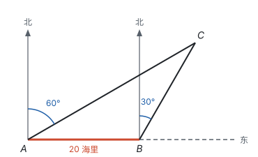

**思路：** 船沿直线 $AB$ 向东走，离灯塔最近的时候，是走到从 $C$ 向航线所作垂线的垂足 $H$ 时，所以要比较的是 $CH$ 和 15 海里。先把方位角换成三角形的内角，看看 $\triangle ABC$ 有什么特点。

**解：** 作 $CH \perp AB$，交 $AB$ 的延长线于点 $H$。

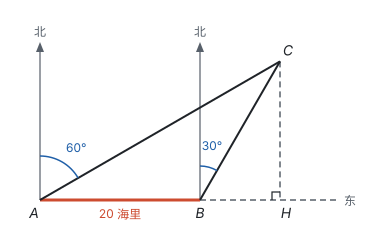

由方位角，$\angle CAB = 90^\circ - 60^\circ = 30^\circ$，$\angle CBH = 90^\circ - 30^\circ = 60^\circ$。$\angle CBH$ 是 $\triangle ABC$ 的外角，所以 $\angle ACB = \angle CBH - \angle CAB = 30^\circ$。于是 $\angle ACB = \angle CAB$，$BC = AB = 20$ 海里（等角对等边）。

在 $\text{Rt}\triangle BCH$ 中，

$$CH = BC \cdot \sin 60^\circ = 20 \times \frac{\sqrt{3}}{2} = 10\sqrt{3}.$$

比较 $10\sqrt{3}$ 和 15，不用近似值，两边平方就行：$(10\sqrt{3})^2 = 300$，$15^2 = 225$，$300 > 225$，所以 $10\sqrt{3} > 15$。答：船继续向正东航行，没有触礁的危险。

## 易错点

- **对边、邻边认错了角。** “对边”“邻边”是相对于某个锐角说的。$\angle A$ 的对边是 $\angle B$ 的邻边。直角不一定在 $C$，先找到直角，再看要用的是哪个锐角。
- **在非直角三角形里直接用定义。** $\sin A = \frac{\text{对边}}{\text{斜边}}$ 只在直角三角形里成立。遇到斜三角形，先作高。
- **把 $\sin A$ 当成乘法。** $\sin 60^\circ \ne 2 \sin 30^\circ$：$\sin 60^\circ = \frac{\sqrt{3}}{2}$，$2 \sin 30^\circ = 1$。角扩大 2 倍，三角函数值并不扩大 2 倍。
- **特殊角的值记混。** 不要死记，画出两个特殊三角形现读；再用“$\sin$ 随角增大而增大”检查，比如 $\sin 30^\circ$ 一定小于 $\sin 60^\circ$。
- **把坡度当成坡角。** 坡度 $i = 1 : \sqrt{3}$ 是 $\tan \alpha = \frac{\sqrt{3}}{3}$，坡角才是 $30^\circ$。
- **仰角、方位角量错了起始线。** 仰角、俯角从水平线量起；方位角从正北或正南方向量起。
- **中途取近似值。** 中间步骤保留根号，最后一步再取近似值，否则误差会累积。

## 联系

- **相似：** 三角函数之所以只由角决定，是因为有一个锐角相等的直角三角形都相似。见第八部分“相似”。
- **勾股定理：** $\sin^2 A + \cos^2 A = 1$ 就是勾股定理两边同除以 $c^2$；特殊角的边长也由勾股定理算出。见第五部分“勾股定理”。
- **一次函数：** 直线 $y = kx + b$（$k > 0$）上，$x$ 每增加 1，$y$ 增加 $k$，这就是一级台阶的“对边 ÷ 邻边”，所以 $k$ 等于直线与 $x$ 轴正方向夹角的正切。$k$ 越大，夹角越大，直线越陡。见第七部分“一次函数”。
- **二次根式：** 特殊角的三角函数值和解直角三角形的结果常含根号，要会化简和分母有理化。见第三部分“二次根式”。
- **函数：** 每个锐角对应唯一的三角函数值，所以叫“函数”。见第七部分“函数”。
- **投影与视图：** 线段 $AB$ 和投影面成 $\alpha$ 角时，它的正投影长 $AB \cdot \cos \alpha$。见第八部分“投影与视图”。
- **与圆有关的计算：** 正多边形的边长、边心距，都是在由半径、边心距和半条边组成的直角三角形里解出来的。见第九部分“与圆有关的计算”。
- **方程思想与建模：** 例 2 在相距 20 m 的 $A$、$B$ 两处测得塔顶的仰角是 $30^\circ$、$45^\circ$，设公共边 $CD$（塔高）为未知数列方程，是解直角三角形实际问题的常用想法。见第十一部分“方程思想与建模”。
