# 与圆有关的计算 ★

> 对应人教版九年级上册 29.3 节、30.3 节。

**弧长和扇形面积，都是把整圆的周长和面积按圆心角占 $360^\circ$ 的比例取出一部分；圆锥的侧面展开是一个扇形，侧面积就是这个扇形的面积。** 整圆的周长和面积本身，则是用圆内接正多边形一步步逼近得到的。

## 正多边形与圆

**各边相等、各角也相等的多边形叫正多边形。** 两个条件缺一不可：菱形各边相等，但各角不一定相等；矩形各角相等，但各边不一定相等。

正多边形可以从圆里得到。**把圆 $n$ 等分（$n \ge 3$），依次连接各分点，就得到圆的内接正 $n$ 边形。** 理由是：

- 各段弧相等，在同一个圆中等弧所对的弦相等，所以各边相等；
- 每个内角都是圆周角，所对的弧都由 $n - 2$ 段相等的小弧组成，同弧或等弧所对的圆周角相等，所以各角相等（见第九部分“圆的有关性质”）。

反过来，任何一个正多边形都有一个外接圆和一个内切圆，两个圆是同心圆。围绕这个共同的圆心，有下面几个名称：

| 名称 | 意思 |
| --- | --- |
| 中心 | 外接圆的圆心 |
| 半径 $R$ | 外接圆的半径，即中心到顶点的距离 |
| 中心角 | 每条边所对的外接圆的圆心角，正 $n$ 边形的中心角是 $\frac{360^\circ}{n}$ |
| 边心距 $r$ | 中心到一边的距离，也就是内切圆的半径 |

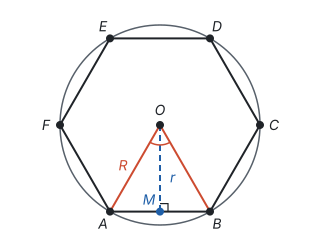

所有计算都集中在一个直角三角形里。作边心距 $OM \perp AB$，由垂径定理，$M$ 是 $AB$ 的中点，$OM$ 平分中心角。在 $\text{Rt}\triangle OAM$ 中，斜边是半径 $R$，一条直角边是边心距 $r$，另一条直角边是边长 $a$ 的一半，$\angle AOM$ 是中心角的一半：

$$\angle AOM = \frac{180^\circ}{n}, \qquad \frac{a}{2} = R\sin\frac{180^\circ}{n}, \qquad r = R\cos\frac{180^\circ}{n}, \qquad R^2 = r^2 + \left(\frac{a}{2}\right)^2.$$

连接中心和各顶点，正 $n$ 边形被分成 $n$ 个全等的等腰三角形，底是边长 $a$，高是边心距 $r$，所以

$$S = n \times \frac{1}{2}ar = \frac{1}{2}Cr,$$

其中 $C = na$ 是正多边形的周长。

最常用的三种正多边形，用半径 $R$ 表示：

| 正多边形 | 图 | 中心角 | 边长 $a$ | 边心距 $r$ | 面积 $S$ |
| --- | --- | --- | --- | --- | --- |
| 正三角形 | 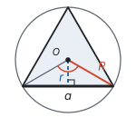 | $120^\circ$ | $\sqrt{3}R$ | $\frac{R}{2}$ | $\frac{3\sqrt{3}R^2}{4}$ |
| 正方形 | 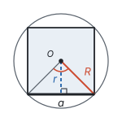 | $90^\circ$ | $\sqrt{2}R$ | $\frac{\sqrt{2}R}{2}$ | $2R^2$ |
| 正六边形 | 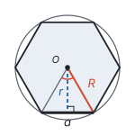 | $60^\circ$ | $R$ | $\frac{\sqrt{3}R}{2}$ | $\frac{3\sqrt{3}R^2}{2}$ |

正六边形最特别：中心角是 $60^\circ$，$OA = OB$，所以 $\triangle OAB$ 是等边三角形，**正六边形的边长等于半径**。用圆规在圆上以半径为距离依次截取，正好截 6 次回到起点，就把圆 6 等分了（见第五部分“尺规作图”）。

**例 1**　一个正六边形的边心距是 $2\sqrt{3}$ cm，求它的边长、周长和面积。

还是前面那张正六边形的图：中心 $O$，半径 $OA$，边心距 $OM \perp AB$，$M$ 是 $AB$ 的中点。

**思路：** 已知边心距，在 $\text{Rt}\triangle OAM$ 中，$\angle AOM = 30^\circ$，由边心距可以求出半边长；也可以直接用“正六边形的边长等于半径”和勾股定理。

**解：** 在 $\text{Rt}\triangle OAM$ 中，$\angle AOM = \frac{1}{2} \times 60^\circ = 30^\circ$，$OM = 2\sqrt{3}$，所以

$$AM = OM \cdot \tan 30^\circ = 2\sqrt{3} \times \frac{\sqrt{3}}{3} = 2.$$

边长 $a = 2AM = 4$ cm，周长 $C = 6a = 24$ cm，面积

$$S = \frac{1}{2}Cr = \frac{1}{2} \times 24 \times 2\sqrt{3} = 24\sqrt{3}\ (\text{cm}^2).$$

**检验：** 正六边形的边长等于半径，$R = 4$，由勾股定理，边心距 $r = \sqrt{4^2 - 2^2} = 2\sqrt{3}$，和已知一致。

## 圆周率 π

圆的周长和直径的比，对所有的圆都一样吗？任意两个圆，一个都可以看成另一个按比例放大或缩小得到的；在两个圆里各作内接正 $n$ 边形，这两个正多边形相似，相似比就是两个圆的半径之比，所以它们的“周长 ÷ 直径”相等（见第八部分“相似”）。边数越多，正多边形越贴近圆，所以**圆的周长和直径的比是一个常数**，这个常数叫圆周率，记作 $\pi$。

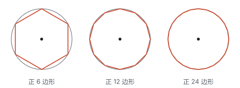

**拓展：** 怎样算出 $\pi$？三国时期的刘徽用的就是上图的办法，叫**割圆术**：从圆内接正六边形开始，边数一次次加倍，用正多边形的周长逼近圆的周长。直径为 $d$ 时，正 $n$ 边形的周长除以直径等于 $n\sin\frac{180^\circ}{n}$：

| 边数 | 6 | 12 | 24 | 48 | 96 |
| --- | --- | --- | --- | --- | --- |
| 周长 ÷ 直径 | 3 | 3.1058 | 3.1326 | 3.1394 | 3.1410 |

正六边形的边长等于半径，周长是 $6R = 3d$，所以 $\pi > 3$。边数越多，比值越大，越来越接近 $\pi$。南北朝的祖冲之算出 $3.1415926 < \pi < 3.1415927$。后来人们证明了 $\pi$ 是无理数（见第二部分“实数”），计算时通常取近似值 3.14，或者在结果里保留 $\pi$。

于是，半径为 $R$ 的圆，周长 $C = 2\pi R$。

**圆的面积。** 正 $n$ 边形的面积是 $\frac{1}{2}Cr$。边数越来越多时，周长越来越接近圆的周长 $2\pi R$，边心距越来越接近半径 $R$，所以圆的面积是

$$S = \frac{1}{2} \times 2\pi R \times R = \pi R^2.$$

同样的道理也可以用剪拼来看：把圆平均分成很多个小扇形，一正一反拼起来，接近一个平行四边形，底是周长的一半 $\pi R$，高是 $R$。

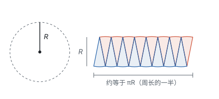

两种说法都是 $S = \frac{1}{2} \times \text{周长} \times \text{半径}$，和三角形面积 $\frac{1}{2} \times \text{底} \times \text{高}$ 是一个样子：圆可以看成很多个以圆心为顶点、高为 $R$ 的细长三角形拼成的。

## 弧长和扇形面积

整圆的圆心角是 $360^\circ$。$1^\circ$ 的圆心角所对的弧长是整个周长的 $\frac{1}{360}$，$n^\circ$ 的圆心角所对的弧长就是周长的 $\frac{n}{360}$：

$$l = \frac{n}{360} \times 2\pi R = \frac{n\pi R}{180}.$$

由两条半径和它们所夹的弧围成的图形叫**扇形**。圆心角为 $n^\circ$ 的扇形，面积是整个圆面积的 $\frac{n}{360}$：

$$S_{\text{扇形}} = \frac{n}{360} \times \pi R^2 = \frac{n\pi R^2}{360}.$$

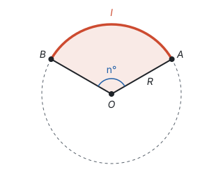

把两个公式放在一起看：$\frac{n\pi R^2}{360} = \frac{1}{2} \times \frac{n\pi R}{180} \times R$，所以

$$S_{\text{扇形}} = \frac{1}{2}lR.$$

这又是“$\frac{1}{2} \times$ 底 $\times$ 高”：把弧长 $l$ 看成底，半径 $R$ 看成高，扇形就像一个“曲边三角形”。整圆也符合这个式子，$\frac{1}{2} \times 2\pi R \times R = \pi R^2$。

| 整圆 | 圆心角为 $n^\circ$ 的部分 | 两者的比 |
| --- | --- | --- |
| 周长 $2\pi R$ | 弧长 $\frac{n\pi R}{180}$ | $\frac{n}{360}$ |
| 面积 $\pi R^2$ | 扇形面积 $\frac{n\pi R^2}{360}$，或 $\frac{1}{2}lR$ | $\frac{n}{360}$ |

扇形统计图里，每个扇形的圆心角等于这一部分所占的百分比乘 $360^\circ$，用的是同一个比例（见第十部分“数据的收集、整理与描述”）。

**例 2**　如图，扇形 $OAB$ 的半径为 6，圆心角 $\angle AOB = 120^\circ$。

1. 求弧 $AB$ 的长和扇形 $OAB$ 的面积；
2. 求弦 $AB$ 和弧 $AB$ 围成的图形（图中红色部分）的面积。

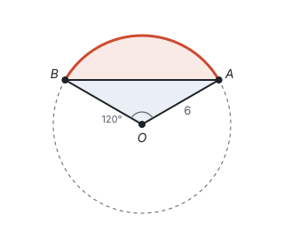

**思路：** 第 1 问直接代公式。第 2 问的图形叫弓形，它不是扇形，也不是三角形，但它是扇形 $OAB$ 去掉 $\triangle OAB$ 剩下的部分，用“割补”转化成会算的图形。$\triangle OAB$ 是等腰三角形，作 $OC \perp AB$，底和高都能从 $\text{Rt}\triangle OAC$ 求出来。

**解：** （1）弧 $AB$ 的长 $l = \frac{120 \times \pi \times 6}{180} = 4\pi$，扇形面积

$$S_{\text{扇形}} = \frac{120 \times \pi \times 6^2}{360} = 12\pi.$$

也可以用 $S_{\text{扇形}} = \frac{1}{2}lR = \frac{1}{2} \times 4\pi \times 6 = 12\pi$ 检验。

（2）作 $OC \perp AB$，垂足为 $C$。$OA = OB$，由“三线合一”，$OC$ 平分 $\angle AOB$，$\angle AOC = 60^\circ$，$C$ 是 $AB$ 的中点。

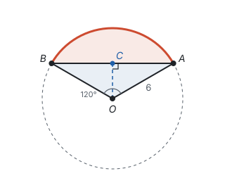

在 $\text{Rt}\triangle OAC$ 中，

$$OC = OA \cdot \cos 60^\circ = 3, \qquad AC = OA \cdot \sin 60^\circ = 3\sqrt{3},$$

所以 $AB = 2AC = 6\sqrt{3}$，$S_{\triangle OAB} = \frac{1}{2} \times 6\sqrt{3} \times 3 = 9\sqrt{3}$。弓形的面积是

$$S_{\text{扇形}} - S_{\triangle OAB} = 12\pi - 9\sqrt{3}.$$

**回顾：** 弓形所对的圆心角小于 $180^\circ$ 时，弓形面积是扇形面积减去三角形面积；圆心角大于 $180^\circ$ 时，弓形包含圆心，面积是扇形面积加上三角形面积：

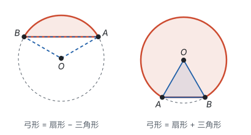

先看清图形由哪些会算的图形拼成或割成，再算。

## 圆锥的侧面积和全面积

圆锥由一个底面和一个侧面围成。连接圆锥顶点和底面圆周上任意一点的线段叫圆锥的**母线**，长记作 $l$；底面半径记作 $r$，高记作 $h$。高、底面半径、母线组成直角三角形，所以

$$l^2 = h^2 + r^2.$$

把圆锥的侧面沿一条母线剪开、展平，得到一个扇形（见第五部分“几何图形初步”）：

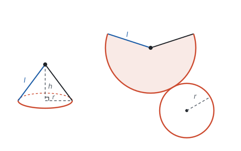

展开前后有两个对应：

- 扇形的**半径**是圆锥的**母线** $l$；
- 扇形的**弧长**是圆锥**底面圆的周长** $2\pi r$。

由 $S_{\text{扇形}} = \frac{1}{2}lR$，这里弧长是 $2\pi r$，半径是 $l$，所以

$$\text{圆锥的侧面积} = \frac{1}{2} \times 2\pi r \times l = \pi rl,$$

$$\text{圆锥的全面积} = \pi rl + \pi r^2.$$

展开图的圆心角 $n^\circ$ 也能求：由弧长 $\frac{n\pi l}{180} = 2\pi r$，得 $n = \frac{360r}{l}$。也就是说，扇形占整个圆的比例 $\frac{n}{360}$，正好等于 $\frac{r}{l}$。

**例 3**　一个圆锥的底面半径是 3 cm，高是 4 cm。求它的侧面积、全面积，以及侧面展开图的圆心角。

**思路：** 侧面积要用母线，不是高，所以先用勾股定理求母线。

**解：** 母线 $l = \sqrt{3^2 + 4^2} = 5$ cm。

侧面积 $\pi rl = \pi \times 3 \times 5 = 15\pi$（cm²），全面积 $15\pi + \pi \times 3^2 = 24\pi$（cm²）。

展开图的圆心角 $n = \frac{360 \times 3}{5} = 216$，即 $216^\circ$。

**例 4**　用一张半径为 12 cm、圆心角为 $120^\circ$ 的扇形纸片，围成一个圆锥的侧面（接缝不计）。求这个圆锥的底面半径和高。

**思路：** 这次反过来，从展开图还原圆锥，用的仍然是那两个对应：扇形的半径 12 cm 是母线，扇形的弧长是底面周长。

**解：** 扇形的弧长 $\frac{120 \times \pi \times 12}{180} = 8\pi$，它等于底面周长，所以 $2\pi r = 8\pi$，$r = 4$ cm。母线 $l = 12$ cm，所以高

$$h = \sqrt{l^2 - r^2} = \sqrt{12^2 - 4^2} = \sqrt{128} = 8\sqrt{2}\ (\text{cm}).$$

**检验：** 由 $\frac{n}{360} = \frac{r}{l}$，$\frac{120}{360} = \frac{4}{12}$，两边都是 $\frac{1}{3}$。

## 易错点

- **弧长公式里的 $R$ 用错。** $R$ 是弧所在圆的半径。圆锥展开图里，扇形的半径是母线 $l$，不是底面半径 $r$。
- **侧面积用了高。** 圆锥的侧面积是 $\pi rl$，$l$ 是母线。只知道高时，先用 $l^2 = h^2 + r^2$ 求母线。
- **全面积忘了加底面。** 全面积是侧面积加上底面积。
- **把弧的度数和弧长混为一谈。** 弧的度数只由圆心角决定；弧长还和半径有关。度数相同的两条弧，半径大的更长。
- **弓形面积一律用“扇形减三角形”。** 圆心角大于 $180^\circ$ 时，要用扇形面积加三角形面积。
- **正多边形的半径和边心距搞混。** 半径是中心到顶点的距离，边心距是中心到边的距离，边心距更短。
- **题目要求保留 $\pi$，却代入了 3.14。** 没有特别说明时，结果里保留 $\pi$ 更精确。

## 联系

- **圆的有关性质：** 弧的度数等于圆心角的度数，弧长和扇形面积才能按圆心角的比例计算；正多边形各边、各角相等，依据是等弧对等弦、同弧所对的圆周角相等。见第九部分“圆的有关性质”。
- **与圆有关的位置关系：** 正多边形的外接圆和内切圆是同心圆，半径和边心距分别是这两个圆的半径。见第九部分“与圆有关的位置关系”。
- **相似：** 所有的圆都相似，所以周长和直径的比是常数 $\pi$。见第八部分“相似”。
- **锐角三角函数：** 正多边形的边长、边心距和割圆术的计算，都在中心角一半所在的直角三角形里完成。见第八部分“锐角三角函数”。
- **勾股定理：** 正多边形中 $R^2 = r^2 + \left(\frac{a}{2}\right)^2$，圆锥中 $l^2 = h^2 + r^2$。见第五部分“勾股定理”。
- **实数：** $\pi$ 是无理数，结果可以保留 $\pi$；要得到具体数值时，才用 3.14 这样的近似值去算。见第二部分“实数”。
- **几何图形初步：** 圆锥的展开图是一个扇形和一个圆，圆柱的展开图是一个长方形和两个圆。见第五部分“几何图形初步”。
- **投影与视图：** 圆锥的主视图是一个等腰三角形，腰是母线，底是底面直径，高是圆锥的高。见第八部分“投影与视图”。
- **数据的收集、整理与描述：** 扇形统计图的圆心角和这里的扇形一样，按所占的比例乘 $360^\circ$。见第十部分“数据的收集、整理与描述”。
