# 与圆有关的位置关系 ★

> 对应人教版九年级上册第三十章。

**点、直线和圆的位置关系，都由“距离和半径谁大”决定：距离小于半径是在圆内或相交，等于半径是在圆上或相切，大于半径是在圆外或相离。** 反过来，知道了位置关系，也就知道了距离和半径的大小关系。

## 点和圆：比较距离和半径

圆是到圆心的距离等于 $r$ 的点组成的图形。所以一个点 $P$ 和圆的位置关系，只要看 $OP$ 和 $r$ 谁大：

| 点 $P$ 的位置 | $OP$ 和 $r$ 的关系 | 图中的点 |
| --- | --- | --- |
| 点在圆内 | $OP < r$ | $A$ |
| 点在圆上 | $OP = r$ | $B$ |
| 点在圆外 | $OP > r$ | $C$ |

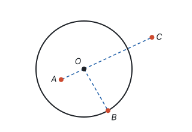

表里每一行从左往右读、从右往左读都成立：由位置可以得出数量关系，由数量关系也可以判断位置。

这和数轴上的绝对值是同一个想法。数轴上 $\lvert x \rvert$ 是点 $x$ 到原点的距离，满足 $\lvert x \rvert < 3$ 的点在 $-3$ 和 $3$ 之间；平面上满足 $OP < r$ 的点在圆的内部。一个在直线上，一个在平面上，都是“到一个定点的距离和一个定长比大小”（见第二部分“有理数”）。

## 过三点作圆

经过一个点 $A$ 能作多少个圆？以任意一点为圆心、以它到 $A$ 的距离为半径，都行，有无数个。

经过两个点 $A$、$B$ 呢？圆心到 $A$、$B$ 的距离相等，所以圆心在线段 $AB$ 的垂直平分线上。这条直线上任取一点都可以作圆心，仍然有无数个。

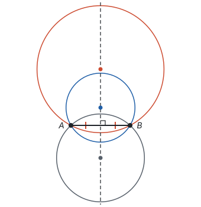

经过三个点 $A$、$B$、$C$，而且三点不在同一直线上：圆心既要在 $AB$ 的垂直平分线上，又要在 $BC$ 的垂直平分线上，只能是这两条直线的交点 $O$。两条直线只有一个交点，所以圆心只有一个，半径 $OA$ 也只有一个。

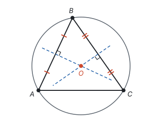

**不在同一直线上的三个点确定一个圆。**

两条垂直平分线为什么一定相交？如果它们平行，那么分别垂直于它们的 $AB$ 和 $BC$ 也互相平行，而 $AB$、$BC$ 有公共点 $B$，只能在同一条直线上，和“三点不在同一直线上”矛盾。反过来也说明了：**经过同一直线上的三个点不能作圆**，因为这时两条垂直平分线平行，找不到圆心。这种先假设、再推出矛盾的证法是反证法（见第一部分“怎样证明”）。

**外接圆和外心。** 经过三角形三个顶点的圆叫三角形的**外接圆**，外接圆的圆心叫三角形的**外心**。外心是三边垂直平分线的交点，到三个顶点的距离相等（见第五部分“轴对称与等腰三角形”）。

外心不一定在三角形里面：

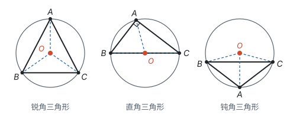

用圆周角定理可以说明原因。$\angle A$ 是弧 $BC$ 所对的圆周角：

- $\angle A = 90^\circ$ 时，$BC$ 是直径，外心就是斜边 $BC$ 的中点；
- $\angle A < 90^\circ$ 时，弧 $BC$ 小于半圆，圆心和 $A$ 在 $BC$ 的同侧；三个角都是锐角，圆心就在三条边的内侧，也就是三角形内部；
- $\angle A > 90^\circ$ 时，弧 $BC$ 大于半圆，圆心和 $A$ 在 $BC$ 的两侧，外心在三角形外部。

## 直线和圆：比较 d 和 r

直线和圆的公共点可能有 2 个、1 个或 0 个：

| 位置关系 | 公共点个数 | 名称 |
| --- | --- | --- |
| 相交 | 2 个 | 直线叫圆的割线 |
| 相切 | 1 个 | 直线叫圆的切线，公共点叫切点 |
| 相离 | 0 个 | — |

公共点有几个，由圆心到直线的距离 $d$ 决定。过 $O$ 作直线 $l$ 的垂线，垂足为 $H$，$d = OH$。把直线 $l$ 看成一条数轴，原点取在 $H$，$l$ 上的点 $P$ 对应的数记作 $t$，那么 $HP = \lvert t \rvert$。

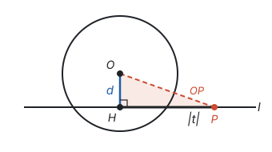

在直角三角形 $OHP$ 中，由勾股定理，

$$OP^2 = d^2 + t^2.$$

$P$ 在圆上，就是 $OP = r$，也就是

$$t^2 = r^2 - d^2.$$

直线和圆有几个公共点，就看这个方程有几个解：

- $d < r$ 时，右边是正数，$t$ 有两个值（互为相反数），直线上有两个点在圆上，**相交**；
- $d = r$ 时，右边是 0，只有 $t = 0$，唯一的公共点就是垂足 $H$，**相切**；
- $d > r$ 时，右边是负数，方程无解，**相离**。

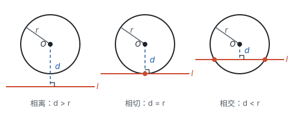

| 位置关系 | 公共点个数 | $d$ 和 $r$ 的关系 |
| --- | --- | --- |
| 相交 | 2 个 | $d < r$ |
| 相切 | 1 个 | $d = r$ |
| 相离 | 0 个 | $d > r$ |

**拓展：** 放到坐标系里看得更清楚。以原点为圆心、5 为半径作圆，点 $(x, y)$ 到原点的距离是 $\sqrt{x^2 + y^2}$，所以点在圆上就是 $x^2 + y^2 = 25$。水平直线 $y = k$ 上的点在圆上，就是 $x^2 = 25 - k^2$：

- $k = 3$：$x^2 = 16$，$x = \pm 4$，有两个公共点 $(-4, 3)$ 和 $(4, 3)$；
- $k = 5$：$x^2 = 0$，$x = 0$，只有一个公共点 $(0, 5)$；
- $k = -6$：$x^2 = -11$，无解，没有公共点。

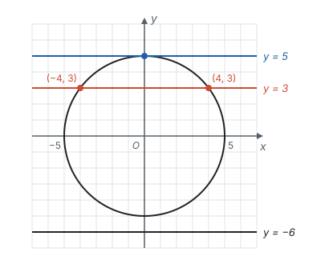

这里 $\lvert k \rvert$ 正是圆心到直线的距离 $d$。“求公共点”变成了“解方程”，“公共点有几个”变成了“方程有几个解”。一元二次方程根的个数由判别式决定，抛物线和 $x$ 轴有几个交点也由判别式决定，想法完全一样（见第四部分“一元二次方程”和第七部分“二次函数”）。

## 切线的判定和性质

直线 $l$ 经过半径 $OA$ 的外端 $A$，并且 $l \perp OA$。这时圆心到 $l$ 的距离就是 $OA$，等于半径，所以 $l$ 和圆相切：

**切线的判定定理：经过半径的外端并且垂直于这条半径的直线是圆的切线。**

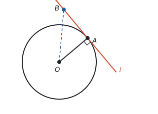

从图上也能直接看出来：$l$ 上除 $A$ 以外的任何一点 $B$，$OB$ 是 $\text{Rt}\triangle OAB$ 的斜边，$OB > OA = r$，所以 $B$ 在圆外，$l$ 和圆只有 $A$ 一个公共点。

反过来，设 $l$ 和 $\odot O$ 相切于点 $A$。过 $O$ 作 $OH \perp l$，垂足为 $H$。由上一节，相切时 $d = r$，也就是 $OH = r$，所以 $H$ 在圆上，是 $l$ 和圆的公共点。相切时公共点只有一个，所以 $H$ 就是切点 $A$，$OA \perp l$。也就是说，切点是直线上离圆心最近的点，$OA$ 正是从 $O$ 到 $l$ 的垂线段（垂线段最短，见第五部分“相交线与平行线”）：

**切线的性质定理：圆的切线垂直于经过切点的半径。**

两个定理的条件和结论互换，是一对互逆的真命题（见第一部分“定义、命题与定理”）。要证明一条直线是切线，按已知条件分两种思路：

| 已知条件 | 思路 | 要证明的 |
| --- | --- | --- |
| 直线和圆有公共点 | 连接圆心和公共点，得到一条半径 | 这条半径和直线垂直 |
| 不知道直线和圆有没有公共点 | 过圆心作直线的垂线 | 垂线段的长等于半径 |

**例 1**　如图，$AB$ 是 $\odot O$ 的直径，点 $C$ 在 $\odot O$ 上，点 $D$ 在 $AB$ 的延长线上，$\angle A = \angle D = 30^\circ$。

1. 求证：$DC$ 是 $\odot O$ 的切线；
2. 若 $\odot O$ 的半径为 2，求 $CD$ 的长。

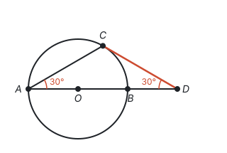

**思路：** $DC$ 和圆有公共点 $C$，所以连接 $OC$，证明 $OC \perp DC$，也就是 $\angle OCD = 90^\circ$。$\angle OCD$ 在 $\triangle OCD$ 里，已知 $\angle D = 30^\circ$，只差 $\angle COD$。$OA = OC$ 组成等腰三角形，$\angle COD$ 是它的外角，可以从 $\angle A$ 求出来。

**证明：** （1）连接 $OC$。

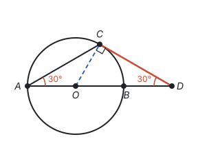

因为 $OA = OC$，所以 $\angle OCA = \angle A = 30^\circ$，于是

$$\angle COD = \angle A + \angle OCA = 60^\circ.$$

在 $\triangle OCD$ 中，$\angle OCD = 180^\circ - 60^\circ - 30^\circ = 90^\circ$，即 $OC \perp DC$。$DC$ 经过半径 $OC$ 的外端 $C$，并且垂直于 $OC$，所以 $DC$ 是 $\odot O$ 的切线。

**解：** （2）在 $\text{Rt}\triangle OCD$ 中，$\angle D = 30^\circ$，$OC = 2$，所以 $OD = 2OC = 4$（$30^\circ$ 角所对的直角边等于斜边的一半），

$$CD = \sqrt{OD^2 - OC^2} = \sqrt{4^2 - 2^2} = 2\sqrt{3}.$$

**想一想：** $\angle COD = 60^\circ$ 也可以用圆周角定理得到：$\angle A$ 是弧 $BC$ 所对的圆周角，$\angle COD$ 就是弧 $BC$ 所对的圆心角，所以 $\angle COD = 2\angle A = 60^\circ$。两种算法本质相同，圆周角定理情况 ① 的证明，用的正是这个等腰三角形的外角：圆心在圆周角的一边上时，两条半径组成等腰三角形，圆心角是它的外角，等于两个相等的底角之和，也就是圆周角的 2 倍（见第九部分“圆的有关性质”）。

## 切线长定理

从圆外一点 $P$ 能作几条切线？设切点为 $A$，由切线的性质，$\angle OAP = 90^\circ$。$\angle OAP$ 是直角，$A$ 就在以 $OP$ 为直径的圆上（见第九部分“圆的有关性质”）。以 $OP$ 为直径的圆经过圆内的点 $O$ 和圆外的点 $P$，和 $\odot O$ 交于两点，所以从圆外一点可以作圆的两条切线。

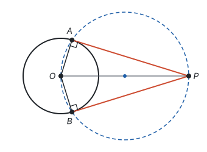

经过圆外一点的切线上，这一点和切点之间线段的长，叫做这点到圆的**切线长**。切线是直线，不能量长度；切线长是一条线段的长。

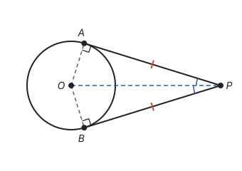

连接 $OA$、$OB$、$OP$。由切线的性质，$OA \perp PA$，$OB \perp PB$；又 $OA = OB$，$OP$ 是公共边，所以 $\text{Rt}\triangle OAP \cong \text{Rt}\triangle OBP$（HL），得 $PA = PB$，$\angle APO = \angle BPO$。

**切线长定理：从圆外一点可以引圆的两条切线，它们的切线长相等，这一点和圆心的连线平分两条切线的夹角。**

从对称的角度看更直接：整个图形关于直线 $OP$ 对称，$A$ 和 $B$ 是一对对称点。

## 三角形的内切圆

和三角形三条边都相切的圆叫三角形的**内切圆**，内切圆的圆心叫三角形的**内心**。

内心在哪里？内切圆和三边都相切，圆心到三边的距离都等于半径。到 $AB$、$AC$ 两边距离相等的点在 $\angle A$ 的平分线上，到 $BA$、$BC$ 两边距离相等的点在 $\angle B$ 的平分线上（见第五部分“全等三角形”）。所以内心是三角形角平分线的交点，内切圆的半径就是内心到任意一边的距离。

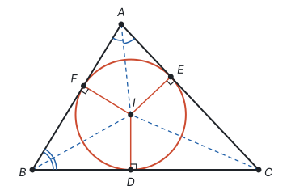

外心和内心放在一起比较：

| 比较 | 外心 | 内心 |
| --- | --- | --- |
| 是哪个圆的圆心 | 外接圆（经过三个顶点） | 内切圆（和三条边都相切） |
| 怎样找到 | 三边垂直平分线的交点 | 三条角平分线的交点 |
| 到什么的距离相等 | 到三个顶点，等于外接圆半径 | 到三条边，等于内切圆半径 |
| 位置 | 锐角三角形在内部，直角三角形在斜边中点，钝角三角形在外部 | 总在三角形内部 |
| 依据 | 线段垂直平分线的性质 | 角平分线的性质 |

**例 2**　在 $\text{Rt}\triangle ABC$ 中，$\angle C = 90^\circ$，$BC = 6$，$AC = 8$。求它的内切圆半径 $r$。

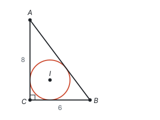

**思路：** 内切圆半径是内心到三边的距离，可以从两个角度去找它：一是面积，连接内心和三个顶点，把三角形分成三块，每块的高都是 $r$；二是切线长，从每个顶点引出的两条切线长相等，三条边被切点分成的六段两两相等。

先由勾股定理，$AB = \sqrt{6^2 + 8^2} = 10$。设内切圆的圆心为 $I$，与 $BC$、$AC$、$AB$ 分别相切于 $D$、$E$、$F$。

**解法一：用面积。** 连接 $IA$、$IB$、$IC$，把 $\triangle ABC$ 分成 $\triangle IBC$、$\triangle ICA$、$\triangle IAB$，它们的高都是 $r$：

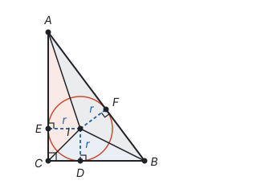

$$S_{\triangle ABC} = \frac{1}{2}r \cdot BC + \frac{1}{2}r \cdot CA + \frac{1}{2}r \cdot AB = \frac{1}{2}r(6 + 8 + 10) = 12r.$$

又 $S_{\triangle ABC} = \frac{1}{2} \times 6 \times 8 = 24$，所以 $12r = 24$，$r = 2$。

**解法二：用切线长。** 连接 $ID$、$IE$，则 $ID \perp BC$，$IE \perp AC$，又 $\angle C = 90^\circ$，所以四边形 $IDCE$ 是矩形；再加上 $ID = IE = r$，它是正方形，$CD = CE = r$。由切线长定理，从同一个顶点引的两条切线长相等：

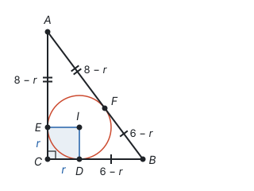

$$BF = BD = 6 - r, \quad AF = AE = 8 - r.$$

而 $AF + BF = AB$，所以 $(8 - r) + (6 - r) = 10$，得 $r = 2$。

**想一想：** 两种解法都可以推广：

| 比较 | 解法一：面积 | 解法二：切线长 |
| --- | --- | --- |
| 用到什么 | 内切圆半径是三个小三角形的高 | 从一个顶点引的两条切线长相等 |
| 推广到一般 | 任何三角形：$r$ 等于面积的 2 倍除以周长 | 直角三角形：$r$ 等于两直角边的和减去斜边，再除以 2 |

对直角三角形（直角边为 $a$、$b$，斜边为 $c$），解法一得到

$$r = \frac{ab}{a + b + c},$$

解法二得到

$$r = \frac{a + b - c}{2}.$$

两个结果总是相等：交叉相乘，$(a + b - c)(a + b + c) = (a + b)^2 - c^2 = 2ab$，最后一步用了勾股定理 $a^2 + b^2 = c^2$。

## 易错点

- **判定切线只用了一个条件。** “经过半径的外端”和“垂直于这条半径”缺一不可：经过半径外端的直线不一定垂直于半径，垂直于半径的直线也不一定经过外端。
- **已知切线，却不连半径。** 要用“切线垂直于经过切点的半径”，先要把圆心和切点连起来，垂直关系才会出现在图上。
- **把切线长当成切线。** 切线是直线，切线长是圆外一点到切点的线段的长。
- **用“只有一个公共点”判断线段、射线和圆相切。** 相切的定义是对直线说的。一条线段和圆只有一个公共点，它所在的直线仍可能和圆相交，只是另一个交点落在线段外面。
- **外心、内心混淆。** 外心到三个顶点距离相等，是垂直平分线的交点；内心到三条边距离相等，是角平分线的交点。外心可能在三角形外部，内心一定在内部。
- **过三点作圆忘了“不在同一直线上”。** 同一直线上的三个点不能确定一个圆。
- **点和圆的位置不分情况。** 只说“点 $P$ 到圆心的距离不大于半径”，点可能在圆内，也可能在圆上。

## 联系

- **有理数：** 点和圆的位置关系，是数轴上“绝对值和定长比大小”在平面上的推广。见第二部分“有理数”。
- **一元二次方程：** 直线和圆的公共点个数，就是方程 $t^2 = r^2 - d^2$ 的解的个数；和判别式决定根的个数是同一个想法。见第四部分“一元二次方程”。
- **二次函数：** 抛物线和 $x$ 轴有几个交点、直线和圆有几个公共点，都是“图形的交点个数就是方程的解的个数”。见第七部分“二次函数”。
- **相交线与平行线：** 切线的性质来自“垂线段最短”。见第五部分“相交线与平行线”。
- **轴对称与等腰三角形：** 外心是三边垂直平分线的交点；切线长定理的图形关于 $OP$ 对称。见第五部分“轴对称与等腰三角形”。
- **全等三角形：** 内心在角平分线上，依据是角平分线的性质；切线长定理用 HL 证明。见第五部分“全等三角形”。
- **圆的有关性质：** 外心的位置和过圆外一点作切线，都要用圆周角定理。见第九部分“圆的有关性质”。
- **尺规作图：** 作三角形的外接圆就是作两边的垂直平分线，作内切圆就是作两个角的平分线。见第五部分“尺规作图”。
- **与圆有关的计算：** 正多边形的外接圆和内切圆是同心圆，半径分别是正多边形的半径和边心距。见第九部分“与圆有关的计算”。
- **分类讨论：** 点和圆、直线和圆的位置各有三种情况，题目没说清是哪一种时要分别讨论。见第十一部分“分类讨论”。
