# 圆的有关性质 ★

> 对应人教版九年级上册第二十九章。

**圆上每一点到圆心的距离都相等，所以圆绕圆心旋转任意角度都和自身重合，沿任何一条直径翻折也和自身重合；弧、弦、圆心角的关系，垂径定理，圆周角定理，都是这两种对称推出来的。** 证明时最常用的一步是“连接半径”：两条半径和一条弦围成一个等腰三角形。

## 从哪里来：圆的定义

在一个平面内，线段 $OA$ 绕它固定的端点 $O$ 旋转一周，另一个端点 $A$ 所形成的图形叫做**圆**。固定的端点 $O$ 叫圆心，线段 $OA$ 叫半径，通常用 $r$ 表示。以 $O$ 为圆心的圆记作 $\odot O$，读作“圆 $O$”。

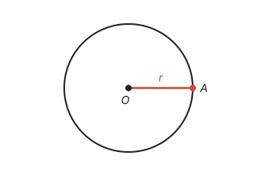

用圆规画圆就是这个过程：针尖是圆心，两脚之间的距离是半径。在转动中，$A$ 每到一个位置，它到 $O$ 的距离都是 $r$。所以圆也可以这样定义：

**圆是平面内到定点的距离等于定长的所有点组成的图形。**

这句话包含两层意思：圆上每一点到圆心的距离都等于 $r$；反过来，到圆心的距离等于 $r$ 的点都在圆上。确定一个圆需要两个条件：圆心确定它的位置，半径确定它的大小。半径相等的两个圆叫等圆，等圆经过平移可以完全重合。

圆上的线和弧有下面这些名称：

| 名称 | 定义 | 图中的例子 |
| --- | --- | --- |
| 弦 | 连接圆上任意两点的线段 | $CD$、$AB$ |
| 直径 | 经过圆心的弦 | $AB$ |
| 弧 | 圆上任意两点间的部分 | 弧 $CD$ |
| 半圆 | 直径的两个端点把圆分成两条弧，每一条都叫半圆 | 弧 $ACB$、弧 $AEB$ |
| 劣弧、优弧 | 小于半圆的弧叫劣弧，大于半圆的弧叫优弧 | 劣弧 $CD$（红色）、优弧 $CED$ |
| 等弧 | 在同圆或等圆中，能够互相重合的弧 | — |

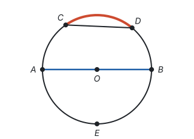

以 $C$、$D$ 为端点的弧读作“弧 $CD$”，书写时在字母 $CD$ 上方画一段弧线。优弧要用三个字母表示，比如优弧 $CED$，中间的字母说明弧经过哪一边。

**直径是圆中最长的弦。** 任取一条不经过圆心的弦 $CD$，连接 $OC$、$OD$。在 $\triangle OCD$ 中，两边之和大于第三边，所以 $CD < OC + OD = 2r$，而直径的长正好是 $2r$。

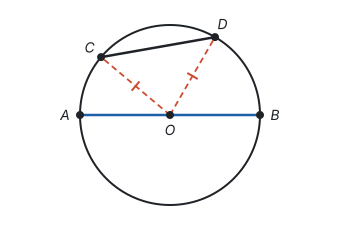

## 旋转对称：圆心角、弧、弦

**顶点在圆心的角叫圆心角。**

把圆绕圆心旋转任意角度，每个点到圆心的距离都不变，所以圆上的点仍然落在圆上：**圆绕圆心旋转任意角度，都能和原来的圆重合。** 转 $180^\circ$ 当然也重合，所以圆是中心对称图形，对称中心是圆心。

用这个性质比较两个相等的圆心角。设 $\angle AOB = \angle A'OB'$，把 $\angle AOB$ 连同弧 $AB$、弦 $AB$ 一起绕 $O$ 旋转，使 $OA$ 和 $OA'$ 重合。因为两个角相等，射线 $OB$ 就落在射线 $OB'$ 上；又因为 $OA = OA'$、$OB = OB'$（都是半径），点 $A$ 落在 $A'$ 上，点 $B$ 落在 $B'$ 上。于是弧 $AB$ 和弧 $A'B'$ 重合，弦 $AB$ 和弦 $A'B'$ 重合：

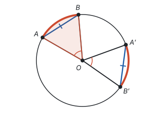

**在同圆或等圆中，相等的圆心角所对的弧相等，所对的弦也相等。**

反过来也成立：

- 弧 $AB$ 和弧 $A'B'$ 相等，就是能够重合，重合时端点对端点，所以圆心角相等、弦相等。
- 弦 $AB = A'B'$，再加上四条半径相等，由 SSS 得 $\triangle AOB \cong \triangle A'OB'$，所以圆心角相等，于是弧也相等（这里的弧都指劣弧，或都指优弧）。

合起来就是：**在同圆或等圆中，两个圆心角、两条弧、两条弦中，只要有一组相等，另外两组也相等。** 三者捆在一起，是因为它们都随着旋转一起移动。

“同圆或等圆”不能丢：两个大小不同的同心圆，同一个圆心角在大圆上截得的弧和弦都比在小圆上的长。

**弧的度数。** 把以圆心为顶点的周角等分成 360 份，每一份是 $1^\circ$ 的圆心角，它所对的弧叫 $1^\circ$ 的弧。所以**圆心角是多少度，它所对的弧就是多少度。** 后面讲圆周角、弧长时都要用到这句话。

## 轴对称：垂径定理

在圆上任取一点 $P$，作它关于某条直径所在直线的对称点 $P'$。圆心 $O$ 在对称轴上，而对称轴是线段 $PP'$ 的垂直平分线，所以 $OP' = OP = r$，$P'$ 也在圆上。**圆是轴对称图形，任何一条直径所在的直线都是它的对称轴。**

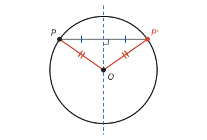

现在让直径 $CD$ 垂直于弦 $AB$，垂足为 $E$：

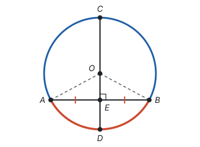

连接 $OA$、$OB$。$OA = OB$，所以 $\triangle OAB$ 是等腰三角形，$OE$ 是底边 $AB$ 上的高。由“三线合一”，$OE$ 也是底边上的中线，$AE = BE$（见第五部分“轴对称与等腰三角形”）。于是直线 $CD$ 是 $AB$ 的垂直平分线，$A$、$B$ 关于直线 $CD$ 对称。沿 $CD$ 翻折，$A$ 和 $B$ 重合，$C$、$D$ 不动，所以弧 $AC$ 和弧 $BC$ 重合，弧 $AD$ 和弧 $BD$ 重合：

**垂径定理：垂直于弦的直径平分弦，并且平分弦所对的两条弧。**

图中，条件是“$CD$ 是直径”和“$CD \perp AB$”，结论是 $AE = BE$，弧 $AC$ 和弧 $BC$ 相等，弧 $AD$ 和弧 $BD$ 相等。

**这五件事说的是同一条直线。** “过圆心”“垂直于弦”“平分弦”“平分弦所对的优弧”“平分弦所对的劣弧”，每一条都是弦 $AB$ 的垂直平分线的特征。一条直线由两个条件就确定了，所以知道其中两条，就能推出另外三条。比如过圆心又平分弦 $AB$，这条直线经过 $O$ 和 $AB$ 的中点两个点，就是 $AB$ 的垂直平分线，于是：

**推论：平分弦（不是直径）的直径垂直于弦，并且平分弦所对的两条弧。**

“不是直径”是因为：如果 $AB$ 本身是直径，它的中点就是 $O$，“过圆心”和“平分弦”说的是同一个点，只算一个条件。两条直径总是互相平分，却不一定互相垂直。

**垂径定理最常见的用法是算长度。** 圆心到弦的距离叫弦心距，记作 $d$，弦长记作 $a$。半径、弦心距、弦的一半组成直角三角形。再看一次前面讲垂径定理时用的图，直径 $CD$ 垂直于弦 $AB$，垂足为 $E$，其中的 $\triangle OAE$ 就是这个直角三角形：

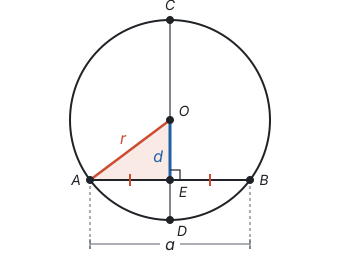

由勾股定理，

$$r^2 = d^2 + \left(\frac{a}{2}\right)^2.$$

三个量知道两个，就能求第三个。

**例 1**　一座石拱桥的桥拱是圆弧形。如图，跨度 $AB = 16$ m，拱高 $CD = 4$ m，其中 $D$ 是 $AB$ 的中点，$CD \perp AB$。求桥拱所在圆的半径。

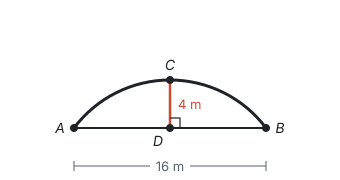

**思路：** 半径、弦的一半、弦心距能组成直角三角形，所以先找圆心。圆心到 $A$、$B$ 的距离相等，一定在 $AB$ 的垂直平分线上，而直线 $CD$ 正是 $AB$ 的垂直平分线，所以圆心 $O$ 在直线 $CD$ 上。半径不知道，就设为 $r$，把直角三角形的三条边都用 $r$ 表示出来，列方程。

**解：** 设桥拱所在圆的圆心为 $O$，半径为 $r$ m，连接 $OA$。由上面的分析，$O$ 在直线 $CD$ 上，$OC = r$，所以 $OD = r - 4$；$AD = \frac{1}{2}AB = 8$。

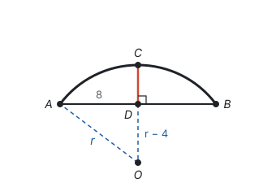

在 $\text{Rt}\triangle AOD$ 中，$OA^2 = AD^2 + OD^2$，即

$$r^2 = 8^2 + (r - 4)^2.$$

展开得 $r^2 = 64 + r^2 - 8r + 16$，所以 $8r = 80$，$r = 10$。

答：桥拱所在圆的半径是 10 m。

**回顾：** 圆里求长度，常常是“作弦心距、连半径，构成直角三角形”，再把未知量设出来用勾股定理列方程（见第十一部分“方程思想与建模”）。

## 圆周角定理

**顶点在圆上，并且两边都和圆相交的角叫圆周角。**

圆心角是“站在圆心看一条弧”，圆周角是“站在圆上看一条弧”。同一条弧 $BC$，站在圆心看和站在圆上看，张开的角有什么关系？在圆上取一点 $A$，看圆周角 $\angle BAC$ 和圆心角 $\angle BOC$。圆心 $O$ 和 $\angle BAC$ 的位置有三种情况：

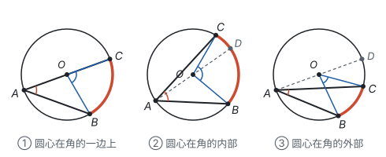

**情况 ①：圆心 $O$ 在 $\angle BAC$ 的一边 $AC$ 上。** 这是最容易的情况。$OA = OB$，所以 $\angle OBA = \angle BAC$。$\angle BOC$ 是 $\triangle OAB$ 的外角，等于和它不相邻的两个内角之和：

$$\angle BOC = \angle BAC + \angle OBA = 2\angle BAC.$$

**情况 ②：圆心在角的内部。** 作直径 $AD$，它把 $\angle BAC$ 分成 $\angle BAD$ 和 $\angle DAC$，两部分都属于情况 ①：$\angle BAD = \frac{1}{2}\angle BOD$，$\angle DAC = \frac{1}{2}\angle DOC$。两式相加，得 $\angle BAC = \frac{1}{2}\angle BOC$。

**情况 ③：圆心在角的外部。** 同样作直径 $AD$，这次 $\angle BAC$ 是两个角的差：

$$\angle BAC = \angle BAD - \angle CAD = \frac{1}{2}\angle BOD - \frac{1}{2}\angle COD = \frac{1}{2}\angle BOC.$$

三种情况结论相同：

**圆周角定理：一条弧所对的圆周角等于它所对的圆心角的一半。**

证明的想法是：先把最简单的情况 ① 证出来，另两种情况都作一条直径，把角拆成或补成情况 ①。这种“分情况、再化归到已经会的情况”的做法，见第十一部分“分类讨论”。

由圆周角定理马上得到两个推论。

**推论 1：同弧或等弧所对的圆周角相等。** 它们都等于同一个圆心角的一半。

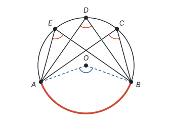

**推论 2：半圆（或直径）所对的圆周角是直角；$90^\circ$ 的圆周角所对的弦是直径。** 直径所对的圆心角是平角，一半就是 $90^\circ$。反过来，圆周角是 $90^\circ$，它所对的圆心角就是 $180^\circ$，弦的两个端点和圆心在一条直线上，这条弦是直径。

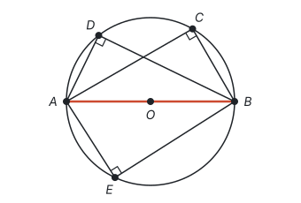

推论 2 就是“直角三角形斜边上的中线等于斜边的一半”换了一种说法：斜边的中点到三个顶点的距离相等，所以直角顶点在以斜边为直径的圆上（见第五部分“四边形”）。

**例 2**　如图，$AB$ 是 $\odot O$ 的直径，点 $C$、$D$ 在 $\odot O$ 上，$\angle ABC = 50^\circ$。求 $\angle BDC$ 的度数。

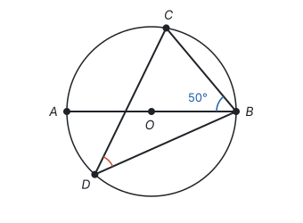

**思路：** $\angle BDC$ 是弧 $BC$ 所对的圆周角，它所在的 $\triangle BCD$ 里没有已知的角。但同一条弧 $BC$ 还对着别的圆周角，比如 $\angle BAC$，可以把问题转到它身上。$\angle BAC$ 在 $\triangle ABC$ 里，而 $AB$ 是直径，$\angle ACB = 90^\circ$，这个三角形的角就都能求了。所以连接 $AC$。

**解：** 连接 $AC$。

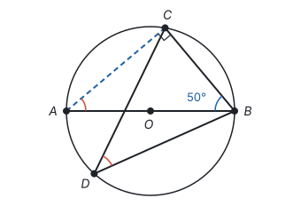

因为 $AB$ 是直径，所以 $\angle ACB = 90^\circ$。在 $\triangle ABC$ 中，

$$\angle BAC = 180^\circ - 90^\circ - 50^\circ = 40^\circ.$$

$\angle BDC$ 和 $\angle BAC$ 都是弧 $BC$ 所对的圆周角，所以 $\angle BDC = \angle BAC = 40^\circ$。

**想一想：** 不连 $AC$，改连 $OC$ 也能做。

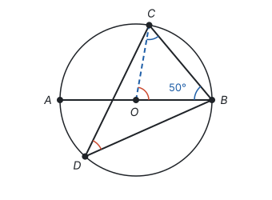

$OB = OC$，所以 $\angle OCB = \angle OBC = 50^\circ$，$\angle BOC = 180^\circ - 2 \times 50^\circ = 80^\circ$，于是 $\angle BDC = \frac{1}{2}\angle BOC = 40^\circ$。

| 比较 | 连 $AC$ | 连 $OC$ |
| --- | --- | --- |
| 得到什么 | 直径所对的圆周角，是直角 | 两条半径，是等腰三角形 |
| 用的定理 | 直径所对的圆周角是直角；同弧所对的圆周角相等 | 等腰三角形的底角相等；圆周角是圆心角的一半 |

这两种添线正是圆里最常用的辅助线：**连半径得到等腰三角形，连出直径所对的圆周角得到直角。** 见第十一部分“辅助线从哪里来”。

## 圆内接四边形

**四个顶点都在同一个圆上的四边形叫圆内接四边形，这个圆叫四边形的外接圆。**

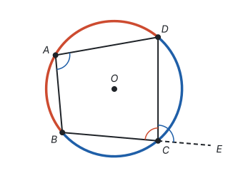

$\angle A$ 是弧 $BCD$ 所对的圆周角，$\angle BCD$ 是弧 $BAD$ 所对的圆周角。两条弧合起来正好是整个圆，它们所对的圆心角合起来是周角 $360^\circ$，所以

$$\angle A + \angle BCD = \frac{1}{2} \times 360^\circ = 180^\circ.$$

同样，$\angle ABC + \angle D = 180^\circ$。**圆内接四边形的对角互补。**

延长 $BC$ 到 $E$，$\angle DCE$ 和 $\angle BCD$ 互补，而 $\angle A$ 也和 $\angle BCD$ 互补，所以 $\angle DCE = \angle A$：**圆内接四边形的任意一个外角等于它的内对角。**

**例 3**　在圆内接四边形 $ABCD$ 中，$\angle A : \angle B : \angle C = 2 : 3 : 4$，求 $\angle D$ 的度数。

**思路：** 四个角里有两对对角，每对互补。$\angle A$ 和 $\angle C$ 是一对，按比例设出来，就能求出每一份是多少度。

**解：** 设 $\angle A = 2x$，$\angle B = 3x$，$\angle C = 4x$。由 $\angle A + \angle C = 180^\circ$，得 $6x = 180^\circ$，$x = 30^\circ$，所以 $\angle B = 90^\circ$。再由 $\angle B + \angle D = 180^\circ$，得 $\angle D = 90^\circ$。

**检验：** $\angle A = 60^\circ$，$\angle C = 120^\circ$，四个角的和是 $60^\circ + 90^\circ + 120^\circ + 90^\circ = 360^\circ$，符合四边形内角和。

## 易错点

- **丢掉“在同圆或等圆中”。** 圆心角、弧、弦“一组相等则其余相等”，只在同一个圆或半径相等的圆里成立。
- **把“度数相等的弧”当成“等弧”。** 等弧要能完全重合。半径不同的两个圆里，度数相同的弧长短不同，不是等弧。
- **垂径定理的推论漏掉“弦不是直径”。** 两条直径互相平分，但不一定互相垂直。
- **一条弦所对的圆周角只算了一个。** 弦把圆分成优弧和劣弧，顶点在优弧上的圆周角和顶点在劣弧上的圆周角互补（这正是圆内接四边形对角互补）。比如弦长等于半径时，它所对的圆心角是 $60^\circ$，所对的圆周角是 $30^\circ$ 或 $150^\circ$。
- **把不是圆周角的角当成圆周角。** 圆周角的顶点必须在圆上，而且两边都和圆相交。顶点在圆内或圆外的角，不能用圆周角定理。
- **弦的位置只考虑了一种。** 半径为 5 的圆里有两条平行弦，长分别为 6 和 8，它们的弦心距分别是 4 和 3。两条弦在圆心同侧时相距 $4 - 3 = 1$，在圆心两侧时相距 $4 + 3 = 7$，要分两种情况。

## 联系

- **轴对称与等腰三角形：** 连接两条半径就得到等腰三角形；垂径定理就是“三线合一”加上圆的轴对称。见第五部分“轴对称与等腰三角形”。
- **平移、轴对称与旋转：** 圆心角、弧、弦的关系来自旋转，垂径定理来自轴对称。见第六部分“平移、轴对称与旋转”。
- **勾股定理：** 半径、弦心距、弦的一半组成直角三角形，知二求一。见第五部分“勾股定理”。
- **三角形：** 圆周角定理的证明用的是三角形的外角等于不相邻的两个内角之和。见第五部分“三角形”。
- **四边形：** 直角三角形斜边上的中线等于斜边的一半，说的就是直角顶点在以斜边为直径的圆上。见第五部分“四边形”。
- **与圆有关的位置关系：** 过三点作圆，圆心在弦的垂直平分线上，是垂径定理的另一种用法；过圆外一点作切线要用直径所对的圆周角是直角。见第九部分“与圆有关的位置关系”。
- **与圆有关的计算：** 弧的度数等于圆心角的度数，弧长、扇形面积都按圆心角占 $360^\circ$ 的比例计算。见第九部分“与圆有关的计算”。
- **辅助线从哪里来：** 连半径、作弦心距、连出直径所对的圆周角，是圆里最常用的辅助线。见第十一部分“辅助线从哪里来”。
