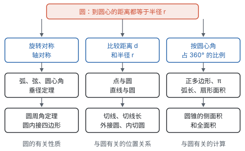

# 总览：圆的对称性

**圆上每一点到圆心的距离都等于半径，这一个事实让圆拥有最完整的对称：沿任何一条直径翻折都和自身重合，绕圆心旋转任意角度也和自身重合；圆的性质都从这两种对称推出来，位置关系都归结为比较距离和半径，计算都归结为按圆心角的比例取整圆的一部分。**

## 两种对称推出的性质

| 对称 | 为什么成立 | 推出的性质 | 页面 |
| --- | --- | --- | --- |
| 旋转对称：绕圆心旋转任意角度，和自身重合 | 旋转不改变点到圆心的距离 | 同圆或等圆中，圆心角、弧、弦有一组相等，另两组也相等；弧的度数等于圆心角的度数 | 第九部分“圆的有关性质” |
| 旋转对称，加上半径相等 | 两条半径和一条弦组成等腰三角形 | 圆周角等于同弧所对圆心角的一半；直径所对的圆周角是直角；圆内接四边形对角互补 | 第九部分“圆的有关性质” |
| 轴对称：任何一条直径所在直线都是对称轴 | 圆心在对称轴上，到一对对称点的距离相等 | 垂径定理：垂直于弦的直径平分弦和弦所对的两条弧 | 第九部分“圆的有关性质” |
| 轴对称 | 两条切线关于圆心和圆外一点的连线对称 | 切线长定理：两条切线长相等 | 第九部分“与圆有关的位置关系” |
| 旋转对称 | 把圆 $n$ 等分，转过一个中心角就重合 | 正 $n$ 边形，中心角是 $\frac{360^\circ}{n}$ | 第九部分“与圆有关的计算” |

证明这些性质时，最常用的一步都是“连接半径”：有了两条相等的半径，就有了等腰三角形，前面学过的“三线合一”、全等、勾股定理就都能用上了。

## 位置关系：比较距离和半径

| 对象 | 比较的距离 $d$ | $d < r$ | $d = r$ | $d > r$ |
| --- | --- | --- | --- | --- |
| 点和圆 | 点到圆心的距离 | 点在圆内 | 点在圆上 | 点在圆外 |
| 直线和圆 | 圆心到直线的距离 | 相交，2 个公共点 | 相切，1 个公共点 | 相离，没有公共点 |

位置关系和数量关系可以互相推出：知道位置，就知道 $d$ 和 $r$ 谁大；知道 $d$ 和 $r$ 谁大，也就知道位置。三角形和圆的关系也是这样说的：外接圆的圆心到三个顶点的距离都等于半径，内切圆的圆心到三条边的距离都等于半径。

## 计算：按比例取一部分

整圆的周长 $2\pi R$ 和面积 $\pi R^2$ 是用圆内接正多边形逼近得到的。有了它们，弧长、扇形面积都是按圆心角占 $360^\circ$ 的比例取一部分，圆锥的侧面积是展开后扇形的面积。

## 三页之间的关系

| 页面 | 讲什么 | 核心的想法 |
| --- | --- | --- |
| 圆的有关性质 | 弦、弧、圆心角；垂径定理；圆周角定理；圆内接四边形 | 旋转对称和轴对称，再加上半径相等 |
| 与圆有关的位置关系 | 点与圆、直线与圆；过三点作圆；切线的判定和性质；切线长定理；外接圆和内切圆 | 比较距离和半径 |
| 与圆有关的计算 | 正多边形与圆；圆周率；弧长；扇形面积；圆锥的侧面积和全面积 | 按圆心角占 $360^\circ$ 的比例取一部分 |

建议按顺序学：

1. 先学第九部分“圆的有关性质”。学之前复习等腰三角形的“三线合一”（见第五部分“轴对称与等腰三角形”）和勾股定理（见第五部分“勾股定理”），圆里的证明和计算几乎都要用到它们。
2. 再学第九部分“与圆有关的位置关系”。它用到上一页的垂径定理和“直径所对的圆周角是直角”；外心和内心又连着线段的垂直平分线（见第五部分“轴对称与等腰三角形”）和角的平分线（见第五部分“全等三角形”）。
3. 最后学第九部分“与圆有关的计算”。正多边形的计算要用锐角三角函数（见第八部分“锐角三角函数”），圆锥的展开图要用到立体图形的展开（见第五部分“几何图形初步”）。

圆里常用的辅助线怎样想到，见第十一部分“辅助线从哪里来”；位置不确定、需要分情况讨论的问题，见第十一部分“分类讨论”。
