# 2022 年河南中考数学

> 河南省 2022 年普通高中招生考试数学试卷，共 23 题，满分 120 分，考试时间 100 分钟。

## 第 1 题

考点：第二部分“有理数”

$-\frac{1}{2}$ 的相反数是

- A. $\frac{1}{2}$
- B. $2$
- C. $-2$
- D. $-\frac{1}{2}$

**答案：** A

**思路：** 相反数是在数轴上到原点距离相等、位于原点两侧的数，只改符号，不改绝对值。$-\frac{1}{2}$ 改变符号得 $\frac{1}{2}$。注意别和倒数（$-2$）混淆。

## 第 2 题

考点：第五部分“几何图形初步”

2022 年北京冬奥会的奖牌“同心”表达了“天地合·人心同”的中华文化内涵。将这六个汉字分别写在某正方体的表面上，如图是它的一种展开图，则在原正方体中，与“地”字所在面相对的面上的汉字是

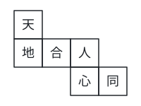

- A. 合
- B. 同
- C. 心
- D. 人

**答案：** D

**思路：** 展开图里排成一行的三个正方形，中间一个两边折起 $90^\circ$，两端的正方形正好面对面，所以一行中隔着一个的两个面相对。“地、合、人”排成一行，“地”和“人”隔着“合”，是相对的面。见第五部分“几何图形初步”。

## 第 3 题

考点：第五部分“相交线与平行线”

如图，直线 $AB$，$CD$ 相交于点 $O$，$EO \perp CD$，垂足为 $O$。若 $\angle 1 = 54^\circ$，则 $\angle 2$ 的度数为

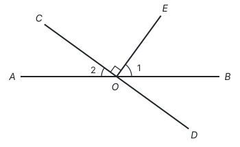

- A. $26^\circ$
- B. $36^\circ$
- C. $44^\circ$
- D. $54^\circ$

**答案：** B

**思路：** $\angle 2$ 和 $\angle 1$ 不相邻，要找一个“中转”的角。$EO \perp CD$，所以 $\angle EOD = 90^\circ$，$\angle BOD = 90^\circ - 54^\circ = 36^\circ$；$\angle 2$ 和 $\angle BOD$ 是对顶角，所以 $\angle 2 = 36^\circ$。

## 第 4 题

考点：第三部分“整式的乘法”、第三部分“二次根式”

下列运算正确的是

- A. $2\sqrt{3} - \sqrt{3} = 2$
- B. $(a + 1)^2 = a^2 + 1$
- C. $(a^2)^3 = a^5$
- D. $2a^2 \cdot a = 2a^3$

**答案：** D

**思路：** 逐个回到定义检查。A：$2\sqrt{3} - \sqrt{3} = \sqrt{3}$，合并同类二次根式只合并系数；B：$(a + 1)^2 = a^2 + 2a + 1$，漏了中间项；C：幂的乘方指数相乘，$(a^2)^3 = a^6$；D：单项式相乘，系数相乘、同底数幂指数相加，正确。

## 第 5 题

考点：第五部分“四边形”

如图，在菱形 $ABCD$ 中，对角线 $AC$，$BD$ 相交于点 $O$，点 $E$ 为 $CD$ 的中点。若 $OE = 3$，则菱形 $ABCD$ 的周长为

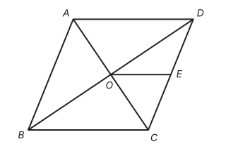

- A. 6
- B. 12
- C. 24
- D. 48

**答案：** C

**思路：** 看到两个中点就想中位线：菱形的对角线互相平分，$O$ 是 $BD$ 的中点，$E$ 是 $CD$ 的中点，所以 $OE$ 是 $\triangle BCD$ 的中位线，$BC = 2OE = 6$。菱形四边相等，周长为 $4 \times 6 = 24$。

## 第 6 题

考点：第四部分“一元二次方程”

一元二次方程 $x^2 + x - 1 = 0$ 的根的情况是

- A. 有两个不相等的实数根
- B. 没有实数根
- C. 有两个相等的实数根
- D. 只有一个实数根

**答案：** A

**思路：** 根的情况由判别式决定。$a = 1$，$b = 1$，$c = -1$，$\Delta = b^2 - 4ac = 1 + 4 = 5 > 0$，所以有两个不相等的实数根。

## 第 7 题

考点：第十部分“数据的分析”、第十部分“数据的收集、整理与描述”

如图所示的扇形统计图描述了某校学生对课后延时服务的打分情况（满分 5 分），则所打分数的众数为

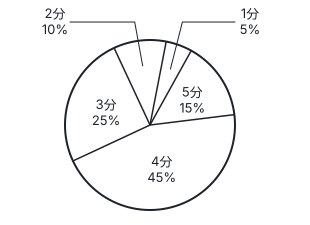

- A. 5 分
- B. 4 分
- C. 3 分
- D. 45%

**答案：** B

**思路：** 众数是出现次数最多的那个数据。扇形统计图里占比最大的是“4 分”（45%），所以打 4 分的人最多，众数是 4 分。众数是数据本身，不是它所占的百分比，所以不选 D。

## 第 8 题

考点：第三部分“整式的乘法”、第二部分“有理数的运算”

《孙子算经》中记载：“凡大数之法，万万曰亿，万万亿曰兆。”说明了大数之间的关系：1 亿 = 1 万 × 1 万，1 兆 = 1 万 × 1 万 × 1 亿。则 1 兆等于

- A. $10^8$
- B. $10^{12}$
- C. $10^{16}$
- D. $10^{24}$

**答案：** C

**思路：** 先把每个单位写成 10 的幂：1 万 $= 10^4$，1 亿 $= 10^4 \times 10^4 = 10^8$。再用同底数幂相乘、指数相加：1 兆 $= 10^4 \times 10^4 \times 10^8 = 10^{16}$。

## 第 9 题

考点：第六部分“平移、轴对称与旋转”、第六部分“平面直角坐标系”、第九部分“与圆有关的计算”、第十一部分“以数解形”

如图，在平面直角坐标系中，边长为 2 的正六边形 $ABCDEF$ 的中心与原点 $O$ 重合，$AB \parallel x$ 轴，交 $y$ 轴于点 $P$。将 $\triangle OAP$ 绕点 $O$ 顺时针旋转，每次旋转 $90^\circ$，则第 2022 次旋转结束时，点 $A$ 的坐标为

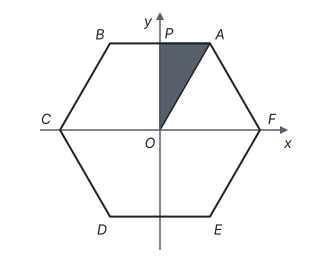

- A. $(\sqrt{3}, -1)$
- B. $(-1, -\sqrt{3})$
- C. $(-\sqrt{3}, -1)$
- D. $(1, \sqrt{3})$

**答案：** B

**思路：** 先求点 $A$ 的坐标：正六边形的边长等于半径，$OA = 2$；$P$ 是 $AB$ 的中点，$AP = 1$，$OP = \sqrt{2^2 - 1^2} = \sqrt{3}$，所以 $A(1, \sqrt{3})$。再看旋转的周期：每 4 次转满 $360^\circ$ 回到原处，$2022 = 4 \times 505 + 2$，相当于只转 2 次，即绕 $O$ 旋转 $180^\circ$。绕原点旋转 $180^\circ$，横、纵坐标都变成相反数，得 $(-1, -\sqrt{3})$。

## 第 10 题

考点：第七部分“函数”

呼气式酒精测试仪中装有酒精气体传感器，可用于检测驾驶员是否酒后驾车。酒精气体传感器是一种气敏电阻（图 1 中的 $R_1$），$R_1$ 的阻值随呼气酒精浓度 $K$ 的变化而变化（如图 2），血液酒精浓度 $M$ 与呼气酒精浓度 $K$ 的关系见图 3。下列说法**不正确**的是

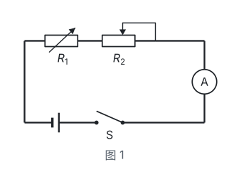

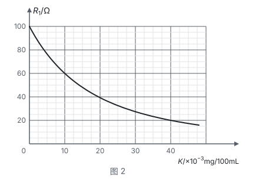

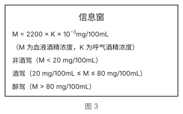

- A. 呼气酒精浓度 $K$ 越大，$R_1$ 的阻值越小
- B. 当 $K = 0$ 时，$R_1$ 的阻值为 100
- C. 当 $K = 10$ 时，该驾驶员为非酒驾状态
- D. 当 $R_1 = 20$ 时，该驾驶员为醉驾状态

**答案：** C

**思路：** 这是读图题：从图 2 的图象上读出 $K$ 与 $R_1$ 的对应值，再代入图 3 的关系式算出 $M$。A、B 直接从图象看出：图象从左往右下降，$K = 0$ 时 $R_1 = 100$。C：$K = 10$ 时，$M = 2200 \times 10 \times 10^{-3} = 22$，在 20 和 80 之间，是酒驾，所以 C 不正确。D：$R_1 = 20$ 时，从图象读出 $K = 40$，$M = 2200 \times 40 \times 10^{-3} = 88 > 80$，是醉驾，正确。

## 第 11 题

考点：第七部分“一次函数”

请写出一个 $y$ 随 $x$ 的增大而增大的一次函数的表达式：____。

**答案：** $y = x$（答案不唯一）

**思路：** 一次函数 $y = kx + b$ 中，$x$ 每增加 1，$y$ 变化 $k$。要 $y$ 随 $x$ 增大而增大，只要 $k > 0$，$b$ 取什么都可以，比如 $y = x$、$y = 2x + 1$。

## 第 12 题

考点：第四部分“不等式与不等式组”、第十一部分“以形助数”

不等式组

$$\begin{cases} x - 3 \le 0, \\ \frac{x}{2} > 1 \end{cases}$$

的解集为____。

**答案：** $2 < x \le 3$

**思路：** 分别解两个不等式，再取公共部分。由 $x - 3 \le 0$ 得 $x \le 3$；由 $\frac{x}{2} > 1$ 得 $x > 2$。在数轴上两部分重叠的是 $2 < x \le 3$。

## 第 13 题

考点：第十部分“概率”

为开展“喜迎二十大、永远跟党走、奋进新征程”主题教育宣讲活动，某单位从甲、乙、丙、丁四名宣讲员中随机选取两名进行宣讲，则恰好选中甲和丙的概率为____。

**答案：** $\frac{1}{6}$

**思路：** 先把所有等可能的结果不重不漏地列出来。从四人中选两人，共有甲乙、甲丙、甲丁、乙丙、乙丁、丙丁 6 种结果，每种可能性相同，恰好选中甲和丙的只有 1 种，所以概率为 $\frac{1}{6}$。用列表法列出 12 种有序结果、其中 2 种符合，结果相同。

## 第 14 题

考点：第九部分“与圆有关的计算”、第六部分“平移、轴对称与旋转”、第十一部分“辅助线从哪里来”

如图，将扇形 $AOB$ 沿 $OB$ 方向平移，使点 $O$ 移到 $OB$ 的中点 $O'$ 处，得到扇形 $A'O'B'$。若 $\angle O = 90^\circ$，$OA = 2$，则阴影部分的面积为____。

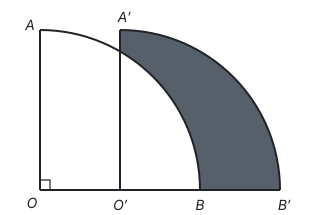

**答案：** $\frac{\pi}{3} + \frac{\sqrt{3}}{2}$

**思路：** 阴影是不规则图形，用“整体减空白”：阴影 = 扇形 $A'O'B'$ − 两扇形重叠的部分（$O'A'$ 右侧、弧 $AB$ 下方的部分）。设 $O'A'$ 与弧 $AB$ 交于点 $G$，连接 $OG$。在 $\text{Rt}\triangle OO'G$ 中，$OO' = 1$，$OG = 2$，所以 $\angle GOO' = 60^\circ$，$O'G = \sqrt{3}$。重叠部分 = 扇形 $GOB$ − $\triangle OO'G$：

$$\frac{60\pi \times 2^2}{360} - \frac{1}{2} \times 1 \times \sqrt{3} = \frac{2\pi}{3} - \frac{\sqrt{3}}{2}.$$

扇形 $A'O'B'$ 的面积是 $\frac{1}{4}\pi \times 2^2 = \pi$，所以阴影面积为

$$\pi - \left(\frac{2\pi}{3} - \frac{\sqrt{3}}{2}\right) = \frac{\pi}{3} + \frac{\sqrt{3}}{2}.$$

## 第 15 题

考点：第十一部分“分类讨论”、第五部分“勾股定理”、第六部分“平移、轴对称与旋转”、第一部分“基本事实”

如图，在 $\text{Rt}\triangle ABC$ 中，$\angle ACB = 90^\circ$，$AC = BC = 2\sqrt{2}$，点 $D$ 为 $AB$ 的中点，点 $P$ 在 $AC$ 上，且 $CP = 1$，将 $CP$ 绕点 $C$ 在平面内旋转，点 $P$ 的对应点为点 $Q$，连接 $AQ$，$DQ$。当 $\angle ADQ = 90^\circ$ 时，$AQ$ 的长为____。

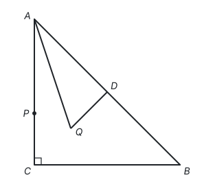

**答案：** $\sqrt{5}$ 或 $\sqrt{13}$

**思路：** 先弄清点 $Q$ 在哪里：$CQ = CP = 1$，$Q$ 在以 $C$ 为圆心、1 为半径的圆上。$\triangle ABC$ 是等腰直角三角形，$D$ 是斜边中点，所以 $CD \perp AB$，$CD = AD = \frac{1}{2}AB = 2$。$\angle ADQ = 90^\circ$ 说明 $DQ \perp AB$，过点 $D$ 垂直于 $AB$ 的直线只有一条，就是直线 $CD$，所以 $Q$ 在直线 $CD$ 上。直线 $CD$ 和圆有两个交点，要分两种情况：

- $Q$ 在线段 $CD$ 上：$DQ = 2 - 1 = 1$，$AQ = \sqrt{AD^2 + DQ^2} = \sqrt{4 + 1} = \sqrt{5}$；
- $Q$ 在 $DC$ 的延长线上：$DQ = 2 + 1 = 3$，$AQ = \sqrt{4 + 9} = \sqrt{13}$。

## 第 16 题

考点：第二部分“实数”、第三部分“分式”、第三部分“因式分解”

（1）（5 分）计算：$\sqrt[3]{27} - \left(\frac{1}{3}\right)^0 + 2^{-1}$；

（2）（5 分）化简：

$$\frac{x^2 - 1}{x} \div \left(1 - \frac{1}{x}\right).$$

**答案：**

（1）原式 $= 3 - 1 + \frac{1}{2} = \frac{5}{2}$。

（2）

$$\text{原式} = \frac{(x + 1)(x - 1)}{x} \cdot \frac{x}{x - 1} = x + 1.$$

**思路：** （1）三项各用一个规定：$3^3 = 27$，所以 $\sqrt[3]{27} = 3$；任何不为 0 的数的 0 次幂是 1；$2^{-1} = \frac{1}{2}$。（2）先把括号里通分成 $\frac{x - 1}{x}$，除法变成乘倒数；分子 $x^2 - 1$ 因式分解成 $(x + 1)(x - 1)$，才能和分母约分。

## 第 17 题

考点：第十部分“数据的分析”

（9 分）2022 年 3 月 23 日下午，“天宫课堂”第二课在中国空间站开讲，神舟十三号乘组航天员翟志刚、王亚平、叶光富相互配合进行授课，这是中国空间站的第二次太空授课，被许多中小学生称为“最牛网课”。某中学为了解学生对“航空航天知识”的掌握情况，随机抽取 50 名学生进行测试，并对成绩（百分制）进行整理，信息如下：

a. 成绩频数分布表：

| 成绩 $x$（分） | $50 \le x < 60$ | $60 \le x < 70$ | $70 \le x < 80$ | $80 \le x < 90$ | $90 \le x \le 100$ |
| --- | --- | --- | --- | --- | --- |
| 频数 | 7 | 9 | 12 | 16 | 6 |

b. 成绩在 $70 \le x < 80$ 这一组的是（单位：分）：

70　71　72　72　74　77　78　78　78　79　79　79

根据以上信息，回答下列问题：

（1）在这次测试中，成绩的中位数是____分，成绩不低于 80 分的人数占测试人数的百分比为____。

（2）这次测试成绩的平均数是 76.4 分，甲的测试成绩是 77 分。乙说：“甲的成绩高于平均数，所以甲的成绩高于一半学生的成绩。”你认为乙的说法正确吗？请说明理由。

（3）请对该校学生“航空航天知识”的掌握情况作出合理的评价。

**答案：**

（1）78.5，44%。

（2）不正确。因为甲的成绩 77 分低于中位数 78.5 分，所以甲的成绩不可能高于一半学生的成绩。

（3）测试成绩不低于 80 分的人数占测试人数的 44%，说明该校学生对“航空航天知识”的掌握情况较好。（答案不唯一，合理即可）

**思路：** （1）50 个数据的中位数是从小到大第 25、26 个数的平均数。前两组共 $7 + 9 = 16$ 人，所以第 25、26 个数是第三组的第 9、10 个，即 78 和 79，中位数是 78.5。不低于 80 分的有 $16 + 6 = 22$ 人，$22 \div 50 = 44\%$。（2）“高于一半学生”要和中位数比，不是和平均数比：平均数会被少数很低的分数拉低，中位数才把数据分成人数相等的两半。

## 第 18 题

考点：第七部分“反比例函数”、第五部分“尺规作图”、第五部分“轴对称与等腰三角形”、第一部分“怎样证明”

（9 分）如图，反比例函数 $y = \frac{k}{x}$（$x > 0$）的图象经过点 $A(2, 4)$ 和点 $B$，点 $B$ 在点 $A$ 的下方，$AC$ 平分 $\angle OAB$，交 $x$ 轴于点 $C$。

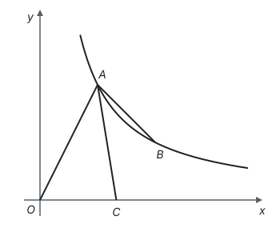

（1）求反比例函数的表达式。

（2）请用无刻度的直尺和圆规作出线段 $AC$ 的垂直平分线。（要求：不写作法，保留作图痕迹，使用 2B 铅笔作图）

（3）线段 $OA$ 与（2）中所作的垂直平分线相交于点 $D$，连接 $CD$。求证：$CD \parallel AB$。

**答案：**

（1）因为反比例函数 $y = \frac{k}{x}$ 的图象经过点 $A(2, 4)$，所以 $k = 2 \times 4 = 8$，反比例函数的表达式为 $y = \frac{8}{x}$。

（2）分别以 $A$、$C$ 为圆心，以大于 $\frac{1}{2}AC$ 的长为半径画弧，两弧在 $AC$ 两侧各交于一点，过这两点画直线，就是 $AC$ 的垂直平分线。

（3）因为 $AC$ 平分 $\angle OAB$，所以 $\angle OAC = \angle BAC$。因为 $AC$ 的垂直平分线交 $OA$ 于点 $D$，所以 $DA = DC$，$\angle DAC = \angle DCA$。所以 $\angle DCA = \angle BAC$，所以 $CD \parallel AB$（内错角相等，两直线平行）。

**思路：** （2）到 $A$、$C$ 距离相等的点都在 $AC$ 的垂直平分线上，所以作两个这样的点，两点确定一条直线（见第五部分“尺规作图”）。（3）要证平行，就找一对内错角相等：角平分线给出 $\angle DAC = \angle BAC$，垂直平分线给出 $DA = DC$，从而 $\angle DAC = \angle DCA$，两个等量关系一接，$\angle DCA = \angle BAC$。角平分线、平行线、等腰三角形常常一起出现，知道其中两个就能推出第三个。

## 第 19 题

考点：第八部分“锐角三角函数”、第十一部分“辅助线从哪里来”

（9 分）开封清明上河园是依照北宋著名画家张择端的《清明上河图》建造的，拂云阁是园内最高的建筑。某数学小组测量拂云阁 $DC$ 的高度，如图，在 $A$ 处用测角仪测得拂云阁顶端 $D$ 的仰角为 $34^\circ$，沿 $AC$ 方向前进 15 m 到达 $B$ 处，又测得拂云阁顶端 $D$ 的仰角为 $45^\circ$。已知测角仪的高度为 1.5 m，测量点 $A$，$B$ 与拂云阁 $DC$ 的底部 $C$ 在同一水平线上，求拂云阁 $DC$ 的高度（结果精确到 1 m。参考数据：$\sin 34^\circ \approx 0.56$，$\cos 34^\circ \approx 0.83$，$\tan 34^\circ \approx 0.67$）。

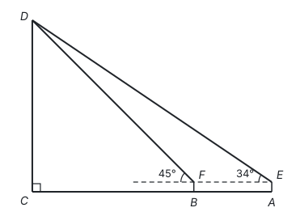

**答案：** 延长 $EF$ 交 $DC$ 于点 $H$，则 $EH \perp DC$，$HC = 1.5$ m。设 $DH = x$ m。

在 $\text{Rt}\triangle DHF$ 中，$\angle DFH = 45^\circ$，所以 $FH = DH = x$。

在 $\text{Rt}\triangle DHE$ 中，$\angle DEH = 34^\circ$，所以 $EH = \frac{DH}{\tan 34^\circ} = \frac{x}{\tan 34^\circ}$。

因为 $EF = 15$，所以 $EH - FH = 15$，即

$$\frac{x}{\tan 34^\circ} - x = 15.$$

解得 $x \approx 30.5$。所以 $DC \approx 30.5 + 1.5 = 32$。

答：拂云阁 $DC$ 的高度约为 32 m。

**思路：** 两个仰角各在一个直角三角形里，要把它们放到同一条水平线上：延长 $EF$ 交 $DC$ 于 $H$，得到两个共用直角边 $DH$ 的直角三角形。设公共边 $DH = x$，用 $x$ 分别表示 $FH$ 和 $EH$，它们的差就是已知的 15 m，列方程求 $x$。最后别忘了加上测角仪的高度 1.5 m。

## 第 20 题

考点：第四部分“分式方程”、第七部分“一次函数”、第四部分“不等式与不等式组”

（9 分）近日，教育部印发《义务教育课程方案》和课程标准（2022 年版），将劳动从原来的综合实践活动课程中独立出来。某中学为了让学生体验农耕劳动，开辟了一处耕种园，需要采购一批菜苗开展种植活动。据了解，市场上每捆 A 种菜苗的价格是菜苗基地的 $\frac{5}{4}$ 倍，用 300 元在市场上购买的 A 种菜苗比在菜苗基地购买的少 3 捆。

（1）求菜苗基地每捆 A 种菜苗的价格。

（2）菜苗基地每捆 B 种菜苗的价格是 30 元。学校决定在菜苗基地购买 A，B 两种菜苗共 100 捆，且 A 种菜苗的捆数不超过 B 种菜苗的捆数。菜苗基地为支持该校活动，对 A，B 两种菜苗均提供九折优惠。求本次购买最少花费多少钱。

**答案：**

（1）设菜苗基地每捆 A 种菜苗的价格为 $x$ 元，根据题意，得

$$\frac{300}{x} - \frac{300}{\frac{5}{4}x} = 3.$$

解得 $x = 20$。经检验，$x = 20$ 是原方程的解。

答：菜苗基地每捆 A 种菜苗的价格为 20 元。

（2）设购买 A 种菜苗 $a$ 捆，则购买 B 种菜苗 $(100 - a)$ 捆。根据题意，得 $a \le 100 - a$，解得 $a \le 50$。

设本次购买花费 $w$ 元，则

$$w = 20a \times 0.9 + 30(100 - a) \times 0.9 = -9a + 2700.$$

因为 $-9 < 0$，$w$ 随 $a$ 的增大而减小，所以当 $a = 50$ 时，$w$ 有最小值 $-450 + 2700 = 2250$。

答：本次购买最少花费 2250 元。

**思路：** （1）等量关系是“捆数差 3”，捆数 = 总价 ÷ 单价，单价是未知数，所以列出的是分式方程，解完要检验。（2）花费随 A 种菜苗的捆数一次变化，写成一次函数 $w = -9a + 2700$；A 种便宜，买得越多越省，但受“不超过 B 种”限制，$a$ 最大取 50。求最值的问题，先写出函数，再由不等式定出自变量的范围，在范围的端点取最值。

## 第 21 题

考点：第七部分“二次函数”、第一部分“三种数学语言”

（9 分）小红看到一处喷水景观，喷出的水柱呈抛物线形状，她对此展开研究：测得喷水头 $P$ 距地面 0.7 m，水柱在距喷水头 $P$ 水平距离 5 m 处达到最高，最高点距地面 3.2 m；建立如图所示的平面直角坐标系，并设抛物线的表达式为 $y = a(x - h)^2 + k$，其中 $x$（m）是水柱距喷水头的水平距离，$y$（m）是水柱距地面的高度。

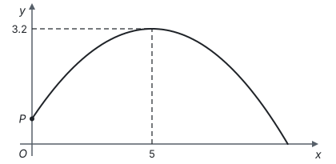

（1）求抛物线的表达式。

（2）爸爸站在水柱正下方，且距喷水头 $P$ 水平距离 3 m。身高 1.6 m 的小红在水柱下方走动，当她的头顶恰好接触到水柱时，求她与爸爸的水平距离。

**答案：**

（1）由题意知，点 $(5, 3.2)$ 是抛物线 $y = a(x - h)^2 + k$ 的顶点，所以 $y = a(x - 5)^2 + 3.2$。又因为抛物线经过点 $(0, 0.7)$，所以 $0.7 = a(0 - 5)^2 + 3.2$，解得 $a = -0.1$。所以抛物线的表达式为 $y = -0.1(x - 5)^2 + 3.2$（或 $y = -0.1x^2 + x + 0.7$）。

（2）当 $y = 1.6$ 时，$1.6 = -0.1(x - 5)^2 + 3.2$，解得 $x_1 = 1$，$x_2 = 9$。$3 - 1 = 2$，$9 - 3 = 6$。

答：小红与爸爸的水平距离为 2 m 或 6 m。

**思路：** （1）已知最高点，就用顶点式，只剩 $a$ 一个未知数，再代入喷水头 $P(0, 0.7)$ 求 $a$。（2）“头顶恰好接触水柱”就是水柱高度等于 1.6 m，已知函数值求自变量，得到对称轴两侧的两个 $x$，所以小红有两个位置，分别和爸爸的位置 $x = 3$ 相减。

## 第 22 题

考点：第九部分“与圆有关的位置关系”、第八部分“锐角三角函数”、第一部分“怎样证明”、第十一部分“辅助线从哪里来”

（10 分）为弘扬民族传统体育文化，某校将传统游戏“滚铁环”列入了校运动会的比赛项目。滚铁环器材由铁环和推杆组成。小明对滚铁环的启动阶段进行了研究，如图，滚铁环时，铁环 $\odot O$ 与水平地面相切于点 $C$，推杆 $AB$ 与铅垂线 $AD$ 的夹角为 $\angle BAD$，点 $O$，$A$，$B$，$C$，$D$ 在同一平面内。当推杆 $AB$ 与铁环 $\odot O$ 相切于点 $B$ 时，手上的力量通过切点 $B$ 传递到铁环上，会有较好的启动效果。

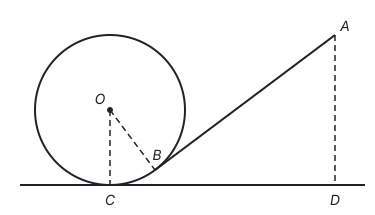

（1）求证：$\angle BOC + \angle BAD = 90^\circ$。

（2）实践中发现，切点 $B$ 只有在铁环上一定区域内时，才能保证铁环平稳启动。图中点 $B$ 是该区域内最低位置，此时点 $A$ 距地面的距离 $AD$ 最小，测得 $\cos \angle BAD = \frac{3}{5}$。已知铁环 $\odot O$ 的半径为 25 cm，推杆 $AB$ 的长为 75 cm，求此时 $AD$ 的长。

**答案：**

（1）过点 $B$ 作 $EF \parallel CD$，分别交 $AD$ 于点 $E$，交 $OC$ 于点 $F$。

因为 $CD$ 与 $\odot O$ 相切于点 $C$，所以 $\angle OCD = 90^\circ$。因为 $AD \perp CD$，所以 $\angle ADC = 90^\circ$。因为 $EF \parallel CD$，所以 $\angle OFB = \angle AEB = 90^\circ$。所以 $\angle BOC + \angle OBF = 90^\circ$，$\angle ABE + \angle BAD = 90^\circ$。

因为 $AB$ 为 $\odot O$ 的切线，所以 $\angle OBA = 90^\circ$，$\angle OBF + \angle ABE = 90^\circ$。所以 $\angle OBF = \angle BAD$，所以 $\angle BOC + \angle BAD = 90^\circ$。

（2）在 $\text{Rt}\triangle ABE$ 中，$AB = 75$，$\cos \angle BAD = \frac{3}{5}$，所以 $AE = 75 \times \frac{3}{5} = 45$。

由（1）知 $\angle OBF = \angle BAD$，所以 $\cos \angle OBF = \frac{3}{5}$。在 $\text{Rt}\triangle OBF$ 中，$OB = 25$，所以 $BF = 15$，$OF = 20$。因为 $OC = 25$，所以 $CF = 5$。

因为 $\angle OCD = \angle ADC = \angle CFE = 90^\circ$，所以四边形 $CDEF$ 为矩形，$DE = CF = 5$。所以 $AD = AE + ED = 50$ cm。

**思路：** （1）题目里有两个“切”：地面切圆于 $C$ 得 $OC \perp CD$，推杆切圆于 $B$ 得 $OB \perp AB$。再加上 $AD$ 铅垂，全是直角，过 $B$ 画一条水平线，就能把 $\angle BOC$ 和 $\angle BAD$ 分别放进两个直角三角形里，用“同角的余角相等”连起来。（2）$AD$ 被水平线 $EF$ 分成两段：上段 $AE$ 在 $\text{Rt}\triangle ABE$ 里直接用余弦算；下段 $ED = CF = OC - OF$，而 $OF$ 要在 $\text{Rt}\triangle OBF$ 里算，这里正好用上（1）的结论 $\angle OBF = \angle BAD$。

## 第 23 题

考点：第六部分“平移、轴对称与旋转”、第五部分“全等三角形”、第五部分“勾股定理”、第一部分“怎样证明”

（10 分）综合与实践

综合与实践课上，老师让同学们以“矩形的折叠”为主题开展数学活动。

（1）操作判断

操作一：对折矩形纸片 $ABCD$，使 $AD$ 与 $BC$ 重合，得到折痕 $EF$，把纸片展平；

操作二：在 $AD$ 上选一点 $P$，沿 $BP$ 折叠，使点 $A$ 落在矩形内部点 $M$ 处，把纸片展平，连接 $PM$，$BM$。

根据以上操作，当点 $M$ 在 $EF$ 上时，写出图 1 中一个 $30^\circ$ 的角：____。

（2）迁移探究

小华将矩形纸片换成正方形纸片，继续探究，过程如下：

将正方形纸片 $ABCD$ 按照（1）中的方式操作，并延长 $PM$ 交 $CD$ 于点 $Q$，连接 $BQ$。

① 如图 2，当点 $M$ 在 $EF$ 上时，$\angle MBQ =$____°，$\angle CBQ =$____°；

② 改变点 $P$ 在 $AD$ 上的位置（点 $P$ 不与点 $A$，$D$ 重合），如图 3，判断 $\angle MBQ$ 与 $\angle CBQ$ 的数量关系，并说明理由。

（3）拓展应用

在（2）的探究中，已知正方形纸片 $ABCD$ 的边长为 8 cm，当 $FQ = 1$ cm 时，直接写出 $AP$ 的长。

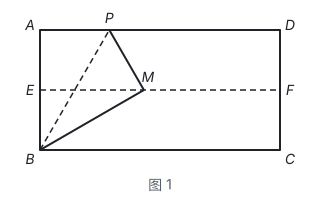

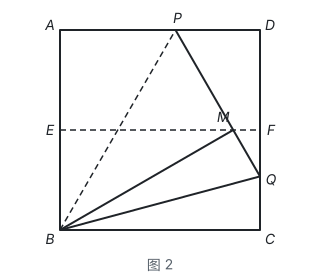

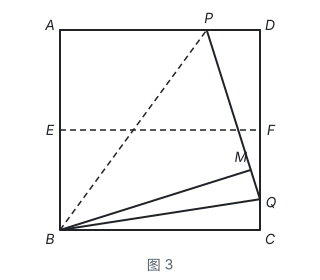

**答案：**

（1）$\angle ABP$ 或 $\angle PBM$ 或 $\angle MBC$ 或 $\angle BME$（任意写出一个即可）。

（2）① 15，15。

② $\angle MBQ = \angle CBQ$。理由如下：

因为四边形 $ABCD$ 是正方形，所以 $AB = BC$，$\angle A = \angle C = 90^\circ$。由轴对称的性质，得 $BM = AB$，$\angle BMP = \angle A = 90^\circ$。所以 $\angle BMQ = \angle C = 90^\circ$，$BM = BC$。又因为 $BQ$ 是公共边，所以 $\text{Rt}\triangle MBQ \cong \text{Rt}\triangle CBQ$（HL），所以 $\angle MBQ = \angle CBQ$。

（3）$\frac{40}{11}$ cm 或 $\frac{24}{13}$ cm。

**思路：** 折叠就是轴对称，折痕两侧的对应边、对应角相等。（1）$EF$ 是对折线，$BE = \frac{1}{2}AB$；折叠后 $BM = AB$，所以 $\text{Rt}\triangle BEM$ 中 $BE = \frac{1}{2}BM$，$\angle BME = 30^\circ$，再由 $EF \parallel BC$ 和折叠推出 $\angle MBC = 30^\circ$、$\angle ABM = 60^\circ$、$\angle ABP = \angle PBM = 30^\circ$。（2）换成正方形后 $BM = AB = BC$，$\angle BMQ = \angle C = 90^\circ$，两个直角三角形斜边公共、一条直角边相等，用 HL 得全等；图 2 中 $\angle MBC = 30^\circ$，被 $BQ$ 平分，所以两个角都是 $15^\circ$。（3）由全等得 $MQ = CQ$，设 $AP = PM = x$，则 $PQ = x + CQ$，$PD = 8 - x$，$DQ = 8 - CQ$，在 $\text{Rt}\triangle PDQ$ 中用勾股定理列方程。$F$ 是 $CD$ 的中点，$FQ = 1$ 时 $Q$ 可能在 $F$ 下方（$CQ = 3$）或上方（$CQ = 5$），要分两种情况：

$$(x + 3)^2 = (8 - x)^2 + 5^2 \Rightarrow x = \frac{40}{11}; \qquad (x + 5)^2 = (8 - x)^2 + 3^2 \Rightarrow x = \frac{24}{13}.$$
