# 2023 年河南中考数学

> 河南省 2023 年普通高中招生考试数学试卷，共 23 题，满分 120 分，考试时间 100 分钟。

## 第 1 题

考点：第二部分“实数”

下列各数中，最小的数是

- A. $-1$
- B. 0
- C. 1
- D. $\sqrt{3}$

**答案：** A

**思路：** 比较大小先看正负：负数小于 0，0 小于正数。四个数里只有 $-1$ 是负数，所以它最小，不用再比较 1 和 $\sqrt{3}$。

## 第 2 题

考点：第八部分“投影与视图”

北宋时期的汝官窑天蓝釉刻花鹅颈瓶是河南博物院九大镇院之宝之一，具有极高的历史价值、文化价值。如图所示，关于它的三视图，下列说法正确的是

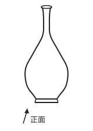

- A. 主视图与左视图相同
- B. 主视图与俯视图相同
- C. 左视图与俯视图相同
- D. 三种视图都相同

**答案：** A

**思路：** 瓶子可以看成一条曲线绕竖直的轴转一圈得到的，从前面看和从左面看，看到的都是同一个瓶身轮廓，所以主视图和左视图相同；从上面看是几个同心圆，和另外两个视图不同。

## 第 3 题

考点：第二部分“有理数的运算”

2022 年河南省出版的 4.59 亿册图书，为贯彻落实党的二十大关于深化全民阅读活动的重要精神，建设学习型社会提供了丰富的图书资源。数据“4.59 亿”用科学记数法表示为

- A. $4.59 \times 10^7$
- B. $45.9 \times 10^8$
- C. $4.59 \times 10^8$
- D. $0.459 \times 10^9$

**答案：** C

**思路：** 科学记数法要求写成 $a \times 10^n$，$1 \le \lvert a \rvert < 10$，所以 B、D 的形式就不对。1 亿 $= 10^8$，4.59 亿 $= 4.59 \times 10^8$。

## 第 4 题

考点：第五部分“相交线与平行线”

如图，直线 $AB$，$CD$ 相交于点 $O$，若 $\angle 1 = 80^\circ$，$\angle 2 = 30^\circ$，则 $\angle AOE$ 的度数为

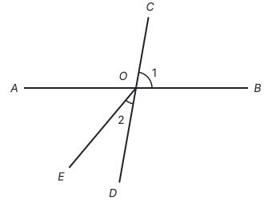

- A. $30^\circ$
- B. $50^\circ$
- C. $60^\circ$
- D. $80^\circ$

**答案：** B

**思路：** $\angle AOE$ 和已知的两个角都不直接相关，先找它所在的大角：$\angle AOE$ 是 $\angle AOD$ 去掉 $\angle 2$ 剩下的部分。$\angle AOD$ 和 $\angle 1$ 是对顶角，等于 $80^\circ$，所以 $\angle AOE = 80^\circ - 30^\circ = 50^\circ$。

## 第 5 题

考点：第三部分“分式”

化简 $\dfrac{a-1}{a} + \dfrac{1}{a}$ 的结果是

- A. 0
- B. 1
- C. $a$
- D. $a - 2$

**答案：** B

**思路：** 同分母的分式相加，分母不变，分子相加：$\dfrac{a - 1 + 1}{a} = \dfrac{a}{a} = 1$。道理和同分母分数相加一样。

## 第 6 题

考点：第九部分“圆的有关性质”

如图，点 $A$，$B$，$C$ 在 $\odot O$ 上，若 $\angle C = 55^\circ$，则 $\angle AOB$ 的度数为

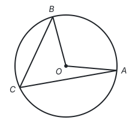

- A. $95^\circ$
- B. $100^\circ$
- C. $105^\circ$
- D. $110^\circ$

**答案：** D

**思路：** $\angle C$ 是圆周角，$\angle AOB$ 是圆心角，它们对着同一条弧 $\overset{\frown}{AB}$。同弧所对的圆周角是圆心角的一半，所以 $\angle AOB = 2 \times 55^\circ = 110^\circ$。

## 第 7 题

考点：第四部分“一元二次方程”、第十一部分“以形助数”

关于 $x$ 的一元二次方程 $x^2 + mx - 8 = 0$ 的根的情况是

- A. 有两个不相等的实数根
- B. 有两个相等的实数根
- C. 只有一个实数根
- D. 没有实数根

**答案：** A

**思路：** 根的情况看判别式：$\Delta = m^2 - 4 \times 1 \times (-8) = m^2 + 32$。不管 $m$ 取什么值，$m^2 \ge 0$，所以 $\Delta > 0$，方程总有两个不相等的实数根。也可以看图：抛物线 $y = x^2 + mx - 8$ 开口向上，又经过 $x$ 轴下方的点 $(0, -8)$，所以一定与 $x$ 轴有两个交点，方程有两个不相等的实数根。

## 第 8 题

考点：第十部分“概率”

为落实教育部办公厅、中共中央宣传部办公厅关于《第 41 批向全国中小学生推荐优秀影片片目》的通知精神，某校七、八年级分别从如图所示的三部影片中随机选择一部组织本年级学生观看，则这两个年级选择的影片相同的概率为

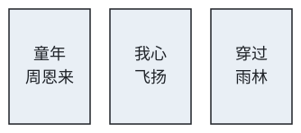

- A. $\dfrac{1}{2}$
- B. $\dfrac{1}{3}$
- C. $\dfrac{1}{6}$
- D. $\dfrac{1}{9}$

**答案：** B

**思路：** 两个年级各选一部，是两步试验，用列表或画树状图列出所有结果：$3 \times 3 = 9$ 种，每种可能性相同。其中两个年级选的相同有 3 种，所以概率是 $\dfrac{3}{9} = \dfrac{1}{3}$。

## 第 9 题

考点：第七部分“二次函数”、第七部分“一次函数”、第十一部分“以形助数”

二次函数 $y = ax^2 + bx$ 的图象如图所示，则一次函数 $y = x + b$ 的图象一定不经过

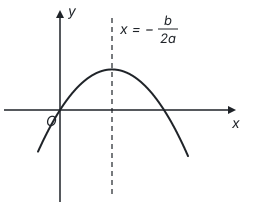

- A. 第一象限
- B. 第二象限
- C. 第三象限
- D. 第四象限

**答案：** D

**思路：** 从图象读出系数的符号：开口向下，$a < 0$；对称轴在 $y$ 轴右侧，$-\dfrac{b}{2a} > 0$，而 $a < 0$，所以 $b > 0$。直线 $y = x + b$ 的 $k = 1 > 0$，从左往右上升，又与 $y$ 轴交在正半轴，所以经过第一、二、三象限，不经过第四象限。

## 第 10 题

考点：第十一部分“动点与函数”、第五部分“轴对称与等腰三角形”

如图 1，点 $P$ 从等边三角形 $ABC$ 的顶点 $A$ 出发，沿直线运动到三角形内部一点，再从该点沿直线运动到顶点 $B$。设点 $P$ 运动的路程为 $x$，$\dfrac{PB}{PC} = y$，图 2 是点 $P$ 运动时 $y$ 随 $x$ 变化的关系图象，则等边三角形 $ABC$ 的边长为

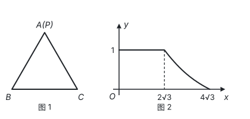

- A. 6
- B. 3
- C. $4\sqrt{3}$
- D. $2\sqrt{3}$

**答案：** A

**思路：** 先读图：第一段 $y = 1$ 不变，说明 $PB = PC$，点 $P$ 一直在 $BC$ 的垂直平分线上，也就是沿着从 $A$ 出发的高走，走了 $2\sqrt{3}$；第二段从内部那一点走到 $B$，也走了 $2\sqrt{3}$。这一点到 $A$、$B$ 的距离相等，又在 $BC$ 的垂直平分线上，所以是三边垂直平分线的交点，即等边三角形的中心 $O$。$AO$ 是高的 $\dfrac{2}{3}$，设边长为 $a$，则 $\dfrac{2}{3} \times \dfrac{\sqrt{3}}{2}a = 2\sqrt{3}$，得 $a = 6$。

## 第 11 题

考点：第三部分“代数式”、第一部分“三种数学语言”

某校计划给每个年级配发 $n$ 套劳动工具，则 3 个年级共需配发 ____ 套劳动工具。

**答案：** $3n$

**思路：** 每个年级 $n$ 套，3 个年级就是 3 个 $n$，用字母表示数量关系，写成 $3n$（数字写在字母前面，乘号省略）。

## 第 12 题

考点：第四部分“二元一次方程组”

方程组

$$\begin{cases} 3x + y = 5, \\ x + 3y = 7 \end{cases}$$

的解为 ____。

**答案：**

$$\begin{cases} x = 1, \\ y = 2. \end{cases}$$

**思路：** 两个方程的系数正好“对调”，两式相加得 $4x + 4y = 12$，即 $x + y = 3$；两式相减得 $2x - 2y = -2$，即 $x - y = -1$。再解这个简单的方程组，得 $x = 1$，$y = 2$。用代入消元法也可以，先由第一个方程得 $y = 5 - 3x$。

## 第 13 题

考点：第十部分“数据的收集、整理与描述”

某林木良种繁育试验基地为全面掌握“无絮杨”品种苗的生长规律，定期对培育的 1000 棵该品种苗进行抽测。如图是某次随机抽测该品种苗的高度 $x$（cm）的统计图，则此时该基地高度不低于 300 cm 的“无絮杨”品种苗约有 ____ 棵。

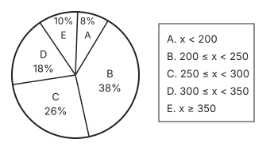

**答案：** 280

**思路：** “不低于 300 cm”是 $x \ge 300$，对应 D、E 两组，在样本中占 $18\% + 10\% = 28\%$。用样本估计总体，1000 棵中约有 $1000 \times 28\% = 280$（棵）。

## 第 14 题

考点：第九部分“与圆有关的位置关系”、第五部分“全等三角形”、第五部分“勾股定理”、第十一部分“辅助线从哪里来”

如图，$PA$ 与 $\odot O$ 相切于点 $A$，$PO$ 交 $\odot O$ 于点 $B$，点 $C$ 在 $PA$ 上，且 $CB = CA$。若 $OA = 5$，$PA = 12$，则 $CA$ 的长为 ____。

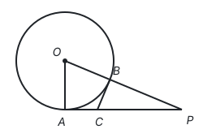

**答案：** $\dfrac{10}{3}$

**思路：** 切线垂直于过切点的半径，所以 $\angle OAP = 90^\circ$，$OP = \sqrt{5^2 + 12^2} = 13$，$PB = 13 - 5 = 8$。连接 $OC$，$OA = OB$，$CA = CB$，$OC$ 公共，所以 $\triangle OAC \cong \triangle OBC$（SSS），$\angle OBC = \angle OAC = 90^\circ$，即 $CB \perp OP$。设 $CA = CB = x$，在 $\text{Rt}\triangle PBC$ 中，$(12 - x)^2 = x^2 + 8^2$，解得 $x = \dfrac{10}{3}$。

## 第 15 题

考点：第十一部分“分类讨论”、第五部分“四边形”、第五部分“勾股定理”、第十一部分“辅助线从哪里来”

矩形 $ABCD$ 中，$M$ 为对角线 $BD$ 的中点，点 $N$ 在边 $AD$ 上，且 $AN = AB = 1$。当以点 $D$，$M$，$N$ 为顶点的三角形是直角三角形时，$AD$ 的长为 ____。

**答案：** 2 或 $\sqrt{2} + 1$

**思路：** 题目没说哪个角是直角，要分情况。$\angle MDN$ 是矩形对角线和边的夹角，不可能是直角，只剩两种：

- $\angle MND = 90^\circ$：$MN \perp AD$，又 $AB \perp AD$，所以 $MN \parallel AB$。$M$ 是 $BD$ 的中点，$N$ 就是 $AD$ 的中点，$AD = 2AN = 2$。
- $\angle NMD = 90^\circ$：连接 $BN$，$MN$ 垂直平分 $BD$，所以 $ND = NB = \sqrt{1^2 + 1^2} = \sqrt{2}$，$AD = AN + ND = \sqrt{2} + 1$。

## 第 16 题

考点：第二部分“实数”、第三部分“整式的乘法”、第三部分“整式的加减”

（1）计算：$\lvert -3 \rvert - \sqrt{9} + 5^{-1}$；

（2）化简：$(x - 2y)^2 - x(x - 4y)$。

**答案：**

（1）原式 $= 3 - 3 + \dfrac{1}{5} = \dfrac{1}{5}$。

（2）原式 $= x^2 - 4xy + 4y^2 - x^2 + 4xy = 4y^2$。

**思路：** （1）三项各有自己的意义：$-3$ 的绝对值是 3，$\sqrt{9}$ 是 9 的算术平方根 3，$5^{-1}$ 按负整数指数幂的规定等于 $\dfrac{1}{5}$。（2）先用完全平方公式展开 $(x - 2y)^2$，再用单项式乘多项式展开 $x(x - 4y)$；减去一个整式时，括号前是减号，每一项都要变号。

## 第 17 题

考点：第十部分“数据的分析”

蓬勃发展的快递业，为全国各地的新鲜水果及时走进千家万户提供了极大便利。不同的快递公司在配送、服务、收费和投递范围等方面各具优势。樱桃种植户小丽经过初步了解，打算从甲、乙两家快递公司中选择一家合作，为此，小丽收集了 10 家樱桃种植户对两家公司的相关评价，并整理、描述、分析如下：

a. 配送速度得分（满分 10 分）：

甲：6　6　7　7　7　8　9　9　9　10

乙：6　7　7　8　8　8　8　9　9　10

b. 服务质量得分统计图（满分 10 分）：

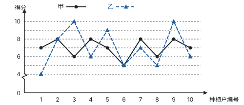

c. 配送速度和服务质量得分统计表：

| 快递公司 | 配送速度得分：平均数 | 配送速度得分：中位数 | 服务质量得分：平均数 | 服务质量得分：方差 |
| --- | --- | --- | --- | --- |
| 甲 | 7.8 | $m$ | 7 | $s_{\text{甲}}^2$ |
| 乙 | 8 | 8 | 7 | $s_{\text{乙}}^2$ |

根据以上信息，回答下列问题：

（1）表格中的 $m =$ ____；$s_{\text{甲}}^2$ ____ $s_{\text{乙}}^2$（填“$>$”“$=$”或“$<$”）。

（2）综合上表中的统计量，你认为小丽应选择哪家公司？请说明理由。

（3）为了从甲、乙两家公司中选出更合适的公司，你认为还应收集什么信息（列出一条即可）？

**答案：**

（1）$m = 7.5$；$s_{\text{甲}}^2 < s_{\text{乙}}^2$。

甲的配送速度得分已经从小到大排好，第 5、6 个数是 7 和 8，所以 $m = \dfrac{7 + 8}{2} = 7.5$。从统计图读出服务质量得分，甲：7，8，6，8，7，5，8，6，8，7；乙：4，8，10，6，9，5，7，5，10，6。

$$s_{\text{甲}}^2 = \frac{1}{10}\left[3 \times (7-7)^2 + 4 \times (8-7)^2 + 2 \times (6-7)^2 + (5-7)^2\right] = 1,$$

$$s_{\text{乙}}^2 = \frac{1}{10}\left[(4-7)^2 + (8-7)^2 + 2 \times (10-7)^2 + 2 \times (6-7)^2 + (9-7)^2 + 2 \times (5-7)^2 + (7-7)^2\right] = 4.2,$$

所以 $s_{\text{甲}}^2 < s_{\text{乙}}^2$。

（2）应选择甲公司。理由：配送速度得分甲和乙相差不大；服务质量得分甲和乙的平均数相同，但甲的方差明显小于乙的方差，甲的服务质量更稳定。（答案不唯一，言之有理即可。比如看重配送速度，也可以选乙公司：乙的配送速度得分的平均数和中位数都比甲高。）

（3）还应收集甲、乙两家公司的收费情况（答案不唯一，言之有理即可）。

**思路：** 中位数先排序再找中间，10 个数取第 5、6 个的平均数。其实不必算方差：图上甲的折线在 5 到 8 之间小幅起伏，乙的折线在 4 到 10 之间大起大落，已经能看出甲更稳定，计算只是把这个印象变成数。第（2）问要“综合”：平均水平相近时，再比较稳定性（见第十部分“数据的分析”）。

## 第 18 题

考点：第五部分“尺规作图”、第五部分“全等三角形”、第一部分“怎样证明”

如图，$\triangle ABC$ 中，点 $D$ 在边 $AC$ 上，且 $AD = AB$。

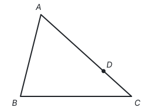

（1）请用无刻度的直尺和圆规作出 $\angle A$ 的平分线（保留作图痕迹，不写作法）。

（2）若（1）中所作的角平分线与边 $BC$ 交于点 $E$，连接 $DE$。求证：$DE = BE$。

**答案：**

（1）以点 $A$ 为圆心、适当长为半径画弧，交 $AB$、$AC$ 于两点；再分别以这两点为圆心、大于两点间距离一半的长为半径画弧，两弧在 $\angle BAC$ 内部交于一点；过点 $A$ 和这一点作射线，交 $BC$ 于点 $E$，射线 $AE$ 就是所求的角平分线。

（2）证明：因为 $AE$ 平分 $\angle BAC$，所以 $\angle BAE = \angle DAE$。在 $\triangle BAE$ 和 $\triangle DAE$ 中，$AB = AD$，$\angle BAE = \angle DAE$，$AE = AE$，所以 $\triangle BAE \cong \triangle DAE$（SAS），所以 $DE = BE$。

**思路：** 作角平分线的依据是三边对应相等的两个三角形全等（见第五部分“尺规作图”）。要证 $DE = BE$，就找它们所在的两个三角形 $\triangle BAE$ 和 $\triangle DAE$：已知 $AB = AD$，角平分线给出夹角相等，$AE$ 是公共边，正好是“边角边”。换个角度看，$AD = AB$ 说明 $D$ 是 $B$ 关于角平分线 $AE$ 的对称点，$DE$ 和 $BE$ 是一对对称线段。

## 第 19 题

考点：第七部分“反比例函数”、第九部分“与圆有关的计算”、第五部分“四边形”、第十一部分“以数解形”

小军借助反比例函数图象设计“鱼形”图案，如图，在平面直角坐标系中，以反比例函数 $y = \dfrac{k}{x}$ 图象上的点 $A(\sqrt{3}, 1)$ 和点 $B$ 为顶点，分别作菱形 $AOCD$ 和菱形 $OBEF$，点 $D$，$E$ 在 $x$ 轴上，以点 $O$ 为圆心，$OA$ 长为半径作 $\overset{\frown}{AC}$，连接 $BF$。

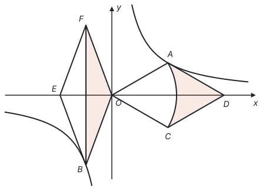

（1）求 $k$ 的值；

（2）求扇形 $AOC$ 的半径及圆心角的度数；

（3）请直接写出图中阴影部分面积之和。

**答案：**

（1）把 $A(\sqrt{3}, 1)$ 代入 $y = \dfrac{k}{x}$，得 $k = \sqrt{3} \times 1 = \sqrt{3}$。

（2）$OA = \sqrt{(\sqrt{3})^2 + 1^2} = 2$，所以扇形 $AOC$ 的半径为 2。过点 $A$ 作 $AH \perp x$ 轴于点 $H$，在 $\text{Rt}\triangle AOH$ 中，$\tan \angle AOH = \dfrac{1}{\sqrt{3}} = \dfrac{\sqrt{3}}{3}$，所以 $\angle AOH = 30^\circ$。菱形的对角线平分一组对角，$OD$ 是菱形 $AOCD$ 的对角线，所以 $\angle AOC = 2\angle AOD = 60^\circ$。

（3）$3\sqrt{3} - \dfrac{2}{3}\pi$。

**思路：** （1）点在图象上，坐标就满足解析式。（2）求角先想它的三角函数：$A$ 的坐标给出两条直角边，$\tan \angle AOH = \dfrac{\sqrt{3}}{3}$。（3）右边的阴影是菱形 $AOCD$ 减去扇形 $AOC$：菱形的对角线 $OD = 2\sqrt{3}$，$AC = 2$，面积 $\dfrac{1}{2} \times 2\sqrt{3} \times 2 = 2\sqrt{3}$；扇形面积 $\dfrac{60}{360} \times \pi \times 2^2 = \dfrac{2}{3}\pi$。左边的阴影是 $\triangle OBF$：设 $B(a, b)$，$ab = \sqrt{3}$，菱形 $OBEF$ 关于 $x$ 轴对称，$F(a, -b)$，$BF = 2\lvert b \rvert$，$BF$ 上的高是 $\lvert a \rvert$，面积 $\dfrac{1}{2} \times 2\lvert b \rvert \times \lvert a \rvert = \lvert ab \rvert = \sqrt{3}$，和 $B$ 在哪里无关。这正是 $k$ 的几何意义（见第七部分“反比例函数”）。

## 第 20 题

考点：第八部分“锐角三角函数”、第八部分“相似”

综合实践活动中，某小组用木板自制了一个测高仪测量树高，测高仪 $ABCD$ 为正方形，$AB = 30$ cm，顶点 $A$ 处挂了一个铅锤 $M$。如图是测量树高的示意图，测高仪上的点 $D$，$A$ 与树顶 $E$ 在一条直线上，铅垂线 $AM$ 交 $BC$ 于点 $H$。经测量，点 $A$ 距地面 1.8 m，到树 $EG$ 的距离 $AF = 11$ m，$BH = 20$ cm。求树 $EG$ 的高度（结果精确到 0.1 m）。

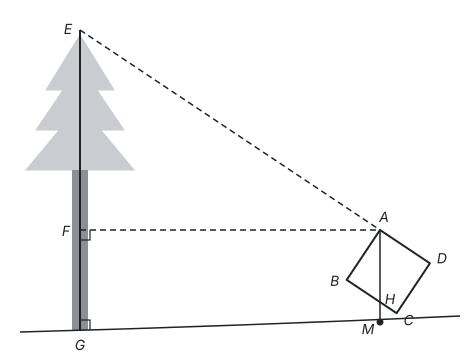

**答案：**

由题意，$\angle DAB = 90^\circ$，点 $E$，$A$，$D$ 在一条直线上，所以 $\angle EAB = 90^\circ$，$\angle EAF = 90^\circ - \angle FAB$。$AF$ 水平，$AH$ 竖直，所以 $\angle FAH = 90^\circ$，$\angle BAH = 90^\circ - \angle FAB$。所以 $\angle EAF = \angle BAH$。

在 $\text{Rt}\triangle ABH$ 中，$\tan \angle BAH = \dfrac{BH}{AB} = \dfrac{20}{30} = \dfrac{2}{3}$。

在 $\text{Rt}\triangle EFA$ 中，$EF = AF \cdot \tan \angle EAF = 11 \times \dfrac{2}{3} = \dfrac{22}{3} \approx 7.33$（m）。

又 $FG = 1.8$ m，所以 $EG = EF + FG \approx 7.33 + 1.8 \approx 9.1$（m）。

答：树 $EG$ 的高度约为 9.1 m。

**思路：** 树高 $EG$ 量不到，要从量得到的 $AF$ 推过去，关键是 $\angle EAF$。这个角在测高仪上“复制”了一份：视线 $AE$ 和边 $AB$ 垂直，水平线 $AF$ 和铅垂线 $AH$ 垂直，两个角都等于 $90^\circ$ 减去 $\angle FAB$。于是小正方形里的 $\triangle ABH$ 和大的 $\triangle EFA$ 两个角相等，是一对相似的直角三角形，$\tan$ 值相同（见第八部分“锐角三角函数”）。注意单位：$BH$ 和 $AB$ 都是 cm，比值不用换算。

## 第 21 题

考点：第四部分“一元一次方程”、第四部分“不等式与不等式组”、第十一部分“方程思想与建模”

某健身器材专卖店推出两种优惠活动，并规定购物时只能选择其中一种。

活动一：所购商品按原价打八折；

活动二：所购商品按原价**每满** 300 元减 80 元。（如：所购商品原价为 300 元，可减 80 元，需付款 220 元；所购商品原价为 770 元，可减 160 元，需付款 610 元）

（1）购买一件原价为 450 元的健身器材时，选择哪种活动更合算？请说明理由。

（2）购买一件原价在 500 元以下的健身器材时，若选择活动一和选择活动二的付款金额相等，求一件这种健身器材的原价。

（3）购买一件原价在 900 元以下的健身器材时，原价在什么范围内，选择活动二比选择活动一更合算？设一件这种健身器材的原价为 $a$ 元，请直接写出 $a$ 的取值范围。

**答案：**

（1）活动一更合算。理由：选活动一需付款 $450 \times 0.8 = 360$（元），选活动二需付款 $450 - 80 = 370$（元），$360 < 370$。

（2）设这种健身器材的原价为 $x$ 元。原价不足 300 元时活动二不减钱，两种活动付款不可能相等，所以 $300 \le x < 500$，此时活动二减 80 元。由题意得 $0.8x = x - 80$，解得 $x = 400$。

答：一件这种健身器材的原价为 400 元。

（3）$300 \le a < 400$ 或 $600 \le a < 800$。

**思路：** 活动二“每满 300 元减 80 元”，减多少取决于原价里有几个 300，所以要按原价分段：不足 300 元不减，300 元到 600 元减 80 元，600 元到 900 元减 160 元。每一段里两种付款都是一次式，相等就列方程，“更合算”就列不等式：$300 \le a < 600$ 时解 $a - 80 < 0.8a$，得 $a < 400$；$600 \le a < 900$ 时解 $a - 160 < 0.8a$，得 $a < 800$。

## 第 22 题

考点：第七部分“二次函数”、第七部分“一次函数”

小林同学不仅是一名羽毛球运动爱好者，还喜欢运用数学知识对羽毛球比赛进行技术分析，下面是他对击球线路的分析。

如图，在平面直角坐标系中，点 $A$，$C$ 在 $x$ 轴上，球网 $AB$ 与 $y$ 轴的水平距离 $OA = 3$ m，$CA = 2$ m，击球点 $P$ 在 $y$ 轴上。若选择扣球，羽毛球的飞行高度 $y$（m）与水平距离 $x$（m）近似满足一次函数关系 $y = -0.4x + 2.8$；若选择吊球，羽毛球的飞行高度 $y$（m）与水平距离 $x$（m）近似满足二次函数关系 $y = a(x - 1)^2 + 3.2$。

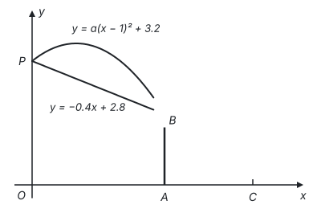

（1）求点 $P$ 的坐标和 $a$ 的值。

（2）小林分析发现，上面两种击球方式均能使球过网。要使球的落地点到 $C$ 点的距离更近，请通过计算判断应选择哪种击球方式。

**答案：**

（1）在 $y = -0.4x + 2.8$ 中，令 $x = 0$，得 $y = 2.8$，所以点 $P$ 的坐标为 $(0, 2.8)$。把 $P(0, 2.8)$ 代入 $y = a(x - 1)^2 + 3.2$，得 $a + 3.2 = 2.8$，所以 $a = -0.4$。

（2）$OC = OA + CA = 5$ m。

扣球：令 $-0.4x + 2.8 = 0$，得 $x = 7$，落地点到 $C$ 点的距离为 $7 - 5 = 2$（m）。

吊球：令 $-0.4(x - 1)^2 + 3.2 = 0$，得 $(x - 1)^2 = 8$，$x_1 = 1 + 2\sqrt{2}$，$x_2 = 1 - 2\sqrt{2}$（不合题意，舍去）。落地点到 $C$ 点的距离为 $5 - (1 + 2\sqrt{2}) = 4 - 2\sqrt{2} \approx 1.17$（m）。

因为 $1.17 < 2$，所以选择吊球，球的落地点到 $C$ 点的距离更近。

**思路：** 两种线路都从击球点 $P$ 出发，$P$ 在 $y$ 轴上，横坐标为 0，先从一次函数求出 $P$，再代入二次函数求 $a$。“落地点”就是飞行高度为 0 的点，即图象与 $x$ 轴交点的横坐标，令 $y = 0$ 解方程；吊球的方程有两个根，要按实际意义舍去负根（见第七部分“二次函数”）。

## 第 23 题

考点：第六部分“平移、轴对称与旋转”、第五部分“四边形”、第八部分“锐角三角函数”、第一部分“怎样证明”

李老师善于通过合适的主题整合教学内容，帮助同学们用整体的、联系的、发展的眼光看问题，形成科学的思维习惯。下面是李老师在“图形的变化”主题下设计的问题，请你解答。

（1）观察发现：如图 1，在平面直角坐标系中，过点 $M(4, 0)$ 的直线 $l \parallel y$ 轴，作 $\triangle ABC$ 关于 $y$ 轴对称的图形 $\triangle A_1B_1C_1$，再分别作 $\triangle A_1B_1C_1$ 关于 $x$ 轴和直线 $l$ 对称的图形 $\triangle A_2B_2C_2$ 和 $\triangle A_3B_3C_3$，则 $\triangle A_2B_2C_2$ 可以看作是 $\triangle ABC$ 绕点 $O$ 顺时针旋转得到的，旋转角的度数为 ____；$\triangle A_3B_3C_3$ 可以看作是 $\triangle ABC$ 向右平移得到的，平移距离为 ____ 个单位长度。

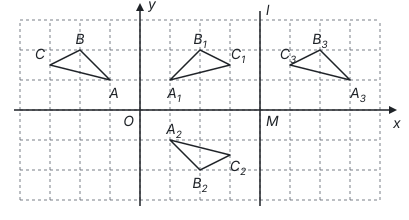

（2）探究迁移：如图 2，$\square ABCD$ 中，$\angle BAD = \alpha$（$0^\circ < \alpha < 90^\circ$），$P$ 为直线 $AB$ 下方一点，作点 $P$ 关于直线 $AB$ 的对称点 $P_1$，再分别作点 $P_1$ 关于直线 $AD$ 和直线 $CD$ 的对称点 $P_2$ 和 $P_3$，连接 $AP$，$AP_2$，请仅就图 2 的情形解决以下问题：

① 若 $\angle PAP_2 = \beta$，请判断 $\beta$ 与 $\alpha$ 的数量关系，并说明理由；

② 若 $AD = m$，求 $P$，$P_3$ 两点间的距离。

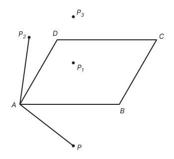

（3）拓展应用：在（2）的条件下，若 $\alpha = 60^\circ$，$AD = 2\sqrt{3}$，$\angle PAB = 15^\circ$，连接 $P_2P_3$。当 $P_2P_3$ 与 $\square ABCD$ 的边平行时，请直接写出 $AP$ 的长。

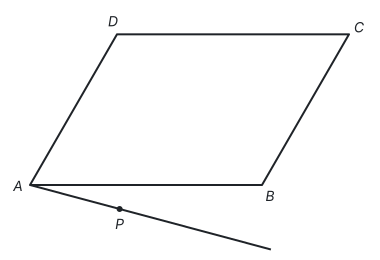

**答案：**

（1）$180^\circ$；8。

（2）① $\beta = 2\alpha$。理由：由轴对称的性质，$\angle PAB = \angle P_1AB$，$\angle P_1AD = \angle P_2AD$。所以

$$\beta = \angle PAB + \angle BAP_1 + \angle P_1AD + \angle DAP_2 = 2(\angle BAP_1 + \angle P_1AD) = 2\angle BAD = 2\alpha.$$

② 设 $PP_1$ 交 $AB$ 于点 $E$，$P_1P_3$ 交 $CD$ 于点 $F$。由轴对称的性质，$PP_1 \perp AB$，$PE = EP_1$；$P_1P_3 \perp CD$，$P_1F = FP_3$。因为 $AB \parallel CD$，所以点 $P$，$E$，$P_1$，$F$，$P_3$ 在同一条直线上，且 $EF$ 是 $AB$ 与 $CD$ 之间的距离，$EF = AD \sin \alpha = m \sin \alpha$。所以

$$PP_3 = 2EP_1 + 2P_1F = 2EF = 2m \sin \alpha.$$

（3）$2\sqrt{6}$ 或 $3\sqrt{2} - \sqrt{6}$。

推理过程：设 $AP = x$，则 $AP_1 = AP_2 = x$。由（2），$PP_3 = 2 \times 2\sqrt{3} \times \sin 60^\circ = 6$。$\angle PAP_1 = 30^\circ$，$\triangle APP_1$ 是等腰三角形，$\angle AP_1P = 75^\circ$，$PP_1 = 2x \sin 15^\circ = \dfrac{\sqrt{6} - \sqrt{2}}{2}x$。$\angle P_1AP_2 = 2\angle P_1AD = 2 \times 45^\circ = 90^\circ$，所以 $P_1P_2 = \sqrt{2}x$，$\angle AP_1P_2 = 45^\circ$，于是 $\angle P_2P_1P_3 = 180^\circ - 75^\circ - 45^\circ = 60^\circ$。

- $P_2P_3 \parallel AB$（也就平行于 $CD$）时，$P_2P_3 \perp PP_3$，$P_1P_3 = P_1P_2 \cos 60^\circ = \dfrac{\sqrt{2}}{2}x$。由 $PP_1 + P_1P_3 = \dfrac{\sqrt{6}}{2}x = 6$，得 $x = 2\sqrt{6}$。
- $P_2P_3 \parallel AD$（也就平行于 $BC$）时，$P_2P_3$ 与 $PP_3$ 的夹角 $\angle P_1P_3P_2 = 90^\circ - 60^\circ = 30^\circ$，所以 $\angle P_1P_2P_3 = 90^\circ$，$P_1P_3 = 2P_1P_2 = 2\sqrt{2}x$。由 $PP_1 + P_1P_3 = \dfrac{\sqrt{6} + 3\sqrt{2}}{2}x = 6$，得 $x = 3\sqrt{2} - \sqrt{6}$。

**思路：** 第（1）问是整道题的线索：沿两条**相交**直线先后翻折，合起来是绕交点的旋转，转过的角是两直线夹角的 2 倍（$y$ 轴和 $x$ 轴夹角 $90^\circ$，转 $180^\circ$）；沿两条**平行**直线先后翻折，合起来是平移，平移距离是两直线间距离的 2 倍（$y$ 轴和 $l$ 相距 4，平移 8）。第（2）问把这两个结论放到平行四边形里：$AB$、$AD$ 相交于 $A$，所以 $\beta = 2\alpha$；$AB \parallel CD$，所以 $PP_3$ 是两条平行线距离的 2 倍（见第六部分“平移、轴对称与旋转”）。第（3）问 $PP_3 = 6$ 已知，把 $PP_3$ 拆成 $PP_1$ 和 $P_1P_3$ 两段，都用 $x$ 表示；平行于哪一组边要分两种情况，每种情况在 $\triangle P_1P_2P_3$ 里得到一个特殊角的直角三角形。
