# 2024 年河南中考数学

> 河南省 2024 年普通高中招生考试数学试卷，共 23 题，满分 120 分，考试时间 100 分钟。

## 第 1 题

考点：第二部分“有理数”

如图，数轴上点 $P$ 表示的数是

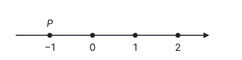

- A. −1
- B. 0
- C. 1
- D. 2

**答案：** A

**思路：** 数轴上的点和数一一对应。点 $P$ 在原点左边，和原点隔一个单位长度，表示的数是 $-1$。

## 第 2 题

考点：第二部分“有理数的运算”

据统计，2023 年我国人工智能核心产业规模达 5 784 亿元。数据“5 784 亿”用科学记数法表示为

- A. $5784 \times 10^8$
- B. $5.784 \times 10^{10}$
- C. $5.784 \times 10^{11}$
- D. $0.5784 \times 10^{12}$

**答案：** C

**思路：** 先把“亿”换成数：1 亿 $= 10^8$，所以 5 784 亿 $= 5784 \times 10^8 = 5.784 \times 10^3 \times 10^8 = 5.784 \times 10^{11}$。科学记数法要求 $a \times 10^n$ 中 $1 \le \lvert a \rvert < 10$，A、D 的 $a$ 都不在这个范围内。

## 第 3 题

考点：第五部分“相交线与平行线”

如图，乙地在甲地的北偏东 $50^\circ$ 方向上，则 $\angle 1$ 的度数为

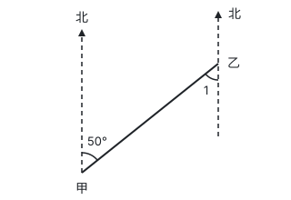

- A. $60^\circ$
- B. $50^\circ$
- C. $40^\circ$
- D. $30^\circ$

**答案：** B

**思路：** 两地的“正北”方向都是竖直向上的，所以两条指北的直线互相平行。连接甲、乙的线段是它们的截线，$50^\circ$ 的角和 $\angle 1$ 是内错角，两直线平行，内错角相等，所以 $\angle 1 = 50^\circ$。

## 第 4 题

考点：第八部分“投影与视图”

信阳毛尖是中国十大名茶之一。如图是信阳毛尖茶叶的包装盒，它的主视图为

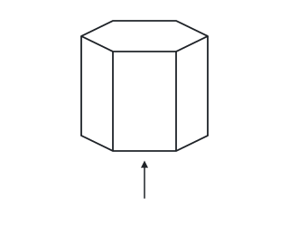

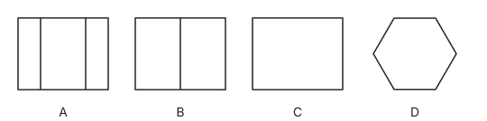

- A. 矩形，中间有两条竖线（见选项图 A）
- B. 矩形，中间有一条竖线（见选项图 B）
- C. 矩形（见选项图 C）
- D. 正六边形（见选项图 D）

**答案：** A

**思路：** 包装盒是正六棱柱，主视图是从正面（箭头方向）看到的图形。正面对着我们的是一个侧面，左右两边各有一个斜着的侧面，看过去被压窄了，所以是一个矩形被两条竖线分成三块，中间宽、两边窄。六边形 D 是从上面看到的俯视图。

## 第 5 题

考点：第四部分“不等式与不等式组”、第十一部分“以形助数”

下列不等式中，与 $-x > 1$ 组成的不等式组无解的是

- A. $x > 2$
- B. $x < 0$
- C. $x < -2$
- D. $x > -3$

**答案：** A

**思路：** 先解 $-x > 1$：两边同乘 $-1$，不等号改变方向，得 $x < -1$。不等式组无解，就是两个解集在数轴上没有公共部分。$x < -1$ 和 $x > 2$ 一个在 $-1$ 左边、一个在 2 右边，没有重叠；B、C、D 都和 $x < -1$ 有公共部分。

## 第 6 题

考点：第八部分“相似”、第五部分“四边形”

如图，在 $\square ABCD$ 中，对角线 $AC$，$BD$ 相交于点 $O$，点 $E$ 为 $OC$ 的中点，$EF \parallel AB$ 交 $BC$ 于点 $F$。若 $AB = 4$，则 $EF$ 的长为

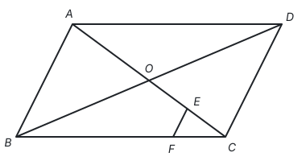

- A. $\dfrac{1}{2}$
- B. 1
- C. $\dfrac{4}{3}$
- D. 2

**答案：** B

**思路：** 平行四边形的对角线互相平分，$O$ 是 $AC$ 的中点，$E$ 又是 $OC$ 的中点，所以 $CE = \dfrac{1}{4}CA$。$EF \parallel AB$，得 $\triangle CEF \sim \triangle CAB$，对应边成比例：$EF = \dfrac{1}{4}AB = 1$。

## 第 7 题

考点：第三部分“整式的乘法”

计算

$$(\underbrace{a \cdot a \cdot \cdots \cdot a}_{a\text{个}})^3$$

的结果是

- A. $a^5$
- B. $a^6$
- C. $a^{a+3}$
- D. $a^{3a}$

**答案：** D

**思路：** 括号里是 $a$ 个 $a$ 相乘，按乘方的定义就是 $a^a$。再用幂的乘方法则“底数不变，指数相乘”：$(a^a)^3 = a^{3a}$。这里指数本身是字母，只要回到乘方的定义就不会被它迷惑。

## 第 8 题

考点：第十部分“概率”

豫剧是国家级非物质文化遗产，因其雅俗共赏，深受大众喜爱。正面印有豫剧经典剧目人物的三张卡片如图所示，它们除正面外完全相同。把这三张卡片背面朝上洗匀，从中随机抽取一张，放回洗匀后，再从中随机抽取一张，两次抽取的卡片正面相同的概率为

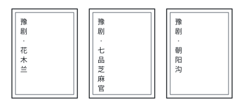

- A. $\dfrac{1}{9}$
- B. $\dfrac{1}{6}$
- C. $\dfrac{1}{5}$
- D. $\dfrac{1}{3}$

**答案：** D

**思路：** “放回”说明两次抽取互不影响，每次都有 3 种等可能的结果。列表或画树状图，共 $3 \times 3 = 9$ 种等可能的结果，其中两次相同的有 3 种，所以概率是 $\dfrac{3}{9} = \dfrac{1}{3}$。

## 第 9 题

考点：第九部分“与圆有关的计算”、第九部分“圆的有关性质”

如图，$\odot O$ 是边长为 $4\sqrt{3}$ 的等边三角形 $ABC$ 的外接圆，点 $D$ 是 $\overset{\frown}{BC}$ 的中点，连接 $BD$，$CD$。以点 $D$ 为圆心，$BD$ 的长为半径在 $\odot O$ 内画弧，则阴影部分的面积为

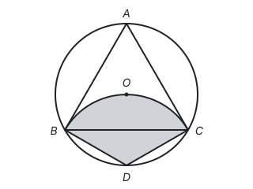

- A. $\dfrac{8\pi}{3}$
- B. $4\pi$
- C. $\dfrac{16\pi}{3}$
- D. $16\pi$

**答案：** C

**思路：** 阴影是以 $D$ 为圆心、$BD$ 为半径的扇形，要求出半径和圆心角。$\angle BAC = 60^\circ$，所以 $\overset{\frown}{BC}$ 所对的圆心角是 $120^\circ$，$D$ 是它的中点，$\angle BOD = 60^\circ$，$\triangle OBD$ 是等边三角形，$BD = OB$。$OB$ 是外接圆半径：等边三角形的外心也是重心，在高上且到顶点的距离是高的 $\dfrac{2}{3}$，高为 $4\sqrt{3} \times \dfrac{\sqrt{3}}{2} = 6$，所以 $OB = 4$。圆内接四边形 $ABDC$ 的对角互补，$\angle BDC = 180^\circ - 60^\circ = 120^\circ$。所以阴影面积为

$$\frac{120\pi \times 4^2}{360} = \frac{16\pi}{3}.$$

## 第 10 题

考点：第七部分“函数”、第七部分“一次函数”、第七部分“二次函数”、第十一部分“以形助数”

把多个用电器连接在同一个插线板上，同时使用一段时间后，插线板的电源线会明显发热，存在安全隐患。数学兴趣小组对这种现象进行研究，得到时长一定时，插线板电源线中的电流 $I$ 与使用电器的总功率 $P$ 的函数图象（如图 1），插线板电源线产生的热量 $Q$ 与 $I$ 的函数图象（如图 2）。下列结论中错误的是

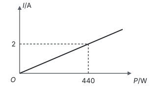

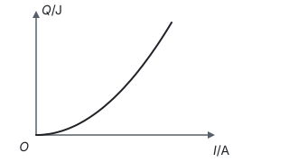

- A. 当 $P = 440$ W 时，$I = 2$ A
- B. $Q$ 随 $I$ 的增大而增大
- C. $I$ 每增加 1 A，$Q$ 的增加量相同
- D. $P$ 越大，插线板电源线产生的热量 $Q$ 越多

**答案：** C

**思路：** 逐项读图。A 直接从图 1 读出。图 2 从左往右一直上升，B 对。把两张图接起来：$P$ 越大 $I$ 越大，$I$ 越大 $Q$ 越多，D 对。图 2 是一条越来越陡的曲线，不是直线，说明 $I$ 每增加 1 A，$Q$ 的增加量越来越大；增加量相同的只有一次函数（直线），C 错。

## 第 11 题

考点：第三部分“整式的加减”

请写出 $2m$ 的一个同类项：____。

**答案：** $m$（答案不唯一）

**思路：** 同类项要求所含字母相同，并且相同字母的指数也相同，系数可以不同。$2m$ 只含字母 $m$，指数是 1，所以 $m$、$-3m$、$\dfrac{1}{2}m$ 都可以。

## 第 12 题

考点：第十部分“数据的分析”

2024 年 3 月是第 8 个全国近视防控宣传教育月，其主题是“有效减少近视发生，共同守护光明未来”。某校组织各班围绕这个主题开展板报宣传活动，并对各班的宣传板报进行评分，得分情况如图，则得分的众数为 ____ 分。

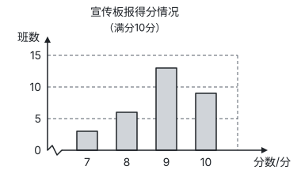

**答案：** 9

**思路：** 众数是一组数据中出现次数最多的数据。条形图的横轴是得分，纵轴是班数，最高的条形对应 9 分（13 个班），所以众数是 9 分。注意众数是得分 9，而不是班数 13。

## 第 13 题

考点：第四部分“一元二次方程”

若关于 $x$ 的方程 $\dfrac{1}{2}x^2 - x + c = 0$ 有两个相等的实数根，则 $c$ 的值为 ____。

**答案：** $\dfrac{1}{2}$

**思路：** 一元二次方程有两个相等的实数根，就是判别式等于 0：$\Delta = (-1)^2 - 4 \times \dfrac{1}{2} \times c = 1 - 2c = 0$，得 $c = \dfrac{1}{2}$。

## 第 14 题

考点：第六部分“平移、轴对称与旋转”、第五部分“勾股定理”、第六部分“平面直角坐标系”、第十一部分“以数解形”

如图，在平面直角坐标系中，正方形 $ABCD$ 的边 $AB$ 在 $x$ 轴上，点 $A$ 的坐标为 $(-2, 0)$，点 $E$ 在边 $CD$ 上。将 $\triangle BCE$ 沿 $BE$ 折叠，点 $C$ 落在点 $F$ 处。若点 $F$ 的坐标为 $(0, 6)$，则点 $E$ 的坐标为 ____。

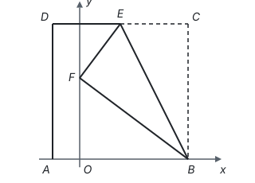

**答案：** $(3, 10)$

**思路：** 折叠是轴对称，折叠前后对应线段相等：$BF = BC$，$EF = EC$。设正方形边长为 $a$，则 $B(a - 2, 0)$。在 $\text{Rt}\triangle BOF$ 中，$BF^2 = (a-2)^2 + 6^2$，又 $BF = a$，得 $a = 10$，所以 $C(8, 10)$。设 $E(x, 10)$，则 $EC = 8 - x$，$EF^2 = x^2 + (10 - 6)^2$，由 $EF = EC$ 得 $(8 - x)^2 = x^2 + 16$，$x = 3$。两次都是“折叠给等长，勾股定理列方程”。

## 第 15 题

考点：第九部分“与圆有关的位置关系”、第九部分“圆的有关性质”、第五部分“勾股定理”

如图，在 $\text{Rt}\triangle ABC$ 中，$\angle ACB = 90^\circ$，$CA = CB = 3$，线段 $CD$ 绕点 $C$ 在平面内旋转，过点 $B$ 作 $AD$ 的垂线，交射线 $AD$ 于点 $E$。若 $CD = 1$，则 $AE$ 的最大值为 ____，最小值为 ____。

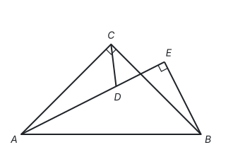

**答案：** $2\sqrt{2} + 1$；$2\sqrt{2} - 1$

**思路：** 点 $D$ 在以 $C$ 为圆心、1 为半径的圆上运动。$\angle AEB = \angle ACB = 90^\circ$，所以 $E$、$C$ 都在以 $AB$ 为直径的圆上，$AE = AB \cos \angle BAE$，$\angle BAE$ 越小 $AE$ 越大。$\angle BAE = 45^\circ \pm \angle CAD$，而 $\angle CAD$ 在 $AD$ 与 $\odot C$ 相切时最大（见第九部分“与圆有关的位置关系”），所以最大值、最小值都出现在相切的时候。相切时 $CD \perp AD$，$AD = \sqrt{3^2 - 1^2} = 2\sqrt{2}$；$\angle AEC$ 和 $\angle ABC$ 都是 $\overset{\frown}{AC}$ 所对的圆周角，相等或互补，由此可得 $\angle CED = 45^\circ$，所以 $\triangle CDE$ 是等腰直角三角形，$DE = CD = 1$。$E$ 在 $D$ 外侧时 $AE = AD + DE = 2\sqrt{2} + 1$，$E$ 在 $A$、$D$ 之间时 $AE = AD - DE = 2\sqrt{2} - 1$。

## 第 16 题

考点：第三部分“二次根式”、第三部分“分式”、第二部分“实数”、第三部分“因式分解”

（1）计算：$\sqrt{2} \times \sqrt{50} - (1 - \sqrt{3})^0$；

（2）化简：

$$\left(\frac{3}{a-2} + 1\right) \div \frac{a+1}{a^2-4}.$$

**答案：**

（1）原式 $= 10 - 1 = 9$。

（2）

$$\text{原式} = \frac{a+1}{a-2} \cdot \frac{(a+2)(a-2)}{a+1} = a + 2.$$

**思路：** （1）$\sqrt{2} \times \sqrt{50} = \sqrt{100} = 10$；$1 - \sqrt{3} \ne 0$，它的 0 次幂等于 1。（2）先把括号里通分：$\dfrac{3}{a-2} + 1 = \dfrac{3 + a - 2}{a-2} = \dfrac{a+1}{a-2}$；除以一个分式等于乘它的倒数，再把 $a^2 - 4$ 分解成 $(a+2)(a-2)$，约去公因式。

## 第 17 题

考点：第十部分“数据的分析”

为提升学生体质健康水平，促进学生全面发展，学校开展了丰富多彩的课外体育活动。在八年级组织的篮球联赛中，甲、乙两名队员表现优异，他们在近六场比赛中关于得分、篮板和失误三个方面的统计结果如下。

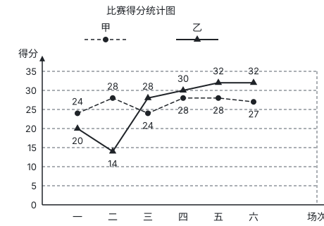

技术统计表：

| 队员 | 平均每场得分 | 平均每场篮板 | 平均每场失误 |
| --- | --- | --- | --- |
| 甲 | 26.5 | 8 | 2 |
| 乙 | 26 | 10 | 3 |

根据以上信息，回答下列问题。

（1）这六场比赛中，得分更稳定的队员是 ____（填“甲”或“乙”）；甲队员得分的中位数为 27.5 分，乙队员得分的中位数为 ____ 分。

（2）请从得分方面分析：这六场比赛中，甲、乙两名队员谁的表现更好。

（3）规定“综合得分”为：平均每场得分 × 1 + 平均每场篮板 × 1.5 + 平均每场失误 ×（−1），且综合得分越高表现越好。请利用这种评价方法，比较这六场比赛中甲、乙两名队员谁的表现更好。

**答案：**

（1）甲；29。

（2）因为甲的平均每场得分大于乙的平均每场得分，且甲的得分更稳定，所以甲队员表现更好。（答案不唯一，合理即可）

（3）甲的综合得分为 $26.5 \times 1 + 8 \times 1.5 + 2 \times (-1) = 36.5$，乙的综合得分为 $26 \times 1 + 10 \times 1.5 + 3 \times (-1) = 38$。因为 $38 > 36.5$，所以乙队员表现更好。

**思路：** （1）稳定性看数据的波动：甲的折线在 24 到 28 之间小幅起伏，乙从 14 升到 32，波动大，所以甲更稳定。乙的六场得分从小到大是 14，20，28，30，32，32，偶数个数据取中间两个的平均数，$\dfrac{28 + 30}{2} = 29$。（2）比较两组数据，平均数看整体水平，方差看稳定性。（3）综合得分就是加权平均的想法，按规定的权重代入计算；失误的权重是 $-1$，失误越多得分越低。评价标准变了，结论也可能变。

## 第 18 题

考点：第七部分“反比例函数”、第六部分“平移、轴对称与旋转”、第十一部分“以数解形”

如图，矩形 $ABCD$ 的四个顶点都在格点（网格线的交点）上，对角线 $AC$，$BD$ 相交于点 $E$，反比例函数 $y = \dfrac{k}{x}$（$x > 0$）的图象经过点 $A$。

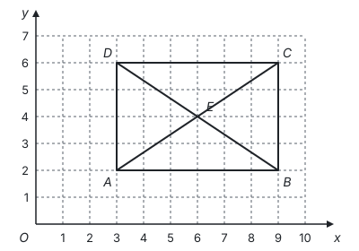

（1）求这个反比例函数的表达式。

（2）请先描出这个反比例函数图象上不同于点 $A$ 的三个格点，再画出反比例函数的图象。

（3）将矩形 $ABCD$ 向左平移，当点 $E$ 落在这个反比例函数的图象上时，平移的距离为 ____。

**答案：**

（1）由图知 $A(3, 2)$。因为反比例函数 $y = \dfrac{k}{x}$ 的图象经过点 $A$，所以 $2 = \dfrac{k}{3}$，$k = 6$，这个反比例函数的表达式为 $y = \dfrac{6}{x}$。

（2）描出格点 $(1, 6)$，$(2, 3)$，$(6, 1)$，用光滑的曲线连接，图象如图。

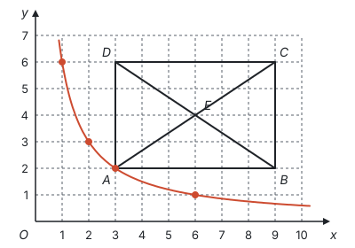

（3）$\dfrac{9}{2}$

**思路：** （1）待定系数法，一个点就能定出 $k$。（2）图象上的格点，横、纵坐标都是整数且乘积为 6，$x > 0$ 时只有 $(1, 6)$，$(2, 3)$，$(3, 2)$，$(6, 1)$。（3）向左平移，纵坐标不变。$E(6, 4)$，平移后纵坐标仍是 4，在图象上时 $x = \dfrac{6}{4} = \dfrac{3}{2}$，所以平移的距离是 $6 - \dfrac{3}{2} = \dfrac{9}{2}$。

## 第 19 题

考点：第五部分“尺规作图”、第五部分“四边形”、第一部分“怎样证明”

如图，在 $\text{Rt}\triangle ABC$ 中，$CD$ 是斜边 $AB$ 上的中线，$BE \parallel DC$ 交 $AC$ 的延长线于点 $E$。

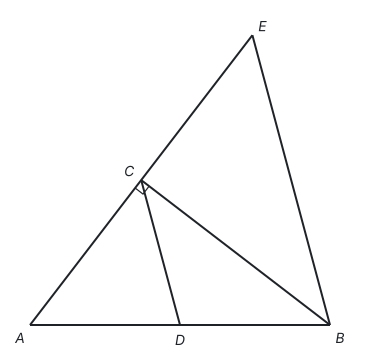

（1）请用无刻度的直尺和圆规作 $\angle ECM$，使 $\angle ECM = \angle A$，且射线 $CM$ 交 $BE$ 于点 $F$（保留作图痕迹，不写作法）。

（2）证明（1）中得到的四边形 $CDBF$ 是菱形。

**答案：**

（1）如图。

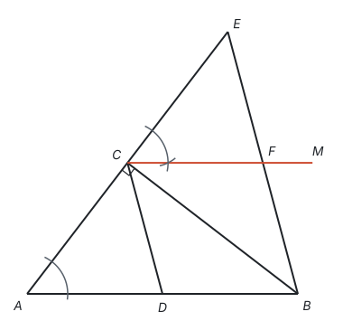

（2）由（1）得 $\angle ECF = \angle A$，所以 $CF \parallel AB$。又因为 $BE \parallel DC$，所以四边形 $CDBF$ 是平行四边形。因为 $CD$ 是 $\text{Rt}\triangle ABC$ 斜边 $AB$ 上的中线，所以 $CD = BD$。所以 $\square CDBF$ 是菱形。

**思路：** （1）按“作一个角等于已知角”，以 $CE$ 为一边在点 $C$ 处复制 $\angle A$（见第五部分“尺规作图”）。（2）$\angle ECF$ 和 $\angle A$ 是同位角，同位角相等，所以 $CF \parallel AB$，两组对边分别平行，先得到平行四边形；再找一组邻边相等：直角三角形斜边上的中线等于斜边的一半，$CD = BD = \dfrac{1}{2}AB$。

## 第 20 题

考点：第九部分“圆的有关性质”、第八部分“锐角三角函数”、第五部分“三角形”、第十一部分“辅助线从哪里来”

如图 1，塑像 $AB$ 在底座 $BC$ 上，点 $D$ 是人眼所在的位置。当点 $B$ 高于人的水平视线 $DE$ 时，由远及近看塑像，会在某处感觉看到的塑像最大，此时视角最大。数学家研究发现：当经过 $A$，$B$ 两点的圆与水平视线 $DE$ 相切时（如图 2），在切点 $P$ 处感觉看到的塑像最大，此时 $\angle APB$ 为最大视角。

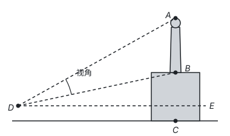

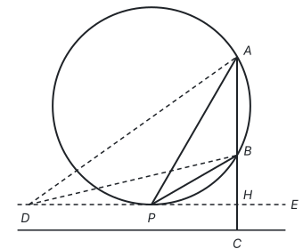

（1）请仅就图 2 的情形证明 $\angle APB > \angle ADB$。

（2）经测量，最大视角 $\angle APB$ 为 $30^\circ$，在点 $P$ 处看塑像顶部点 $A$ 的仰角 $\angle APE$ 为 $60^\circ$，点 $P$ 到塑像的水平距离 $PH$ 为 6 m。求塑像 $AB$ 的高（结果精确到 0.1 m。参考数据：$\sqrt{3} \approx 1.73$）。

**答案：**

（1）如图，设 $AD$ 与圆交于点 $M$，连接 $BM$。则 $\angle AMB = \angle APB$。因为 $\angle AMB$ 是 $\triangle BMD$ 的外角，所以 $\angle AMB > \angle ADB$，所以 $\angle APB > \angle ADB$。

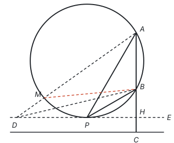

（2）在 $\text{Rt}\triangle AHP$ 中，$\angle APH = 60^\circ$，$PH = 6$，所以 $AH = PH \cdot \tan 60^\circ = 6\sqrt{3}$。因为 $\angle APB = 30^\circ$，所以 $\angle BPH = \angle APH - \angle APB = 30^\circ$。在 $\text{Rt}\triangle BHP$ 中，$BH = PH \cdot \tan 30^\circ = 6 \times \dfrac{\sqrt{3}}{3} = 2\sqrt{3}$。所以

$$AB = AH - BH = 6\sqrt{3} - 2\sqrt{3} = 4\sqrt{3} \approx 4 \times 1.73 \approx 6.9 \text{（m）}.$$

答：塑像 $AB$ 的高约为 6.9 m。

**思路：** （1）$\angle APB$ 的顶点在圆上，$\angle ADB$ 的顶点在圆外，要比较它们，就在圆上找一个和 $\angle APB$ 相等、又能和 $\angle ADB$ 放进同一个三角形的角：$AD$ 与圆的交点 $M$ 处的 $\angle AMB$ 和 $\angle APB$ 是同弧所对的圆周角，而它又是 $\triangle BMD$ 的外角，大于不相邻的内角 $\angle ADB$。（2）$A$、$B$、$H$ 在同一条竖直线上，$AB = AH - BH$，两段分别在两个有公共直角边 $PH$ 的直角三角形里，用正切求出。

## 第 21 题

考点：第四部分“二元一次方程组”、第四部分“不等式与不等式组”、第七部分“一次函数”

为响应“全民植树增绿，共建美丽中国”的号召，学校组织学生到郊外参加义务植树活动，并准备了 A，B 两种食品作为午餐。这两种食品每包质量均为 50 g，营养成分表如下。

A 营养成分表：

| 项目 | 每 50 g |
| --- | --- |
| 热量 | 700 kJ |
| 蛋白质 | 10 g |
| 脂肪 | 5.3 g |
| 碳水化合物 | 28.7 g |
| 钠 | 205 mg |

B 营养成分表：

| 项目 | 每 50 g |
| --- | --- |
| 热量 | 900 kJ |
| 蛋白质 | 15 g |
| 脂肪 | 18.2 g |
| 碳水化合物 | 6.3 g |
| 钠 | 236 mg |

（1）若要从这两种食品中摄入 4 600 kJ 热量和 70 g 蛋白质，应选用 A，B 两种食品各多少包？

（2）运动量大的人或青少年对蛋白质的摄入量应更多。若每份午餐选用这两种食品共 7 包，要使每份午餐中的蛋白质含量不低于 90 g，且热量最低，应如何选用这两种食品？

**答案：**

（1）设选用 A 种食品 $x$ 包，B 种食品 $y$ 包。根据题意，得

$$\begin{cases} 700x + 900y = 4600, \\ 10x + 15y = 70. \end{cases}$$

解方程组，得

$$\begin{cases} x = 4, \\ y = 2. \end{cases}$$

答：选用 A 种食品 4 包，B 种食品 2 包。

（2）设选用 A 种食品 $a$ 包，则选用 B 种食品 $(7 - a)$ 包。根据题意，得 $10a + 15(7 - a) \ge 90$，解得 $a \le 3$。

设总热量为 $w$ kJ，则 $w = 700a + 900(7 - a) = -200a + 6300$。因为 $-200 < 0$，所以 $w$ 随 $a$ 的增大而减小。所以当 $a = 3$ 时，$w$ 最小，此时 $7 - a = 4$。

答：选用 A 种食品 3 包，B 种食品 4 包。

**思路：** （1）两个未知数，题目给了热量、蛋白质两个相等关系，列二元一次方程组。（2）“不低于”是不等关系，列不等式得出 $a$ 的范围；“热量最低”是求最值，把热量写成 $a$ 的一次函数，用增减性在范围的端点取最小值（见第七部分“一次函数”）。

## 第 22 题

考点：第七部分“二次函数”、第四部分“一元二次方程”

从地面竖直向上发射的物体离地面的高度 $h$（m）满足关系式 $h = -5t^2 + v_0 t$，其中 $t$（s）是物体运动的时间，$v_0$（m/s）是物体被发射时的速度。社团活动时，科学小组在实验楼前从地面竖直向上发射小球。

（1）小球被发射后 ____ s 时离地面的高度最大（用含 $v_0$ 的式子表示）。

（2）若小球离地面的最大高度为 20 m，求小球被发射时的速度。

（3）按（2）中的速度发射小球，小球离地面的高度有两次与实验楼的高度相同。小明说：“这两次间隔的时间为 3 s。”已知实验楼高 15 m，请判断他的说法是否正确，并说明理由。

**答案：**

（1）$\dfrac{v_0}{10}$

（2）根据题意，当 $t = \dfrac{v_0}{10}$ 时，$h = 20$，所以

$$-5 \times \left(\frac{v_0}{10}\right)^2 + v_0 \cdot \frac{v_0}{10} = 20,$$

解得 $v_0 = 20$（负值舍去）。即小球被发射时的速度是 20 m/s。

（3）小明的说法不正确。理由如下：由（2）得 $h = -5t^2 + 20t$。当 $h = 15$ 时，$15 = -5t^2 + 20t$，解得 $t_1 = 1$，$t_2 = 3$。$3 - 1 = 2$（s），所以两次间隔的时间为 2 s，小明的说法不正确。

**思路：** （1）$h$ 是 $t$ 的二次函数，二次项系数 $-5 < 0$，开口向下，顶点处最高，顶点横坐标是 $t = -\dfrac{v_0}{2 \times (-5)} = \dfrac{v_0}{10}$。（2）把顶点代入，得 $\dfrac{v_0^2}{20} = 20$。（3）“高度等于 15 m”就是函数值等于 15，把函数问题转化成一元二次方程，两个根就是两次到达的时刻，间隔是两根之差。

## 第 23 题

考点：第五部分“四边形”、第五部分“全等三角形”、第十一部分“分类讨论”、第一部分“定义、命题与定理”

**综合与实践**

在学习特殊四边形的过程中，我们积累了一定的研究经验。请运用已有经验，对“邻等对补四边形”进行研究。

定义：至少有一组邻边相等且对角互补的四边形叫做邻等对补四边形。

（1）操作判断

用分别含有 $30^\circ$ 和 $45^\circ$ 角的直角三角形纸板拼出如图 1 所示的 4 个四边形，其中是邻等对补四边形的有 ____（填序号）。

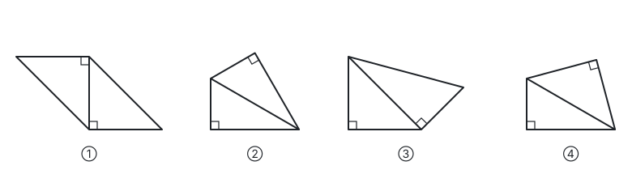

（2）性质探究

根据定义可得出邻等对补四边形的边、角的性质。下面研究与对角线相关的性质。

如图 2，四边形 $ABCD$ 是邻等对补四边形，$AB = AD$，$AC$ 是它的一条对角线。

① 写出图中相等的角，并说明理由；

② 若 $BC = m$，$DC = n$，$\angle BCD = 2\theta$，求 $AC$ 的长（用含 $m$，$n$，$\theta$ 的式子表示）。

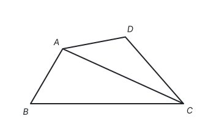

（3）拓展应用

如图 3，在 $\text{Rt}\triangle ABC$ 中，$\angle B = 90^\circ$，$AB = 3$，$BC = 4$，分别在边 $BC$，$AC$ 上取点 $M$，$N$，使四边形 $ABMN$ 是邻等对补四边形。当该邻等对补四边形仅有一组邻边相等时，请直接写出 $BN$ 的长。

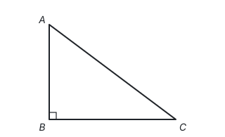

**答案：**

（1）②④

（2）① $\angle ACD = \angle ACB$。理由如下：

如图，延长 $CB$ 至点 $E$，使 $BE = DC$，连接 $AE$。因为四边形 $ABCD$ 是邻等对补四边形，所以 $\angle ABC + \angle D = 180^\circ$。又因为 $\angle ABC + \angle ABE = 180^\circ$，所以 $\angle ABE = \angle D$。又 $AB = AD$，所以 $\triangle ABE \cong \triangle ADC$（SAS），所以 $\angle E = \angle ACD$，$AE = AC$，所以 $\angle E = \angle ACB$，所以 $\angle ACD = \angle ACB$。

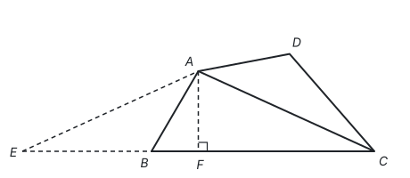

② 过点 $A$ 作 $AF \perp EC$，垂足为点 $F$。因为 $AE = AC$，所以

$$CF = \frac{1}{2}CE = \frac{1}{2}(BC + BE) = \frac{1}{2}(BC + DC) = \frac{m+n}{2}.$$

因为 $\angle BCD = 2\theta$，所以 $\angle ACB = \angle ACD = \theta$。在 $\text{Rt}\triangle AFC$ 中，$\cos \theta = \dfrac{CF}{AC}$，所以

$$AC = \frac{CF}{\cos \theta} = \frac{m+n}{2\cos \theta}.$$

（3）$\dfrac{12\sqrt{2}}{5}$ 或 $\dfrac{12\sqrt{2}}{7}$

**思路：** （1）逐个检查定义的两个条件。① 是平行四边形，对角相等而不互补；③ 的两组对角都不互补。② 和 ④ 中，两个直角顶点相对，对角互补；② 是两个全等的含 $30^\circ$ 角的三角形拼成，④ 上面是等腰直角三角形，都有一组邻边相等。

（2）要证的两个角 $\angle ACB$、$\angle ACD$ 分在对角线两侧，条件 $AB = AD$ 也分在两侧。“对角互补”提示把 $\angle D$ 搬到 $\angle ABC$ 的邻补角上：延长 $CB$ 构造和 $\triangle ADC$ 全等的三角形，把分散的条件集中到等腰三角形 $AEC$ 里（见第十一部分“辅助线从哪里来”）。于是 $AC$ 平分 $\angle BCD$，求 $AC$ 就在等腰三角形里作底边上的高，用余弦（见第八部分“锐角三角函数”）。

（3）$\angle B = 90^\circ$，对角互补要求 $\angle MNA = 90^\circ$，即 $MN \perp AC$。四组邻边中，若 $BM = MN$ 或 $NA = AB$，由 HL 可得 $\text{Rt}\triangle ABM \cong \text{Rt}\triangle ANM$，两组邻边同时相等，不合题意，所以只能是 $AB = BM$ 或 $MN = NA$，分两种情况计算。两种情况都是先求出 $CN$，再以 $B$ 为原点、$BC$ 为 $x$ 轴、$BA$ 为 $y$ 轴建立坐标系，由 $C(4, 0)$ 沿 $CA$ 方向走 $CN$ 得到点 $N$ 的坐标，再算 $BN$。$AB = BM = 3$ 时，$CM = 1$，$N$ 是 $M$ 在 $AC$ 上的垂足，$CN = CM \cos C = \dfrac{4}{5}$，得 $N\left(\dfrac{84}{25}, \dfrac{12}{25}\right)$，$BN = \dfrac{12\sqrt{2}}{5}$；这时 $MN = \dfrac{3}{5}$，$NA = \dfrac{21}{5}$，确实只有一组邻边相等。$MN = NA$ 时，设 $NA = t$，则 $CN = 5 - t$，由 $\tan C = \dfrac{MN}{CN} = \dfrac{3}{4}$ 得 $t = \dfrac{3}{4}(5 - t)$，$t = \dfrac{15}{7}$，$CN = \dfrac{20}{7}$，得 $N\left(\dfrac{12}{7}, \dfrac{12}{7}\right)$，$BN = \dfrac{12\sqrt{2}}{7}$；这时 $CM = \dfrac{CN}{\cos C} = \dfrac{25}{7} < 4$，$M$ 在边 $BC$ 上，$BM = \dfrac{3}{7}$，也只有一组邻边相等。
