# 2025 年河南中考数学

> 河南省 2025 年初中学业水平考试数学试卷，共 23 题，满分 120 分，考试时间 100 分钟。

## 第 1 题

考点：第二部分“有理数”

在学校足球比赛中，如果某班足球队进 4 个球记作 $+4$ 个，那么该队失 3 个球记作

- A. $+3$ 个
- B. $-3$ 个
- C. $+4$ 个
- D. $-4$ 个

**答案：** B

**思路：** “进球”和“失球”是意义相反的两个量，一个记作正，另一个就记作负。进球记作正，失 3 个球就记作 $-3$ 个。

## 第 2 题

考点：第五部分“几何图形初步”、第九部分“与圆有关的计算”

数学活动课上，小颖绘制的某立体图形展开图如图所示，则该立体图形是

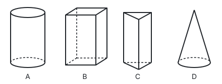

- A. 选项图 A
- B. 选项图 B
- C. 选项图 C
- D. 选项图 D

**答案：** D

**思路：** 想象把展开图折回去：一个扇形卷起来，两条半径对接，弧围成一个圆，成为一个尖顶的侧面；下面的圆正好把这个圆口封住，就是圆锥。圆柱的侧面展开是长方形，棱柱的侧面展开是几个长方形，都没有扇形。

## 第 3 题

考点：第二部分“有理数的运算”

通电瞬间，导线中的电流以接近光速形成，但其中自由电子定向移动的平均速度大约只有 0.000 074 m/s，比蜗牛爬行的速度还慢。数据“0.000 074”用科学记数法表示为

- A. $0.74 \times 10^{-4}$
- B. $7.4 \times 10^{-4}$
- C. $7.4 \times 10^{-5}$
- D. $74 \times 10^{-6}$

**答案：** C

**思路：** 科学记数法写成 $a \times 10^n$，要求 $1 \le \lvert a \rvert < 10$，所以 $a = 7.4$，A、D 都不合要求。从 0.000 074 变成 7.4，小数点向右移了 5 位，数变大了 $10^5$ 倍，所以要乘 $10^{-5}$ 才相等：$0.000\,074 = 7.4 \times 10^{-5}$。

## 第 4 题

考点：第五部分“几何图形初步”、第五部分“相交线与平行线”、第五部分“三角形”

如图所示，有一个六边形零件，利用图中的量角器可以量出该零件内角的度数，则所量内角的度数为

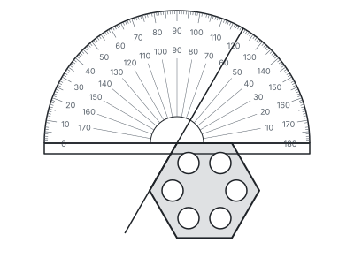

- A. $100^\circ$
- B. $110^\circ$
- C. $120^\circ$
- D. $130^\circ$

**答案：** C

**思路：** 零件的一条边贴着量角器的底边，另一条边的延长线穿过量角器，读数是 $120^\circ$（内圈读数 $60^\circ$ 是它的邻补角）。量角器上量出的角和零件的内角是对顶角，所以内角是 $120^\circ$。如果零件是正六边形，用多边形的内角和也能检验：每个内角是 $(6 - 2) \times 180^\circ \div 6 = 120^\circ$（见第五部分“三角形”）。

## 第 5 题

考点：第四部分“一元二次方程”

一元二次方程 $x^2 - 2x = 0$ 的根的情况是

- A. 有两个不相等的实数根
- B. 有两个相等的实数根
- C. 只有一个实数根
- D. 没有实数根

**答案：** A

**思路：** 看判别式：$a = 1$，$b = -2$，$c = 0$，$\Delta = b^2 - 4ac = 4 > 0$，所以有两个不相等的实数根。也可以直接因式分解 $x(x - 2) = 0$，得 $x_1 = 0$，$x_2 = 2$。

## 第 6 题

考点：第五部分“四边形”、第八部分“相似”

如图所示的网格中，每个小正方形的边长均为 1，$\triangle ABC$ 的三个顶点均在网格线的交点上，点 $D$，$E$ 分别是边 $BA$，$CA$ 与网格线的交点，连接 $DE$，则 $DE$ 的长为

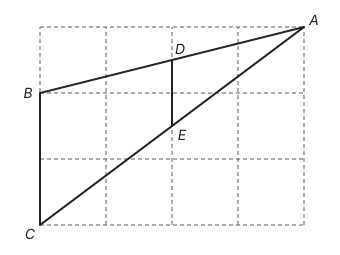

- A. $\frac{1}{2}$
- B. 1
- C. $\sqrt{2}$
- D. $\sqrt{3}$

**答案：** B

**思路：** 网格是 4 格宽，点 $D$，$E$ 所在的竖线在正中间，把 $BA$，$CA$ 都平分，所以 $D$，$E$ 分别是 $BA$，$CA$ 的中点，$DE$ 是 $\triangle ABC$ 的中位线。$BC = 2$，所以 $DE = \frac{1}{2}BC = 1$（见第五部分“四边形”）。

## 第 7 题

考点：第三部分“分式”、第三部分“因式分解”

化简

$$\frac{x^2 - 2}{x - 1} - \frac{1}{1 - x}$$

的结果是

- A. $x + 1$
- B. $x$
- C. $x - 1$
- D. $x - 2$

**答案：** A

**思路：** 两个分母 $x - 1$ 和 $1 - x$ 互为相反数，先把第二项的分母变成 $x - 1$，减号变加号，就是同分母相加：

$$\frac{x^2 - 2}{x - 1} + \frac{1}{x - 1} = \frac{x^2 - 1}{x - 1} = \frac{(x + 1)(x - 1)}{x - 1} = x + 1.$$

## 第 8 题

考点：第十部分“概率”

甲骨文是我国已发现最早的成熟文字，代表了早期中华文明的辉煌成就。正面分别印有甲骨文“美”“丽”“山”“河”的四张卡片如图所示，它们除正面外完全相同。把这四张卡片背面朝上洗匀，从中随机抽取两张，则这两张卡片正面恰好是甲骨文“丽”和“山”的概率是

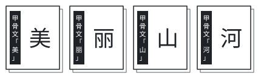

- A. $\frac{1}{12}$
- B. $\frac{1}{6}$
- C. $\frac{1}{4}$
- D. $\frac{1}{2}$

**答案：** B

**思路：** 列出所有等可能的结果：从 4 张里一次抽 2 张，有“美丽、美山、美河、丽山、丽河、山河”6 种，其中“丽”和“山”只有 1 种，概率是 $\frac{1}{6}$。用树状图按先后抽取来列也可以，共 $4 \times 3 = 12$ 种，“丽山”和“山丽”2 种，结果相同。

## 第 9 题

考点：第五部分“四边形”、第六部分“平移、轴对称与旋转”、第五部分“勾股定理”

如图，在菱形 $ABCD$ 中，$\angle B = 45^\circ$，$AB = 6$，点 $E$ 在边 $BC$ 上，连接 $AE$，将 $\triangle ABE$ 沿 $AE$ 折叠，若点 $B$ 落在 $BC$ 延长线上的点 $F$ 处，则 $CF$ 的长为

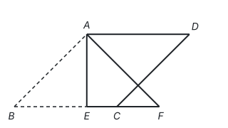

- A. 2
- B. $6 - 3\sqrt{2}$
- C. $2\sqrt{2}$
- D. $6\sqrt{2} - 6$

**答案：** D

**思路：** 折叠是轴对称，对称轴 $AE$ 垂直平分对应点的连线 $BF$。所以 $AE \perp BC$，$BE = EF$。在等腰直角三角形 $ABE$ 中，$AB = 6$，$BE = \frac{6}{\sqrt{2}} = 3\sqrt{2}$，于是 $BF = 6\sqrt{2}$，$CF = BF - BC = 6\sqrt{2} - 6$。

## 第 10 题

考点：第七部分“函数”、第一部分“三种数学语言”

汽车轮胎的摩擦系数是影响行车安全的重要因素，在一定条件下，它会随车速的变化而变化。研究发现，某款轮胎的摩擦系数 $\mu$ 与车速 $v$（km/h）之间的函数关系如图所示。下列说法中**错误**的是

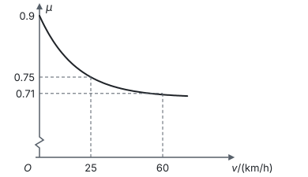

- A. 汽车静止时，这款轮胎的摩擦系数为 0.9
- B. 当 $0 \le v \le 60$ 时，这款轮胎的摩擦系数随车速的增大而减小
- C. 要使这款轮胎的摩擦系数不低于 0.71，车速应不低于 60 km/h
- D. 若车速从 25 km/h 增大到 60 km/h，则这款轮胎的摩擦系数减小 0.04

**答案：** C

**思路：** 逐项回到图象上读。静止就是 $v = 0$，图象从 0.9 出发，A 对；图象一路下降，B 对；0.75 降到 0.71，减小 0.04，D 对。C 把方向弄反了：$\mu$ 随 $v$ 增大而减小，$\mu \ge 0.71$ 对应的是 $v \le 60$，车速应不高于 60 km/h。

## 第 11 题

考点：第三部分“二次根式”、第四部分“不等式与不等式组”

请写出一个使 $\sqrt{5 - x}$ 在实数范围内有意义的 $x$ 的值：____。

**答案：** 5（答案不唯一，满足 $x \le 5$ 即可）

**思路：** 负数没有平方根，所以被开方数 $5 - x \ge 0$，即 $x \le 5$。在这个范围里任取一个数都对。

## 第 12 题

考点：第十部分“数据的分析”

为考察学校劳动实践基地甲、乙两种小麦的长势，数学兴趣小组从两种小麦中各随机抽取 20 株进行测量，测得两种小麦苗高的平均数相同，方差分别为 $s_{\text{甲}}^2 = 3.6$，$s_{\text{乙}}^2 = 5.8$，则这两种小麦长势更整齐的是 ____（填“甲”或“乙”）。

**答案：** 甲

**思路：** 方差是各数据与平均数之差的平方的平均数，衡量数据偏离平均数的程度。方差越小，苗高越集中在平均数附近，长势越整齐。$3.6 < 5.8$，所以甲更整齐。

## 第 13 题

考点：第三部分“代数式”

观察 $2x$，$4x^2$，$6x^3$，$8x^4$，…，根据这些式子的变化规律，可得第 $n$ 个式子为 ____。

**答案：** $2nx^n$

**思路：** 把每个式子拆成系数和字母两部分分别看：系数 2，4，6，8 是第几个就乘 2，第 $n$ 个是 $2n$；$x$ 的指数 1，2，3，4 就是序号，第 $n$ 个是 $x^n$。合起来是 $2nx^n$，再代入 $n = 1$ 检验一下。

## 第 14 题

考点：第九部分“与圆有关的计算”、第九部分“圆的有关性质”、第九部分“与圆有关的位置关系”

我国魏晋时期数学家刘徽在为《九章算术》作注时，创立了“割圆术”。如图是研究“割圆术”时的一个图形，$\overset{\frown}{AB}$ 所在圆的圆心为点 $O$，四边形 $ABCD$ 为矩形，边 $CD$ 与 $\odot O$ 相切于点 $E$，连接 $BE$，$\angle ABE = 15^\circ$，连接 $OE$ 交 $AB$ 于点 $F$。若 $AB = 4$，则图中阴影部分的面积为 ____。

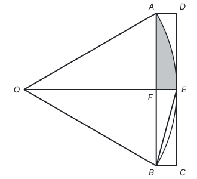

**答案：** $\frac{4\pi}{3} - 2\sqrt{3}$

**思路：** 阴影由线段 $AF$，$FE$ 和弧 $AE$ 围成，等于扇形 $AOE$ 减去 $\triangle AOF$。切线垂直于过切点的半径，$OE \perp CD$，又 $AB \parallel CD$，所以 $OE \perp AB$，由垂径定理 $AF = BF = 2$。$\angle ABE$ 是弧 $AE$ 所对的圆周角，圆心角 $\angle AOE = 2 \times 15^\circ = 30^\circ$。在直角三角形 $AOF$ 中，$OA = 2AF = 4$，$OF = 2\sqrt{3}$，所以

$$S_{\text{阴影}} = \frac{30\pi \times 4^2}{360} - \frac{1}{2} \times 2 \times 2\sqrt{3} = \frac{4\pi}{3} - 2\sqrt{3}.$$

## 第 15 题

考点：第十一部分“分类讨论”、第五部分“轴对称与等腰三角形”、第八部分“相似”、第十一部分“辅助线从哪里来”

定义：有两个内角的差为 $90^\circ$ 的三角形叫做“反直角三角形”。如图，在 $\triangle ABC$ 中，$AB = AC = 5$，$BC = 8$，点 $P$ 为边 $BC$ 上一点，若 $\triangle APC$ 为“反直角三角形”，则 $BP$ 的长为 ____。

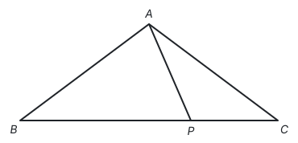

**答案：** $\frac{25}{4}$ 或 $\frac{11}{2}$

**思路：** $\triangle APC$ 有三个角，差为 $90^\circ$ 的可能是哪两个角、谁大谁小，要逐一讨论。先算出已知的角：作高 $AH$，$BH = CH = 4$，$AH = 3$，$\angle C$ 是锐角，$\tan C = \frac{3}{4}$，$\angle C < 45^\circ$。

- $\angle APC - \angle C = 90^\circ$：因为 $\angle APC = \angle B + \angle BAP$，$\angle B = \angle C$，所以 $\angle BAP = 90^\circ$。由 $\triangle BAP \sim \triangle BHA$ 得 $\frac{BP}{BA} = \frac{BA}{BH}$，$BP = \frac{25}{4}$。
- $\angle APC - \angle PAC = 90^\circ$：把 $\angle APC$ 中的 $90^\circ$ 单独分出来：过 $P$ 作 $PM \perp BC$ 交 $AC$ 于 $M$，则 $\angle APM = \angle APC - 90^\circ = \angle PAC$，所以 $AM = PM$。设 $CP = x$，由 $\tan C = \frac{3}{4}$ 得 $PM = \frac{3}{4}x$，$CM = \frac{5}{4}x$，于是 $\frac{3}{4}x + \frac{5}{4}x = 5$，$x = \frac{5}{2}$，$BP = 8 - \frac{5}{2} = \frac{11}{2}$。
- 以 $\angle PAC$ 或 $\angle C$ 为大角时：$\angle C$ 是锐角，不可能比别的角大 $90^\circ$。$\sin C = \frac{3}{5} > \frac{1}{2}$，所以 $\angle C > 30^\circ$，$\angle BAC = 180^\circ - 2\angle C < 120^\circ$；而 $\angle PAC - \angle C = 90^\circ$ 或 $\angle PAC - \angle APC = 90^\circ$（$\angle APC \ge \angle B = \angle C > 30^\circ$）都会使 $\angle PAC > 120^\circ$，超过 $\angle BAC$，不可能。

## 第 16 题

考点：第二部分“实数”、第三部分“整式的乘法”、第三部分“整式的加减”

（1）计算：$\sqrt[3]{8} + (\pi - 1)^0 - \sqrt{3} \times \sqrt{3}$；

（2）化简：$(x + 1)^2 - x(x + 2)$。

**答案：**

（1）原式 $= 2 + 1 - 3 = 0$。

（2）原式 $= x^2 + 2x + 1 - x^2 - 2x = 1$。

**思路：** （1）三项各自按定义算：$2^3 = 8$，所以 $\sqrt[3]{8} = 2$；$\pi - 1 \ne 0$，它的零次幂是 1；$\sqrt{3}$ 是平方等于 3 的正数，$\sqrt{3} \times \sqrt{3} = 3$。（2）用完全平方公式和单项式乘多项式展开，再合并同类项。

## 第 17 题

考点：第十部分“数据的分析”、第十部分“数据的收集、整理与描述”

为加强对青少年学生的宪法法治教育，普及宪法法治知识，教育部决定举办第十届全国学生“学宪法 讲宪法”活动。某学校为了解学生对宪法法治知识的掌握情况，从七、八年级各随机抽取 50 名学生进行测试，并对测试得分（10 分为满分，9 分或 9 分以上为优秀）进行整理、描述、分析，部分信息如下。

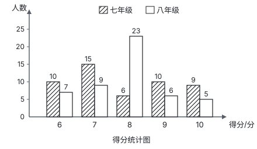

得分统计表：

| 统计量 | 七年级 | 八年级 |
| --- | --- | --- |
| 平均数 | 7.86 | 7.86 |
| 中位数 | $a$ | 8 |
| 众数 | 7 | $b$ |
| 优秀率 | 38% | $c$ |

根据以上信息，回答下列问题。

（1）表格中的 $a =$ ____，$b =$ ____，$c =$ ____。

（2）你认为哪个年级的学生对宪法法治知识的掌握情况更好？请说明理由。

**答案：**

（1）$a = 7.5$，$b = 8$，$c = 22\%$。

（2）七年级的学生掌握情况更好，因为两个年级的平均数相同，七年级的优秀率（38%）高于八年级（22%）。（答案不唯一，合理即可。比如从中位数、众数看，八年级更好。）

**思路：** （1）50 个数据的中位数是排序后第 25、26 个数的平均数。七年级得 6 分的 10 人、7 分的 15 人，累计 25 人，所以第 25 个是 7，第 26 个是 8，$a = \frac{7 + 8}{2} = 7.5$。八年级得 8 分的 23 人最多，$b = 8$。八年级优秀的有 $6 + 5 = 11$ 人，$c = \frac{11}{50} = 22\%$。（2）先说清用哪个统计量比较、它说明什么，再下结论。

## 第 18 题

考点：第七部分“反比例函数”、第六部分“平移、轴对称与旋转”、第十一部分“以数解形”

小军将一副三角板按如图方式摆放在平面直角坐标系 $xOy$ 中，其中含 $30^\circ$ 角的三角板 $OAB$ 的直角边 $OA$ 落在 $y$ 轴上，含 $45^\circ$ 角的三角板 $OAC$ 的直角顶点 $C$ 的坐标为 $(2, 2)$，反比例函数 $y = \frac{k}{x}$（$x > 0$）的图象经过点 $C$。

（1）求反比例函数的表达式。

（2）将三角板 $OAB$ 绕点 $O$ 顺时针旋转 $90^\circ$，$AB$ 边上的点 $D$ 恰好落在反比例函数图象上，求旋转前点 $D$ 的坐标。

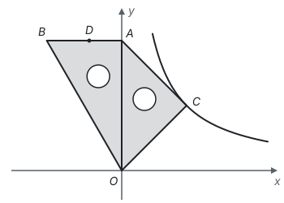

**答案：**

（1）把 $C(2, 2)$ 代入 $y = \frac{k}{x}$，得 $k = 2 \times 2 = 4$，所以反比例函数的表达式为 $y = \frac{4}{x}$。

（2）在等腰直角三角形 $OAC$ 中，点 $C$ 到 $y$ 轴的垂线段是斜边 $OA$ 上的高，也是中线，所以 $OA = 2 \times 2 = 4$，点 $A(0, 4)$。$AB \perp OA$，所以 $AB$ 在直线 $y = 4$ 上，设 $D(-m, 4)$（$m > 0$），$AD = m$。

绕点 $O$ 顺时针旋转 $90^\circ$ 后，点 $A$ 转到 $x$ 轴上的点 $A'(4, 0)$，$A'B'$ 与 $x$ 轴垂直，点 $D$ 的对应点 $D'$ 满足 $A'D' = AD = m$，所以 $D'(4, m)$。$D'$ 在 $y = \frac{4}{x}$ 上，$m = \frac{4}{4} = 1$。

所以旋转前点 $D$ 的坐标为 $(-1, 4)$。

**思路：** 旋转不改变线段长度和夹角。与其跟踪点 $D$ 的坐标怎样变，不如先看整条边 $AB$ 转到了哪里：$OA$ 从 $y$ 轴正半轴转到 $x$ 轴正半轴，$AB$ 随之变成竖直的，点 $D$ 到 $A$ 的距离不变，这样 $D'$ 的坐标就能用 $AD$ 表示，再让它满足函数表达式。

## 第 19 题

考点：第五部分“尺规作图”、第五部分“四边形”、第九部分“圆的有关性质”、第一部分“怎样证明”

如图，四边形 $ABCD$ 是平行四边形，以 $BC$ 为直径的圆交 $AD$ 于点 $E$。

（1）请用无刻度的直尺和圆规作出圆心 $O$（保留作图痕迹，不写作法）。

（2）若点 $E$ 是 $AD$ 的中点，连接 $OA$，$CE$。求证：四边形 $AOCE$ 是平行四边形。

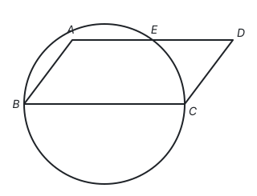

**答案：**

（1）作线段 $BC$ 的垂直平分线，它与 $BC$ 的交点就是圆心 $O$，如下图。

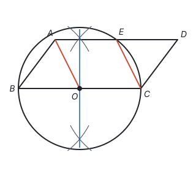

（2）证明：因为四边形 $ABCD$ 是平行四边形，所以 $AD = BC$，$AD \parallel BC$。

又因为 $E$ 是 $AD$ 的中点，$O$ 是 $BC$ 的中点，所以 $AE = \frac{1}{2}AD = \frac{1}{2}BC = OC$，且 $AE \parallel OC$。

所以四边形 $AOCE$ 是平行四边形（一组对边平行且相等的四边形是平行四边形）。

**思路：** （1）$BC$ 是直径，圆心就是 $BC$ 的中点，找中点用垂直平分线（见第五部分“尺规作图”）。（2）$AE$ 和 $OC$ 都在平行四边形的一组对边上，天然平行；都是对边的一半，天然相等，所以用“一组对边平行且相等”来判定最直接。

## 第 20 题

考点：第四部分“二元一次方程组”、第七部分“一次函数”、第四部分“不等式与不等式组”

为助力乡村振兴，支持惠农富农，某合作社销售我省西部山区出产的甲、乙两种苹果。已知 2 箱甲种苹果和 3 箱乙种苹果的售价之和为 440 元；4 箱甲种苹果和 5 箱乙种苹果的售价之和为 800 元。

（1）求甲、乙两种苹果每箱的售价。

（2）某公司计划从该合作社购买甲、乙两种苹果共 12 箱，且乙种苹果的箱数不超过甲种苹果的箱数。求该公司最少需花费多少元。

**答案：**

（1）设甲种苹果每箱售价 $x$ 元，乙种苹果每箱售价 $y$ 元，根据题意，得

$$\begin{cases} 2x + 3y = 440, \\ 4x + 5y = 800. \end{cases}$$

解得 $x = 100$，$y = 80$。甲种苹果每箱售价 100 元，乙种苹果每箱售价 80 元。

（2）设购买甲种苹果 $a$ 箱，则购买乙种苹果 $(12 - a)$ 箱。由 $12 - a \le a$，得 $a \ge 6$。

设花费为 $w$ 元，则 $w = 100a + 80(12 - a) = 20a + 960$。因为 $20 > 0$，$w$ 随 $a$ 的增大而增大，所以 $a = 6$ 时 $w$ 最小，$w = 20 \times 6 + 960 = 1080$。

该公司最少需花费 1080 元。

**思路：** （2）问“最少花费”，花费随甲的箱数变化，所以先把花费写成甲的箱数的一次函数，再由“乙不超过甲”列不等式求出箱数的范围。一次函数的最值出现在范围的端点，看 $k$ 的正负决定取哪一端：甲比乙贵，甲越多越贵，所以甲取最少的 6 箱。

## 第 21 题

考点：第八部分“相似”、第八部分“投影与视图”、第十一部分“辅助线从哪里来”、第十一部分“以数解形”

焦裕禄纪念园是全国重点革命烈士纪念建筑物保护单位，革命烈士纪念碑位于纪念园南部的中心。某综合与实践小组开展测量纪念碑高度的活动，记录如下。

| 项目 | 内容 |
| --- | --- |
| 活动主题 | 测量纪念碑的高度 |
| 实物图和测量示意图 | 见下图（实物照片从略） |
| 测量说明 | 如图，纪念碑 $AB$ 位于有台阶的平台 $BC$ 上，太阳光下，其顶端 $A$ 的影子落在点 $D$ 处，同一时刻，竖直放置的标杆 $DE$ 顶端 $E$ 的影子落在点 $F$ 处，位于点 $M$ 处的观测者眼睛所在位置为点 $N$，点 $N$，$E$，$A$ 在一条直线上，纪念碑底部点 $B$ 在观测者的水平视线上。 |
| 测量数据 | $DE = 2.1$ m，$DF = 2.1$ m，$DM = 1$ m，$MN = 1.2$ m。 |
| 备注 | 点 $F$，$M$，$D$，$C$ 在同一水平线上。 |

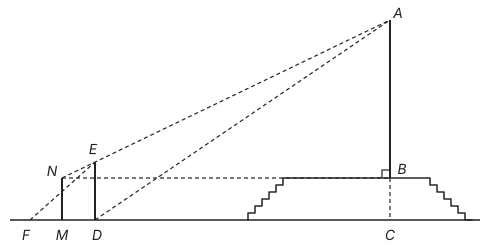

根据以上信息，解决下列问题。

（1）由标杆的影子 $DF$ 的长和标杆 $DE$ 的长相等，可得 $CD = CA$，请说明理由。

（2）求纪念碑 $AB$ 的高度。

（3）小红通过间接测量得到 $CD$ 的长，进而求出纪念碑 $AB$ 的高度约为 18.5 m。查阅资料得知，纪念碑的实际高度为 19.64 m。请判断小红的结果和（2）中的结果哪个误差较大？并分析误差较大的可能原因（写出一条即可）。

**答案：**

（1）同一时刻的太阳光线是平行的，所以 $EF \parallel AD$；$ED$，$AC$ 都与地面垂直，所以 $ED \parallel AC$。于是 $\angle EFD = \angle ADC$，$\angle EDF = \angle ACD$，$\triangle EDF \sim \triangle ACD$，$\frac{CD}{CA} = \frac{DF}{DE} = 1$，所以 $CD = CA$。

（2）过点 $E$ 作 $EH \perp AC$ 于点 $H$。设 $AB = x$ m。

由题意，$BC = MN = 1.2$ m，$CH = DE = 2.1$ m，所以 $EH = CD = CA = (x + 1.2)$ m，$BN = CM = CD + DM = (x + 2.2)$ m，$AH = CA - CH = (x - 0.9)$ m。

因为 $EH \parallel BN$，所以 $\angle ANB = \angle AEH$，$\tan \angle ANB = \tan \angle AEH$，即

$$\frac{x}{x + 2.2} = \frac{x - 0.9}{x + 1.2}.$$

解得 $x = 19.8$，经检验 $x = 19.8$ 符合题意。纪念碑 $AB$ 的高度为 19.8 m。

（3）（2）中结果的误差是 $19.8 - 19.64 = 0.16$（m），小红结果的误差是 $19.64 - 18.5 = 1.14$（m），$0.16 < 1.14$，所以小红的结果误差较大。可能的原因：测量工具不精确（答案不唯一，合理即可）。

**思路：** 高 $AB$ 够不着，就找和它相似的小三角形。（1）太阳光平行，标杆和它的影子组成的三角形与纪念碑和它的影子组成的三角形相似，标杆的影长等于杆长，纪念碑的“影长”$CD$ 也就等于它的“高”$CA$（见第八部分“投影与视图”）。（2）视线 $N$，$E$，$A$ 共线，站在两个直角三角形 $ANB$ 和 $AEH$ 里看同一个角，两条直角边的比相等，列出关于 $x$ 的方程。把 $CD = CA$ 用进来，才能把所有长度都用 $x$ 表示。

## 第 22 题

考点：第七部分“二次函数”、第十一部分“分类讨论”、第十一部分“以形助数”

在二次函数 $y = ax^2 + bx - 2$ 中，$x$ 与 $y$ 的几组对应值如下表所示。

| $x$ | … | $-2$ | 0 | 1 | … |
| --- | --- | --- | --- | --- | --- |
| $y$ | … | $-2$ | $-2$ | 1 | … |

（1）求二次函数的表达式。

（2）求二次函数图象的顶点坐标，并在给出的平面直角坐标系中画出二次函数的图象。

（3）将二次函数的图象向右平移 $n$ 个单位长度后，当 $0 \le x \le 3$ 时，若图象对应的函数最大值与最小值的差为 5，请直接写出 $n$ 的值。

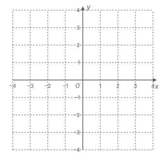

**答案：**

（1）把 $x = -2$，$y = -2$ 和 $x = 1$，$y = 1$ 代入，得

$$\begin{cases} 4a - 2b - 2 = -2, \\ a + b - 2 = 1. \end{cases}$$

解得 $a = 1$，$b = 2$，所以二次函数的表达式为 $y = x^2 + 2x - 2$。

（2）$y = x^2 + 2x - 2 = (x + 1)^2 - 3$，顶点坐标为 $(-1, -3)$。图象如下图。

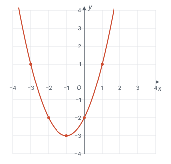

（3）$n = 4 - \sqrt{5}$ 或 $n = 1 + \sqrt{5}$。

**思路：** （2）配方得顶点式，描点时以对称轴 $x = -1$ 为中心左右对称地取点。（3）平移后是 $y = (x - h)^2 - 3$，对称轴 $x = h = n - 1$。函数在区间上的最大、最小值取决于对称轴在区间的左边、里面还是右边，要分类讨论。对称轴在 $0 \le x \le 3$ 左边时，差为 $(3 - h)^2 - h^2 = 9 - 6h = 5$，$h = \frac{2}{3}$，与 $h < 0$ 矛盾；在右边时同理矛盾。所以对称轴在区间内，最小值在顶点，差就是 $(x - h)^2$ 的最大值，即 $h^2$ 与 $(3 - h)^2$ 中较大的等于 5：$h = \sqrt{5}$ 或 $h = 3 - \sqrt{5}$，所以 $n = 1 + \sqrt{5}$ 或 $4 - \sqrt{5}$。

## 第 23 题

考点：第五部分“全等三角形”、第五部分“四边形”、第十一部分“辅助线从哪里来”、第一部分“怎样证明”

在 $\angle AOB$ 中，点 $C$ 是 $\angle AOB$ 的平分线上一点，过点 $C$ 作 $CD \perp OB$，垂足为点 $D$，过点 $D$ 作 $DE \perp OA$，垂足为点 $E$，直线 $DE$，$OC$ 交于点 $F$，过点 $C$ 作 $CG \perp DE$，垂足为点 $G$。

（1）**观察猜想**

如图 1，当 $\angle AOB$ 为锐角时，用等式表示线段 $CG$，$OE$，$OD$ 的数量关系：____。

（2）**类比探究**

如图 2，当 $\angle AOB$ 为钝角时，请依据题意补全图形（无需尺规作图），并判断（1）中的结论是否仍然成立？若成立，请证明；若不成立，请写出正确结论，并证明。

（3）**拓展应用**

当 $0^\circ < \angle AOB < 180^\circ$，且 $\angle AOB \ne 90^\circ$ 时，若 $\frac{GF}{EF} = 3$，请直接写出 $\frac{OD}{CD}$ 的值。

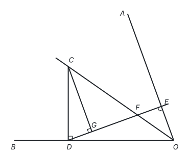

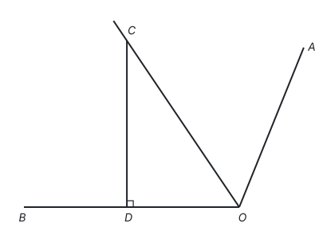

**答案：**

（1）$CG + OE = OD$。

（2）补全图形如下（虚线 $CH$ 是证明时添的辅助线）。

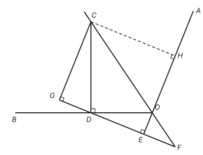

不成立，正确结论是 $CG - OE = OD$。证明如下：

过点 $C$ 作 $CH \perp OA$，交直线 $OA$ 于点 $H$。因为 $CG \perp DE$，$DE \perp OA$，所以 $\angle CHE = \angle HEG = \angle G = 90^\circ$，四边形 $CGEH$ 是矩形，$CG = EH = OE + OH$。

因为 $OC$ 平分 $\angle AOB$，所以 $\angle COD = \angle COH$；又 $\angle ODC = \angle OHC = 90^\circ$，$OC = OC$，所以 $\triangle ODC \cong \triangle OHC$（AAS），$OD = OH$。

所以 $CG = OE + OD$，即 $CG - OE = OD$。

（3）$\frac{OD}{CD} = \frac{\sqrt{15}}{3}$ 或 $\frac{\sqrt{3}}{3}$。

**思路：** 三条线段 $CG$，$OE$，$OD$ 不在一起，要把它们“搬”到一条直线上。$CG$ 与 $OA$ 平行（都垂直于 $DE$），过 $C$ 作 $OA$ 的垂线 $CH$，就得到矩形 $CGEH$，$CG$ 搬到了 $OA$ 上成为 $EH$；角平分线上的点到角两边的距离相等，全等三角形又把 $OD$ 搬成 $OH$。锐角时点 $E$ 在 $H$ 和 $O$ 之间，$EH = OH - OE$；钝角时点 $E$ 落在 $AO$ 的延长线上，$EH = OH + OE$，结论随之改变。

（3）$\frac{GF}{EF}$ 是同一条直线上的两段，要换成能和 $OD$，$CD$ 联系起来的比。$OE$ 和 $CG$ 都垂直于 $DE$，互相平行，$\triangle FEO \sim \triangle FGC$，所以 $\frac{CG}{OE} = \frac{GF}{EF} = 3$。锐角时由（1）得 $OD = CG + OE = 4OE$，钝角时由（2）得 $OD = CG - OE = 2OE$。再看 $\triangle CGD$ 和 $\triangle DEO$：都有直角，$\angle CDG$ 和 $\angle DOE$ 都与 $\angle ODE$ 互余，所以两个三角形相似，$\frac{CG}{CD} = \frac{DE}{OD}$。锐角时取 $OE = 1$，则 $OD = 4$，$CG = 3$，$DE = \sqrt{15}$，得 $CD = \frac{12}{\sqrt{15}}$，$\frac{OD}{CD} = \frac{\sqrt{15}}{3}$；钝角时 $OD = 2$，$CG = 3$，$DE = \sqrt{3}$，得 $CD = 2\sqrt{3}$，$\frac{OD}{CD} = \frac{\sqrt{3}}{3}$。
