# 2026 年河南中考数学

> 河南省 2026 年初中学业水平考试数学试卷，共 23 题，满分 120 分，考试时间 100 分钟。

## 第 1 题

考点：第二部分“有理数的运算”、第二部分“有理数”

某地一天早晨的气温是 −3 ℃，到中午升高了 5 ℃，则中午的气温是

- A. −3 ℃
- B. −2 ℃
- C. 2 ℃
- D. 5 ℃

**答案：** C

**思路：** “升高”就是加上，中午的气温是 $-3 + 5 = 2$（℃）。异号两数相加，取绝对值较大的数的符号，再用较大的绝对值减去较小的绝对值；在数轴上看，就是从 $-3$ 向右走 5 个单位。

## 第 2 题

考点：第五部分“几何图形初步”

今年我国六五环境日的主题为“全面绿色转型，共建美丽中国”。将“共建美丽中国”这六个汉字分别写在某正方体的表面上，如图是它的一种展开图，则在原正方体中，与“建”字所在面相对的面上的汉字是

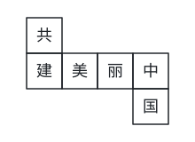

- A. 美
- B. 丽
- C. 中
- D. 国

**答案：** B

**思路：** 想象把展开图折回正方体。“建、美、丽、中”连成一行，折起来围成一圈侧面，一圈上隔一个面的两个面相对，所以“建”对“丽”，“美”对“中”；剩下的“共”和“国”分别是上、下底面，互相相对。

## 第 3 题

考点：第十部分“数据的收集、整理与描述”

下列调查中，适宜用全面调查（普查）的是

- A. 检查某载人飞船的零部件质量
- B. 检测一条河流的水质情况
- C. 了解某市中学生的课外阅读时间
- D. 调查一批玉米种子的发芽率

**答案：** A

**思路：** 选全面调查还是抽样调查，看两件事：结果是否要求绝对可靠，逐个调查是否可行。载人飞船关系到生命安全，每个零部件都必须检查；河水无法全部检测，全市学生人数太多，测发芽率会把种子用掉，都适合抽样调查。

## 第 4 题

考点：第四部分“一元二次方程”、第四部分“一元一次方程”

已知 $x = 2$ 是关于 $x$ 的方程 $x^2 - mx = 6$ 的一个根，则 $m$ 的值为

- A. 5
- B. −5
- C. 1
- D. −1

**答案：** D

**思路：** 方程的根就是使等式成立的数，所以把 $x = 2$ 代入：$4 - 2m = 6$，得 $m = -1$。这里不用解一元二次方程，只要用“根”的定义，把问题变成关于 $m$ 的一元一次方程。

## 第 5 题

考点：第六部分“平移、轴对称与旋转”、第五部分“勾股定理”

如图，$\triangle ABC$ 与 $\triangle A'B'C'$ 关于直线 $l$ 对称，$\angle C = 90^\circ$，$AC = 8$，$BC = 6$，则 $A'B'$ 的长为

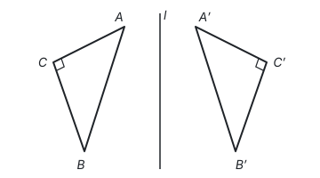

- A. 6
- B. 8
- C. 10
- D. 12

**答案：** C

**思路：** 轴对称不改变图形的形状和大小，所以 $A'B' = AB$。在直角三角形 $ABC$ 中，由勾股定理，$AB = \sqrt{8^2 + 6^2} = 10$。

## 第 6 题

考点：第五部分“相交线与平行线”、第五部分“三角形”

如图是高铁线路上某高压线支撑结构的部分示意图，已知 $AB \parallel CD$，$\angle 1 = 50^\circ$，$\angle 2 = 30^\circ$，则 $\angle 3$ 的度数为

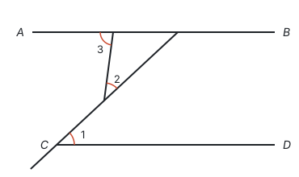

- A. $90^\circ$
- B. $80^\circ$
- C. $70^\circ$
- D. $60^\circ$

**答案：** B

**思路：** $\angle 1$ 在 $CD$ 上，$\angle 3$ 在 $AB$ 上，要用平行线把 $\angle 1$ 搬到 $AB$ 上。过点 $C$ 的斜线和 $AB$ 相交，由两直线平行、内错角相等，斜线与 $AB$ 所成的这个角也是 $50^\circ$。$\angle 3$ 是 $AB$、斜线和短线段围成的小三角形的外角，等于和它不相邻的两个内角之和：$\angle 3 = 50^\circ + 30^\circ = 80^\circ$。

## 第 7 题

考点：第三部分“整式的乘法”

下列式子中，运算结果为 $x^2 - 4$ 的是

- A. $(x-2)^2$
- B. $(x+2)(2-x)$
- C. $(x+2)(x-2)$
- D. $x(x-4)$

**答案：** C

**思路：** $x^2 - 4$ 是两个平方的差，正是平方差公式 $(a+b)(a-b) = a^2 - b^2$ 的结果。B 看起来也像，但展开是 $4 - x^2$，符号反了；A 是完全平方，会多出中间项 $-4x$。

## 第 8 题

考点：第二部分“有理数的运算”

2026 年 3 月，我国自主研发的 SYT80（T1200 级）超高强度碳纤维发布，这是全世界第一款量产的 T1200 级碳纤维产品。SYT80 超高强度碳纤维拉伸强度突破 $8 \times 10^3$ 兆帕，普通钢材的拉伸强度约为 $8 \times 10^2$ 兆帕。数据“$8 \times 10^3$”是“$8 \times 10^2$”的

- A. 2 倍
- B. 5 倍
- C. 8 倍
- D. 10 倍

**答案：** D

**思路：** 求一个数是另一个数的几倍，用除法：$(8 \times 10^3) \div (8 \times 10^2) = 10^3 \div 10^2 = 10$。科学记数法里前面的数相同时，指数每大 1，数就大到 10 倍。

## 第 9 题

考点：第六部分“平面直角坐标系”、第六部分“平移、轴对称与旋转”、第五部分“四边形”

如图，在平面直角坐标系中，矩形 $OABC$ 的边 $OC$ 在 $x$ 轴上，对角线 $OB$，$AC$ 交于点 $P$，$OA = 2$，$OC = 4$。将矩形 $OABC$ 向左平移，当点 $P$ 的对应点落在 $y$ 轴上时，点 $A$ 的对应点的坐标为

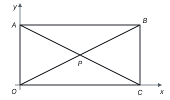

- A. $(-2, 2)$
- B. $(-2, 1)$
- C. $(0, 2)$
- D. $(0, 1)$

**答案：** A

**思路：** 矩形的对角线互相平分，所以 $P$ 是 $OB$ 的中点，$A(0, 2)$、$B(4, 2)$，$P(2, 1)$。$P$ 落到 $y$ 轴上，要向左平移 2 个单位；平移时每个点走的距离相同，所以 $A$ 也向左平移 2 个单位，到 $(-2, 2)$。

## 第 10 题

考点：第九部分“与圆有关的计算”、第九部分“与圆有关的位置关系”、第十一部分“辅助线从哪里来”

团扇始于汉代，盛于唐宋，寓意“团圆友善”。劳动课上，小红想在自己制作的团扇边缘选一段弧进行装饰。如图，已知扇面边缘为 $\odot O$，扇柄所在直线经过圆心 $O$，她过扇柄端点 $P$ 作 $PA$，$PB$ 分别与 $\odot O$ 相切于点 $A$，$B$，得到 $\overset{\frown}{AB}$。若 $\odot O$ 的半径为 9 cm，$\angle APB = 60^\circ$，则小红想要装饰的 $\overset{\frown}{AB}$ 的长为

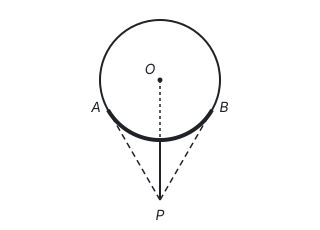

- A. $3\pi$ cm
- B. $6\pi$ cm
- C. $9\pi$ cm
- D. $27\pi$ cm

**答案：** B

**思路：** 求弧长要知道圆心角，图中没有画出圆心角，就连接 $OA$，$OB$ 把它补出来。切线垂直于过切点的半径，所以 $\angle OAP = \angle OBP = 90^\circ$，四边形 $OAPB$ 的内角和是 $360^\circ$，得 $\angle AOB = 360^\circ - 90^\circ - 90^\circ - 60^\circ = 120^\circ$。弧长

$$l = \frac{120 \pi \times 9}{180} = 6\pi \text{（cm）}.$$

## 第 11 题

考点：第七部分“一次函数”

请写出一个图象经过第一、三象限的正比例函数表达式 ____。

**答案：** $y = x$（答案不唯一）

**思路：** 正比例函数 $y = kx$ 的图象是过原点的直线。$k > 0$ 时，$x$ 为正 $y$ 也为正，$x$ 为负 $y$ 也为负，图象经过第一、三象限，所以任取一个正数作 $k$ 都可以。

## 第 12 题

考点：第四部分“分式方程”

方程 $\dfrac{2}{x+1} = \dfrac{1}{x}$ 的解为 ____。

**答案：** $x = 1$

**思路：** 两边同乘最简公分母 $x(x+1)$，化成整式方程 $2x = x + 1$，得 $x = 1$。去分母时乘的式子可能为 0，所以要检验：$x = 1$ 时 $x(x+1) = 2 \ne 0$，是原方程的解。

## 第 13 题

考点：第九部分“圆的有关性质”

如图，$AB$ 为 $\odot O$ 的直径，$C$，$D$ 为 $\odot O$ 上两点，$\angle ADC = 40^\circ$，则 $\angle CAB$ 的度数为 ____。

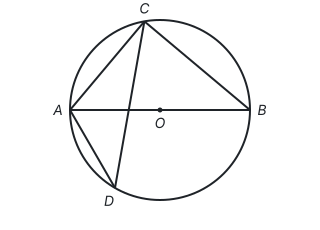

**答案：** $50^\circ$

**思路：** 见到直径，就想到它所对的圆周角是直角：$\angle ACB = 90^\circ$。$\angle ADC$ 和 $\angle ABC$ 都对着 $\overset{\frown}{AC}$，同弧所对的圆周角相等，所以 $\angle ABC = 40^\circ$。在直角三角形 $ABC$ 中，$\angle CAB = 90^\circ - 40^\circ = 50^\circ$。

## 第 14 题

考点：第十部分“概率”

在钢琴上弹奏不同的琴键，能够发出高低不同的声音，当同时弹奏两个相邻的白色琴键时，发出的声音构成二度音程。如图是钢琴键盘的一部分，从 F，G，A，B 四个白色琴键中随机选两个琴键同时弹奏，发出的声音构成二度音程的概率为 ____。

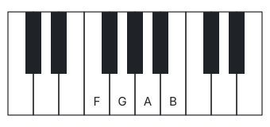

**答案：** $\dfrac{1}{2}$

**思路：** 从 4 个琴键里选 2 个，所有可能的结果是 FG、FA、FB、GA、GB、AB，共 6 种，每种可能性相同。相邻的有 FG、GA、AB 这 3 种，所以概率是 $\dfrac{3}{6} = \dfrac{1}{2}$。列举时注意“同时弹奏”不分先后，FG 和 GF 是同一种。

## 第 15 题

考点：第十一部分“分类讨论”、第五部分“轴对称与等腰三角形”、第五部分“勾股定理”、第十一部分“以数解形”

如图，在 $\triangle ABC$ 中，$AB = AC = 5$，$BC = 6$，$CD$ 是角平分线。点 $E$ 为边 $BC$ 上一点，连接 $AE$，交 $CD$ 于点 $F$，连接 $BF$。若 $AE = 2\sqrt{5}$，则 $BF$ 的长为 ____。

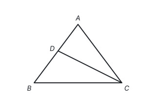

**答案：** $2\sqrt{2}$ 或 $\dfrac{10\sqrt{2}}{3}$

**思路：** 先定点 $E$ 的位置。作高 $AM$，等腰三角形三线合一，$M$ 是 $BC$ 的中点，$BM = 3$，$AM = \sqrt{5^2 - 3^2} = 4$。由 $AE^2 = AM^2 + ME^2$ 得 $ME = 2$，而 $E$ 可以在 $M$ 的左边或右边，所以要分两种情况：$BE = 1$ 或 $BE = 5$。

再定点 $F$。以 $M$ 为原点、$BC$ 为 $x$ 轴建立坐标系，$A(0, 4)$，$B(-3, 0)$，$C(3, 0)$。

- $BE = 1$ 时，$CE = 5 = CA$，$\triangle CAE$ 是等腰三角形，顶角的平分线 $CF$ 也是中线，$F$ 是 $AE$ 的中点。$E(-2, 0)$，$F(-1, 2)$，$BF = \sqrt{2^2 + 2^2} = 2\sqrt{2}$。
- $BE = 5$ 时，$CE = 1$。$\triangle ACF$ 和 $\triangle ECF$ 以 $AF$、$FE$ 为底时高相同；又因为 $F$ 在 $\angle ACE$ 的平分线上，到 $CA$、$CE$ 的距离相等，以 $CA$、$CE$ 为底时高也相同。比较两种算法的面积比，得 $AF : FE = CA : CE = 5 : 1$。$E(2, 0)$，$F$ 从 $A$ 出发走 $AE$ 的 $\dfrac{5}{6}$，$F\left(\dfrac{5}{3}, \dfrac{2}{3}\right)$，$BF = \sqrt{\left(\dfrac{14}{3}\right)^2 + \left(\dfrac{2}{3}\right)^2} = \dfrac{10\sqrt{2}}{3}$。

## 第 16 题

考点：第四部分“不等式与不等式组”、第二部分“有理数的运算”、第二部分“实数”、第十一部分“以形助数”

（1）计算：$(3-\pi)^0 - 2^{-1} + \sqrt{\dfrac{1}{4}}$。

（2）解不等式组：

$$\begin{cases} 3x - 1 \le 2, & ① \\ 2x + 5 \ge x + 3. & ② \end{cases}$$

完成以下解答过程。

ⅰ）解不等式 ①，得 ____。

ⅱ）解不等式 ②，得 ____。

ⅲ）把不等式 ① 和 ② 的解集在数轴上表示出来。

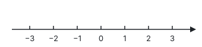

ⅳ）所以，原不等式组的解集是 ____。

**答案：**

（1）原式 $= 1 - \dfrac{1}{2} + \dfrac{1}{2} = 1$。

（2）ⅰ）$x \le 1$；ⅱ）$x \ge -2$；ⅲ）如图；ⅳ）$-2 \le x \le 1$。

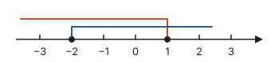

**思路：** （1）三项各用一个定义：非零数的 0 次幂等于 1（$3 - \pi \ne 0$），$2^{-1} = \dfrac{1}{2}$，$\dfrac{1}{4}$ 的算术平方根是 $\dfrac{1}{2}$。（2）不等式组的解集是两个解集的公共部分，在数轴上就是两条线都覆盖的那一段；端点能取到，画实心点。

## 第 17 题

考点：第十部分“数据的分析”

加强中小学科技教育是服务国家创新驱动发展战略、培养未来科技创新人才的重要路径。某学校科创社团组装了甲、乙两个投篮机器人，准备从中选一个参加青少年科技创新大赛。为此，该社团对两个投篮机器人分别进行了 10 组测试（每组测试投篮 10 次，以投进次数作为测试成绩），并对测试成绩整理、描述、分析如下。

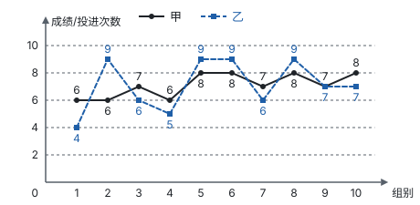

测试成绩统计表：

| 统计量 | 甲 | 乙 |
| --- | --- | --- |
| 平均数 | 7.1 | 7.1 |
| 中位数 | $a$ | 7 |
| 众数 | 8 | $b$ |
| 方差 | $s_1^2$ | $s_2^2$ |

根据以上信息，回答下列问题。

（1）表中 $a$ 的值为 ____，$b$ 的值为 ____，$s_1^2$ ____ $s_2^2$（填“>”“=”或“<”）。

（2）你认为科创社团应选哪个投篮机器人参加青少年科技创新大赛？请说明理由。

**答案：**

（1）$a = 7$，$b = 9$，$s_1^2 < s_2^2$。

（2）应选甲投篮机器人。因为甲、乙两个投篮机器人测试成绩的平均数相同，中位数相同，但甲的方差小于乙的方差，说明甲投篮机器人的成绩更稳定。（答案不唯一，合理即可）

**思路：** 从图上读出数据：甲是 6，6，7，6，8，8，7，8，7，8，乙是 4，9，6，5，9，9，6，9，7，7。甲排序后第 5、6 个数都是 7，中位数 $a = 7$；乙中 9 出现 4 次最多，众数 $b = 9$。方差比较的是数据离平均数的远近，不必算出来：甲的折线在 6 到 8 之间小幅起伏，乙从 4 跳到 9，波动大，所以 $s_1^2 < s_2^2$（算出来是 $0.69$ 和 $3.09$）。平均数、中位数相同时，比稳定性就看方差。

## 第 18 题

考点：第四部分“二元一次方程组”、第十一部分“方程思想与建模”、第一部分“三种数学语言”

近视可防可控不可逆，保持“一尺、一拳、一寸”的正确书写姿势能有效预防近视。小文发现，一本书的长度加上她的一拳长是 1 尺，这本书长度的 2 倍比她的一拳长的 3 倍多 1 尺。这本书的长度和小文的一拳长分别是多少尺？

**答案：** 设这本书的长度是 $x$ 尺，小文的一拳长是 $y$ 尺。根据题意，得

$$\begin{cases} x + y = 1, \\ 2x - 3y = 1. \end{cases}$$

解这个方程组，得

$$\begin{cases} x = 0.8, \\ y = 0.2. \end{cases}$$

答：这本书的长度是 0.8 尺，小文的一拳长是 0.2 尺。

**思路：** 两个未知量，题目正好给了两个相等关系：“书长 + 一拳长 = 1 尺”，“书长的 2 倍 − 一拳长的 3 倍 = 1 尺”。“多 1 尺”说的是差，把它翻译成减法，是列方程时最容易出错的地方。解方程组时由第一个方程得 $x = 1 - y$，代入第二个方程消元。

## 第 19 题

考点：第五部分“尺规作图”、第五部分“四边形”、第五部分“全等三角形”、第一部分“怎样证明”

如图，在 $\square ABCD$ 中，点 $E$ 为边 $BC$ 上一点，连接 $AE$。

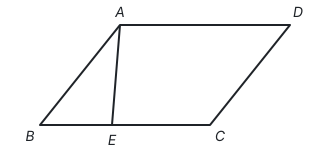

（1）请用无刻度的直尺和圆规作 $\angle DCM$，使 $\angle DCM = \angle BAE$，且射线 $CM$ 交边 $AD$ 于点 $F$（保留作图痕迹，不写作法）。

（2）判断线段 $BE$ 与（1）中得到的线段 $DF$ 的数量关系，并给出证明。

**答案：**

（1）按“作一个角等于已知角”作图：以点 $A$ 为圆心、适当长为半径画弧，交 $AB$、$AE$ 于两点；以点 $C$ 为圆心、同样长为半径画弧，交 $CD$ 于一点；以这一点为圆心、前面两个交点间的距离为半径画弧，与上一条弧在平行四边形内部交于一点 $M$；作射线 $CM$ 交 $AD$ 于点 $F$。

（2）$BE = DF$。证明：因为四边形 $ABCD$ 是平行四边形，所以 $AB = CD$，$\angle B = \angle D$。由作图可知 $\angle BAE = \angle DCF$。所以 $\triangle ABE \cong \triangle CDF$（ASA），所以 $BE = DF$。

**思路：** 作图就是把 $\angle BAE$ 复制到顶点 $C$、一边在 $CD$ 上，依据是三边对应相等的三角形全等（见第五部分“尺规作图”）。第（2）问要比较 $BE$、$DF$，就找它们所在的两个三角形 $\triangle ABE$ 和 $\triangle CDF$：平行四边形给出一组对边相等、一组对角相等，作图又给出一组角相等，正好凑成“角边角”。也可以证 $AE \parallel CF$，得到四边形 $AECF$ 是平行四边形，再用 $BC - CE = AD - AF$。

## 第 20 题

考点：第七部分“反比例函数”、第七部分“一次函数”、第十一部分“动点与函数”

今年是红军长征胜利 90 周年，为传承红色基因、厚植爱国情怀，某校学生上午 8:00 从学校出发步行到长征纪念广场开展研学活动，学生步行的平均速度 $v$（km/h）与步行全程所用时间 $t$（h）的函数关系如图 1 所示。

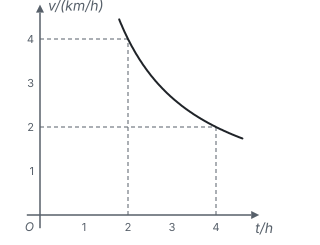

（1）求 $v$ 关于 $t$ 的函数表达式。

（2）如果学生从学校出发步行到长征纪念广场所用时间不超过 2.5 h，那么学生步行的平均速度至少为多少？

（3）学生出发 0.25 h 后，李老师带着补给物品从学校出发，沿与学生相同的路线先去补给点，为学生整理、发放补给物品后，再去长征纪念广场。李老师、学生已走路程 $y$（km）与学生步行时间 $t$（h）的函数关系如图 2 所示。下列三个说法：

① 李老师在补给点停留的时间为 1 h；

② 李老师比学生先到达长征纪念广场；

③ 学生从学校到补给点所走路程为 4 km。

其中正确说法的序号是 ____。

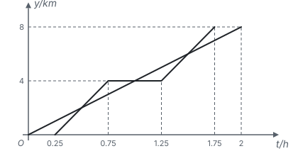

**答案：**

（1）由题意知，$v$ 是 $t$ 的反比例函数，当 $t = 4$ 时，$v = 2$，所以 $v = \dfrac{8}{t}$。

（2）把 $t = 2.5$ 代入 $v = \dfrac{8}{t}$，得 $v = 3.2$。对于函数 $v = \dfrac{8}{t}$，当 $t > 0$ 时，$t$ 越小，$v$ 越大。所以学生步行的平均速度至少为 3.2 km/h。

（3）②③

**思路：** （1）路程一定时，速度和时间的乘积不变，所以是反比例函数，图上 $(2, 4)$ 和 $(4, 2)$ 都给出 $vt = 8$，这个 8 就是全程 8 km。（2）“不超过 2.5 h”是 $t \le 2.5$，要从图象的增减性推出 $v$ 的范围：$t$ 越小 $v$ 越大，所以 $v \ge 3.2$。（3）读图 2：学生是过原点的直线，2 h 走完 8 km；李老师的折线在 0.75 h 到 1.25 h 之间是水平的，说明停在 4 km 处的补给点 0.5 h，所以 ① 错、③ 对；李老师 1.75 h 到达 8 km，早于学生的 2 h，② 对。

## 第 21 题

考点：第八部分“锐角三角函数”、第十一部分“辅助线从哪里来”

某学校为提高地下车库入口的行车安全性，计划对其进行改造。为此，某数学兴趣小组开展了综合与实践活动，记录如下。

| 活动主题 | 地下车库入口改造 |
| --- | --- |
| 采集信息 | 图 1 是地下车库入口示意图。① 点 $C$，$B$，$D$ 在同一水平线上，点 $E$，$A$，$F$ 在同一水平线上，$CD \parallel EF$。② 斜坡 $AB$ 的长为 10 m，$\angle BAF = 26.4^\circ$。③ 车库限高 2.7 m。 |
| 设计方案 | 如图 2，保持点 $A$ 不动，将点 $B$ 沿射线 $BD$ 平移到点 $B'$，使 $\angle B'AF = 18.4^\circ$。 |
| 完成任务 | 任务一：求 $BB'$ 的长。任务二：调整限高。经计算，点 $C$ 到斜坡 $AB'$ 的距离约为 3.47 m。在保障行车安全的前提下，车库限高标志上的数值最大可为 ____。（结果均保留一位小数） |

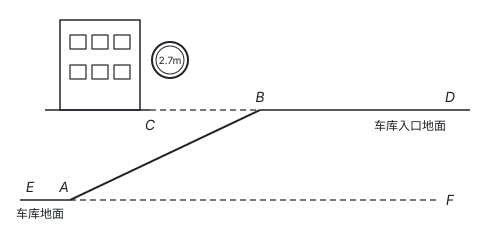

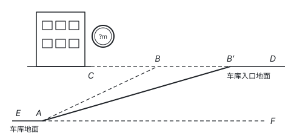

请帮数学兴趣小组完成表中的两个任务（参考数据：$\sin 26.4^\circ \approx 0.44$，$\cos 26.4^\circ \approx 0.90$，$\tan 26.4^\circ \approx 0.50$，$\sin 18.4^\circ \approx 0.32$，$\cos 18.4^\circ \approx 0.95$，$\tan 18.4^\circ \approx 0.33$）。

**答案：**

任务一：如图，过点 $A$ 作 $AH \perp CD$，垂足为点 $H$。

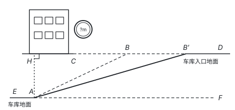

由题意知，$\angle ABH = \angle BAF = 26.4^\circ$，$\angle AB'H = \angle B'AF = 18.4^\circ$。

在 $\text{Rt}\triangle ABH$ 中，

$$AH = AB \sin \angle ABH = 10 \sin 26.4^\circ \approx 4.4, \quad BH = AB \cos \angle ABH = 10 \cos 26.4^\circ \approx 9.0.$$

在 $\text{Rt}\triangle AB'H$ 中，

$$B'H = \frac{AH}{\tan \angle AB'H} \approx \frac{4.4}{\tan 18.4^\circ} \approx 13.33.$$

所以 $BB' = B'H - BH \approx 4.3$，即 $BB'$ 的长约为 4.3 m。

任务二：3.4

**思路：** 斜坡不是直角三角形的边时，先作垂线造直角三角形。$AH$ 是两段斜坡共同的高度，是连接两个直角三角形的桥梁：在 $\text{Rt}\triangle ABH$ 中由斜边 $AB$ 求出 $AH$ 和 $BH$，在 $\text{Rt}\triangle AB'H$ 中由 $AH$ 和 $\angle AB'H$ 求出 $B'H$，两段水平距离相减就是 $BB'$。任务二里，车在斜坡上时车身垂直于坡面，入口上沿 $C$ 到坡面 $AB'$ 的距离 3.47 m 就是能通过的最大高度；限高标志的数值不能超过它，保留一位小数时只能取 3.4，不能四舍五入成 3.5。

## 第 22 题

考点：第七部分“二次函数”、第十一部分“分类讨论”、第十一部分“以形助数”、第一部分“三种数学语言”

定义：若点 $P$，$Q$ 在同一抛物线上，且点 $Q$ 的横坐标比点 $P$ 的横坐标大 3，则称点 $Q$ 是点 $P$ 的“黄金搭档点”。例如，抛物线 $y = x^2$ 上，点 $(3, 9)$ 是点 $(0, 0)$ 的“黄金搭档点”。

（1）点 $A(0, -3)$ 和点 $B$ 在抛物线 $y = x^2 + bx + c$ 上，点 $B$ 是点 $A$ 的“黄金搭档点”，且点 $B$ 的纵坐标为 12。求 $b$，$c$ 的值。

（2）点 $M$，$N$ 在（1）中的抛物线上，且点 $N$ 是点 $M$ 的“黄金搭档点”。

① 若点 $M$，$N$ 的纵坐标相等，求点 $M$，$N$ 的横坐标。

② 抛物线上 $M$，$N$ 两点之间的部分（含 $M$，$N$ 两点）记为图象 W，设点 $M$ 的横坐标为 $m$，当 $-\dfrac{5}{2} < m < 0$ 时，若图象 W 上的最高点和最低点到 $x$ 轴的距离之和为 5，请直接写出 $m$ 的值。

**答案：**

（1）因为点 $A(0, -3)$ 在抛物线上，所以 $c = -3$。由题意知，点 $B$ 的坐标为 $(3, 12)$，所以 $9 + 3b - 3 = 12$，$b = 2$。

（2）① 由（1）知，抛物线的表达式为 $y = x^2 + 2x - 3$，对称轴为直线 $x = -1$。因为点 $M$，$N$ 的纵坐标相等，且 $MN = 3$，所以点 $M$，$N$ 关于对称轴对称，点 $M$ 的横坐标为 $-1 - \dfrac{3}{2} = -\dfrac{5}{2}$，点 $N$ 的横坐标为 $-1 + \dfrac{3}{2} = \dfrac{1}{2}$。

② $m = -4 + \sqrt{3}$ 或 $m = -4 + \sqrt{5}$。

推理过程：图象 W 是 $m \le x \le m + 3$ 上的一段。抛物线开口向上，离对称轴越远的点越高，所以 W 上的最高点是两个端点中的一个。$N$ 比 $M$ 高：

$$\big[(m+3)^2 + 2(m+3) - 3\big] - (m^2 + 2m - 3) = 6m + 15 > 0,$$

所以最高点总是 $N$，纵坐标 $y_N = (m+4)^2 - 4$。

- $-\dfrac{5}{2} < m \le -1$ 时，W 含顶点 $(-1, -4)$，最低点到 $x$ 轴的距离是 4，所以 $\lvert y_N \rvert = 1$。$y_N = 1$ 得 $m = -4 + \sqrt{5}$，$y_N = -1$ 得 $m = -4 + \sqrt{3}$，都在范围内。
- $-1 < m < 0$ 时，W 从左到右上升，最低点是 $M$（在 $x$ 轴下方），最高点是 $N$（在 $x$ 轴上方），距离之和是 $y_N - y_M = 6m + 15 = 5$，得 $m = -\dfrac{5}{3}$，不在范围内，舍去。

**思路：** “黄金搭档点”只是说横坐标差 3，把它翻译成坐标就能代入。纵坐标相等的两点一定关于对称轴对称，用对称性比解方程快。第 ② 问先想图象 W 的最高点、最低点在哪里：要看顶点在不在 W 上，所以按 $m$ 和 $-1$ 的大小分类；最高点在 $x$ 轴上方还是下方又决定“距离”要不要变号（见第十一部分“分类讨论”）。

## 第 23 题

考点：第五部分“全等三角形”、第五部分“四边形”、第十一部分“分类讨论”、第一部分“怎样证明”

在菱形 $ABCD$ 中，$\angle BAD = 120^\circ$，$AB = 4$。将边 $AB$ 绕点 $A$ 逆时针旋转至 $AE$，记旋转角为 $\alpha$。作射线 $DE$，在射线 $DE$ 上取一点 $H$，使 $BH = BE$，连接 $CH$。

（1）观察猜想

当 $\alpha = 30^\circ$ 时，如图 1，$\angle BEH$ 的度数为 ____，$CH$ 的长为 ____。

（2）探究证明

当 $0^\circ < \alpha < 120^\circ$ 时，（1）中的两个结论是否仍然成立？若成立，请仅就图 2 的情形进行证明；若不成立，请说明理由。

（3）拓展延伸

当 $0^\circ < \alpha < 120^\circ$ 时，若 $\triangle DCH$ 的面积为 $4\sqrt{2}$，请直接写出此时旋转角 $\alpha$ 的度数。

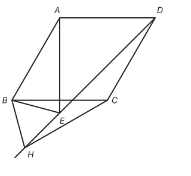

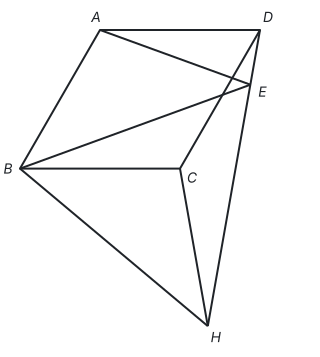

**答案：**

（1）$60^\circ$，4。

（2）两个结论仍然成立。证明：因为四边形 $ABCD$ 是菱形，$\angle BAD = 120^\circ$，$AB = 4$，所以 $AB = AD = BC = 4$，$AD \parallel BC$，$\angle ABC = 180^\circ - \angle BAD = 60^\circ$。因为 $AB = AE$，所以 $AD = AE = AB$。因为 $\angle BAE = \alpha$，所以

$$\angle AEB = 90^\circ - \frac{\alpha}{2}, \quad \angle AED = \frac{1}{2}\big[180^\circ - (120^\circ - \alpha)\big] = 30^\circ + \frac{\alpha}{2}.$$

所以 $\angle BEH = 180^\circ - \angle AEB - \angle AED = 60^\circ$。又因为 $BE = BH$，所以 $\triangle BEH$ 为等边三角形，$\angle EBH = 60^\circ$。所以 $\angle ABC = \angle EBH$，两边都减去 $\angle EBC$，得 $\angle ABE = \angle CBH$。又因为 $BE = BH$，$AB = CB$，所以 $\triangle ABE \cong \triangle CBH$（SAS），所以 $AE = CH$，即 $CH = 4$。

（3）$15^\circ$ 或 $105^\circ$。

推理过程：由（2）的全等，$\angle BCH = \angle BAE = \alpha$，$CH = 4$。$\triangle DCH$ 以 $CD = 4$ 为底，面积为 $4\sqrt{2}$，所以点 $H$ 到直线 $CD$ 的距离是 $2\sqrt{2}$。在以 $CH = 4$ 为斜边、这段距离为直角边的直角三角形中，$\dfrac{2\sqrt{2}}{4} = \dfrac{\sqrt{2}}{2}$，所以 $CH$ 与直线 $CD$ 所成的锐角是 $45^\circ$，$\angle DCH$ 是 $45^\circ$ 或 $135^\circ$。

$H$ 在 $BC$ 的下方，$\angle DCH$ 由 $\angle BCD = 120^\circ$ 和 $\angle BCH = \alpha$ 合成：$120^\circ + \alpha \le 180^\circ$ 时 $\angle DCH = 120^\circ + \alpha$，否则 $\angle DCH = 360^\circ - (120^\circ + \alpha) = 240^\circ - \alpha$。两种情况下 $\angle DCH$ 都大于 $120^\circ$，只能是 $135^\circ$，所以 $\alpha = 15^\circ$ 或 $\alpha = 105^\circ$。

**思路：** 旋转带来等线段：$AB = AE = AD$，于是 $\triangle ABE$ 和 $\triangle ADE$ 都是等腰三角形，底角都能用 $\alpha$ 表示，相加时 $\alpha$ 抵消，$\angle BEH$ 恒为 $60^\circ$。有了 $60^\circ$ 和 $BE = BH$，就得到等边三角形；它和菱形里的等边三角形 $ABC$ 共顶点 $B$，两个等边三角形绕公共顶点 $B$ 转过同样的角，找到 $\triangle ABE \cong \triangle CBH$，就把 $CH$ 转化成了 $AE$。第（3）问 $CD$、$CH$ 都是 4，面积只由 $\angle DCH$ 决定，再按 $H$ 的位置分两种情况表示 $\angle DCH$。
