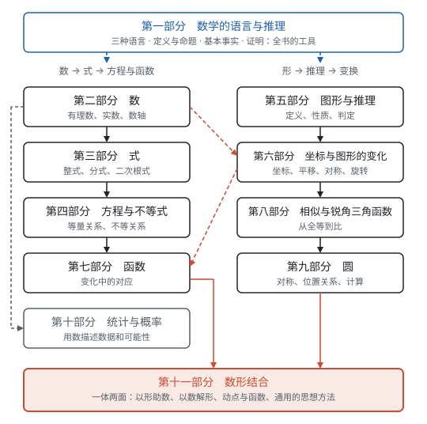

# 导读

**初中数学有两条主线：一条从数出发，经过式，走到方程和函数；一条从形出发，经过推理，走到图形的变换。两条线最后汇合，因为每个代数关系都有一个几何的样子，每个几何关系都能写成数。**

## 两条主线

**数的一条：数 → 式 → 方程与函数。** 先把数从有理数扩充到实数，再用字母代替数，得到式；式和式之间用等号、不等号连起来，就是方程和不等式；把其中的字母看成变量，研究一个量怎样跟着另一个量变，就是函数。每走一步，都是为了解决上一步解决不了的问题：减法要有负数，开方要有无理数，“倒着算”太难就列方程，一个方程只回答一个值、想看整个变化过程就要函数。

**形的一条：形 → 推理 → 变换。** 先认识点、线、角，再研究三角形、四边形和圆。几何从一开始就要求说理：结论不是量出来、看出来的，而是从定义和基本事实一步一步推出来的。推理的核心工具是全等三角形；让全等“动起来”，就是平移、轴对称和旋转；放开大小、只保留形状，就是相似。

**两条线汇合：数形结合。** 数轴让数有了位置，坐标系让点有了一对数，函数的图象让式子有了形状；反过来，勾股定理把直角变成边的关系，相似把形状变成比，坐标把几何问题变成计算。学到最后，同一个问题既能用数来算，也能画成图来看。

## 框架图

| 部分 | 讲什么 | 从这里开始读 |
| --- | --- | --- |
| 数学的语言与推理 | 三种数学语言；定义、命题与定理；基本事实；怎样证明 | 第一部分“总览：数学怎样说话、怎样讲理” |
| 数 | 从自然数扩充到实数，数轴 | 第二部分“总览：数的扩充” |
| 式 | 代数式、整式、分式、二次根式 | 第三部分“总览：式的家族” |
| 方程与不等式 | 各种方程和不等式，都化归为一元一次方程来解 | 第四部分“总览：从等式到方程” |
| 图形与推理 | 从点、线、角到三角形、四边形，每一条性质都要证明 | 第五部分“总览：从直线形到证明” |
| 坐标与图形的变化 | 坐标系；平移、轴对称、旋转 | 第六部分“总览：给图形装上坐标” |
| 函数 | 一次函数、反比例函数、二次函数 | 第七部分“总览：三种函数对照” |
| 相似与锐角三角函数 | 从全等到相似，从相似到边的比 | 第八部分“总览：从全等到相似” |
| 圆 | 圆的对称性，位置关系，弧长和面积 | 第九部分“总览：圆的对称性” |
| 统计与概率 | 收集、整理、描述、分析数据；概率 | 第十部分“总览：从数据到决策” |
| 数形结合 | 以形助数、以数解形，以及贯穿全书的思想方法 | 第十一部分“总览：一体两面” |

第一部分不属于哪一个年级，是全书的工具：怎样把一句话翻译成式子和图形，推理从哪里开始，证明怎样写。第十部分用的主要是数和比，自成一个领域。其余八个部分，左边四个是数的主线，右边四个是形的主线，中间靠数轴和坐标系连在一起，最后在第十一部分汇合。

## 贯穿全书的几条主线

同一个想法会在不同的部分里反复出现，只是换了样子。下面几条线把分散在各处的内容串起来，学到后面时回头看前面，会发现是同一件事：

| 主线 | 经过的页面 |
| --- | --- |
| 数轴 → 坐标系 → 函数图象 | 第二部分“有理数”（数轴，绝对值是到原点的距离）→ 第四部分“不等式与不等式组”（解集画在数轴上）→ 第六部分“平面直角坐标系”（两条数轴组成坐标系）→ 第七部分“一次函数”、第七部分“反比例函数”、第七部分“二次函数”（函数的图象） |
| 面积模型 | 第三部分“整式的乘法”（拼图验证乘法公式）→ 第三部分“因式分解”（把面积块拼成长方形）→ 第五部分“勾股定理”（拼图证明）→ 第四部分“一元二次方程”（配方就是配成正方形） |
| 方程是数与形的交点 | 第四部分“二元一次方程组”（方程组的解是两条直线的交点）→ 第七部分“二次函数”（一元二次方程的根是抛物线与 $x$ 轴的交点，判别式决定交点个数）→ 第九部分“与圆有关的位置关系”（直线与圆有几个公共点，就是一个方程有几个解） |
| 对称 | 第二部分“有理数”（相反数关于原点对称）→ 第五部分“轴对称与等腰三角形”→ 第六部分“平移、轴对称与旋转”（对称点的坐标）→ 第七部分“二次函数”（抛物线的对称轴）→ 第九部分“圆的有关性质”（圆的对称性和垂径定理） |
| 比 | 第八部分“相似”（比例线段、相似比）→ 第八部分“锐角三角函数”（直角三角形两条边的比）→ 第七部分“一次函数”（$k$ 是直线的倾斜程度） |
| 变化与对应 | 第三部分“代数式”（代数式的值随字母变化）→ 第七部分“函数”（一个量跟着另一个量变）→ 第十一部分“动点与函数”（图形里的点在动，长度和面积跟着变） |

这几条线在第十一部分“总览：一体两面”里会再收拢一次，那里还有一张代数和几何的对照表。

## 怎么用这份资料

**每一页都是同样的结构：** 开头一行注明对应人教版教材的哪一章；接着用一句话讲清这一页是什么；然后是“从哪里来”（为什么需要它、怎样定义）、推导、例题、易错点，最后是“联系”，链接到和它有关的其他页面。标有 ★ 的页面是中考的重点；标有“拓展”的内容是课本的选学部分，或者超出了课标的要求，可以先跳过。

**学习顺序。** 学校是按年级学的，一个学期里数和形交替出现。所以平时可以跟着课本的进度：学到哪一章，就读对应的那一页，每页开头都写着对应的章节。每个部分的总览页列出了本部分各页的关系和建议的顺序，第一次进入一个部分时先读总览。复习时再按部分的顺序通读，把同一部分的内容连成一片。各年级对应哪些页面，见附录[学习建议](appendix/index.md)。

**第一部分穿插着学。** 第一部分讲数学的语言与推理，都是方法，不必一口气读完，也不必等到最后。学到用字母表示数时，读第一部分“三种数学语言”；第一次写几何推理时，读第一部分“定义、命题与定理”和第一部分“基本事实”；学全等三角形时，读第一部分“怎样证明”。什么时候读哪一节，第一部分“总览：数学怎样说话、怎样讲理”里有一张表。

**读的时候多问“为什么”。** 每个性质、公式都能从定义和前面的结论推出来，书里都写了推导。读完一条结论，试着合上书，自己把推导说一遍；说不下去的地方，就是还没弄懂的地方。遇到“见第几部分某某”的链接，点过去看看，那里讲的往往是同一件事的另一面。

**公式和定理的汇总**见附录[公式与定理汇总](appendix/formulas.md)，每一条都链接回推导它的页面，复习时可以用来查漏补缺。
